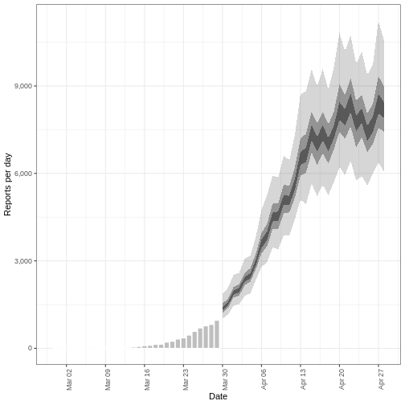

:::::::::::::::::::::::::::::::::::::: questions 

- How do I create short-term forecasts from case data?
- How do I account for incomplete reporting in forecasts?


::::::::::::::::::::::::::::::::::::::::::::::::

::::::::::::::::::::::::::::::::::::: objectives

- Learn how to make forecasts of cases using R package `EpiNow2`
- Learn how to include an observation process in estimation

::::::::::::::::::::::::::::::::::::::::::::::::

::::::::::::::::::::::::::::::::::::: prereq

## Prerequisites

+ Complete tutorial [Quantifying transmission](../episodes/quantify-transmissibility.md)

Learners should familiarise themselves with following concept dependencies before working through this tutorial: 

**Statistics** : probability distributions, principle of Bayesian analysis. 

**Epidemic theory** : Effective reproduction number.

:::::::::::::::::::::::::::::::::

## Introduction

Given case data of an epidemic, we can create estimates of the current and future number of cases by accounting for both delays 
in reporting and under reporting. To make statements about the future of th epidemic, we need to make an assumption of how 
observations up to the present are related to what we expect to happen in the future. The simplest way of doing so is to assume "no change", i.e.,  the reproduction number remains the same in the future as last observed. In this tutorial we will create short-term [forecasts](../learners/reference.md#forecast) by assuming the reproduction number will remain the same as its estimate was on the final date for which data was available.

In this tutorial we are going to learn how to use the `{EpiNow2}` package to forecast cases accounting for incomplete observations and forecast secondary observations like deaths.

We’ll use the pipe `%>%` operator to connect functions, so let’s also call to the `{tidyverse}` package:

```r
library(EpiNow2)
library(tidyverse)
```


::::::::::::::::::: checklist

### The double-colon

The double-colon `::` in R let you call a specific function from a package without loading the entire package into the current environment. 

For example, `dplyr::filter(data, condition)` uses `filter()` from the `{dplyr}` package.

This help us remember package functions and avoid namespace conflicts.

:::::::::::::::::::

## Create a short-term forecast

The function `epinow()` described in the [quantifying transmission](../episodes/quantify-transmissibility.md) episode is a wrapper for the functions: 

- `estimate_infections()` used to estimate cases by date of infection. 
- `forecast_infections()` used to simulate infections using an existing fit (estimate) to observed cases.

Let's use the same code used in [quantifying transmission](../episodes/quantify-transmissibility.md) episode to get the input data, delays and priors:


``` r
# Read cases dataset
cases <- incidence2::covidregionaldataUK %>%
  # use {tidyr} to preprocess missing values
  tidyr::replace_na(base::list(cases_new = 0)) %>%
  # use {incidence2} to compute the daily incidence
  incidence2::incidence(
    date_index = "date",
    counts = "cases_new",
    count_values_to = "confirm",
    date_names_to = "date",
    complete_dates = TRUE
  ) %>%
  dplyr::select(-count_variable)

# Incubation period
incubation_period_fixed <- EpiNow2::Gamma(
  mean = 4,
  sd = 2,
  max = 20
)

# Log-tranformed mean
log_mean <- EpiNow2::convert_to_logmean(mean = 2, sd = 1)

# Log-transformed std
log_sd <- EpiNow2::convert_to_logsd(mean = 2, sd = 1)

# Reporting dalay
reporting_delay_fixed <- EpiNow2::LogNormal(
  mean = log_mean,
  sd = log_sd,
  max = 10
)

# Generation time
generation_time_fixed <- EpiNow2::LogNormal(
  mean = 3.6,
  sd = 3.1,
  max = 20
)

# define Rt prior distribution
rt_prior <- EpiNow2::rt_opts(prior = base::list(mean = 2, sd = 2))
```

Now we can extract the short-term forecast using:


``` r
# Assume we only have the first 90 days of this data
reported_cases <- cases %>%
  dplyr::slice(1:90)

# Estimate and forecast
estimates <- EpiNow2::epinow(
  data = reported_cases,
  generation_time = EpiNow2::generation_time_opts(generation_time_fixed),
  delays = EpiNow2::delay_opts(incubation_period_fixed + reporting_delay_fixed),
  rt = rt_prior
)
```

``` output
WARN [2024-11-19 03:20:14] epinow: There were 4 divergent transitions after warmup. See
https://mc-stan.org/misc/warnings.html#divergent-transitions-after-warmup
to find out why this is a problem and how to eliminate them. - 
WARN [2024-11-19 03:20:14] epinow: Examine the pairs() plot to diagnose sampling problems
 - 
```

::::::::::::::::::::::::::::::::: callout

### Do not wait for this to complete!

This last chunk may take 10 minutes to run. Keep reading this tutorial episode while this runs in the background. For more information on computing time, read the "Bayesian inference using Stan" section within the [quantifying transmission](../episodes/quantify-transmissibility.md) episode.

:::::::::::::::::::::::::::::::::

We can visualise the estimates of the effective reproduction number and the estimated number of cases using `plot()`. The estimates are split into three categories:

+ **Estimate** (green): utilises all data,

+ **Estimate based on partial data** (orange): contains a higher degree of uncertainty because such estimates are based on less data,

+ **Forecast** (purple): forecasts into the future. 


``` r
plot(estimates)
```


### Forecasting with incomplete observations 

In the [quantifying transmission](../episodes/quantify-transmissibility.md) episode we accounted for delays in reporting.In `EpiNow2` we also can account for incomplete observations as in reality, 100% of cases are not reported.
We will pass another argument into `epinow()` function  called `obs` to define an observation model. The format of `obs` is defined by the `obs_opt()` function (see `?EpiNow2::obs_opts` for more detail). 

Let's say we believe the COVID-19 outbreak data in the `cases` object do not include all reported cases. We believe that we only observe 40% of cases. To specify this in the observation model, we must pass a scaling factor with a mean and standard deviation. If we assume that 40% of cases are in the case data (with standard deviation 1%), then we specify the `scale` input to `obs_opts()` as follows:


``` r
obs_scale <- base::list(mean = 0.4, sd = 0.01)
```

To run the inference framework with this observation process, we add `obs = obs_opts(scale = obs_scale)` to the input arguments of `epinow()`:


``` r
# Define observation model
obs_scale <- base::list(mean = 0.4, sd = 0.01)

# Assume we only have the first 90 days of this data
reported_cases <- cases %>%
  dplyr::slice(1:90)

# Estimate and forecast
estimates <- EpiNow2::epinow(
  data = reported_cases,
  generation_time = EpiNow2::generation_time_opts(generation_time_fixed),
  delays = EpiNow2::delay_opts(incubation_period_fixed + reporting_delay_fixed),
  rt = rt_prior,
  # Add observation model
  obs = EpiNow2::obs_opts(scale = obs_scale)
)
```

``` output
WARN [2024-11-19 03:29:30] epinow: There were 3 divergent transitions after warmup. See
https://mc-stan.org/misc/warnings.html#divergent-transitions-after-warmup
to find out why this is a problem and how to eliminate them. - 
WARN [2024-11-19 03:29:30] epinow: Examine the pairs() plot to diagnose sampling problems
 - 
```

``` r
base::summary(estimates)
```

``` output
                            measure                estimate
                             <char>                  <char>
1:           New infections per day   17165 (9235 -- 30156)
2: Expected change in daily reports       Likely decreasing
3:       Effective reproduction no.      0.88 (0.59 -- 1.3)
4:                   Rate of growth -0.042 (-0.18 -- 0.096)
5:     Doubling/halving time (days)       -17 (7.2 -- -3.8)
```


The estimates of transmission measures such as the effective reproduction number and rate of growth are similar (or the same in value) compared to when we didn't account for incomplete observations (see [quantifying transmission episode](../episodes/quantify-transmissibility.md) in the "Finding estimates" section). However the number of new confirmed cases by infection date has changed substantially in magnitude to reflect the assumption that only 40% of cases are in the data set.

We can also change the default distribution from Negative Binomial to Poisson, remove the default week effect and more. See `?EpiNow2::obs_opts` for more details.

::::::::::::::::::::::::::: discussion

### What are the implications of this change?

- Compare different percents of observations %
- How are they different in the number of infections estimated?
- What are the public health implications of this change?

:::::::::::::::::::::::::::

## Forecasting secondary observations

`EpiNow2` also has the ability to estimate and forecast secondary observations, e.g., deaths and hospitalisations, from a primary observation, e.g., cases. Here we will illustrate how to forecast the number of deaths arising from observed cases of COVID-19 in the early stages of the UK outbreak. 

First, we must format our data to have the following columns:

+ `date`: the date (as a date object see `?is.Date()`),
+ `primary`: number of primary observations on that date, in this example **cases**,
+ `secondary`: number of secondary observations date, in this example **deaths**.


``` r
reported_cases_deaths <- incidence2::covidregionaldataUK %>%
  # use {tidyr} to preprocess missing values
  tidyr::replace_na(base::list(cases_new = 0, deaths_new = 0)) %>%
  # use {incidence2} to compute the daily incidence
  incidence2::incidence(
    date_index = "date",
    counts = c(primary = "cases_new", secondary = "deaths_new"),
    date_names_to = "date",
    complete_dates = TRUE
  ) %>%
  # rearrange to wide format for {EpiNow2}
  pivot_wider(names_from = count_variable, values_from = count)
```

<div class="figure" style="text-align: center">

<p class="caption">Distribution of secondary cases (deaths). We will drop the first 30 days with no observed deaths. We will use the deaths between day 31 and day 60 to estimate the secondary observations. We will forecast deaths from day 61 to day 90.</p>
</div>

Using the data on cases and deaths between day 31 and day 60, we will estimate the relationship between the primary and secondary observations using `estimate_secondary()`, then forecast future deaths using `forecast_secondary()`. For more details on the model see the [model documentation](https://epiforecasts.io/EpiNow2/dev/articles/estimate_secondary.html). 

We must specify the type of observation using `type` in `secondary_opts()`, options include:

+ "incidence": secondary observations arise from previous primary observations, i.e., deaths arising from recorded cases.
+ "prevalence": secondary observations arise from a combination current primary observations and past secondary observations, i.e., hospital bed usage arising from current hospital admissions and past hospital bed usage. 

In this example we specify `secondary_opts(type = "incidence")`. See `?EpiNow2::secondary_opts` for more detail.

The final key input is the delay distribution between the primary and secondary observations. Here this is the delay between case report and death, we assume this follows a gamma distribution with mean of 14 days and standard deviation of 5 days (Alternatively, we can use `{epiparameter}` to [access epidemiological delays](https://epiverse-trace.github.io/tutorials-early/delays-reuse.html)). Using `Gamma()` we specify a fixed gamma distribution.

There are further function inputs to `estimate_secondary()` which can be specified, including adding an observation process, see `?EpiNow2::estimate_secondary` for detail on these options. 

To find the model fit between cases and deaths: 

``` r
# Estimate from day 31 to day 60 of this data
cases_to_estimate <- reported_cases_deaths %>%
  slice(31:60)

# Delay distribution between case report and deaths
delay_report_to_death <- EpiNow2::Gamma(
  mean = EpiNow2::Normal(mean = 14, sd = 0.5),
  sd = EpiNow2::Normal(mean = 5, sd = 0.5),
  max = 30
)

# Estimate secondary cases
estimate_cases_to_deaths <- EpiNow2::estimate_secondary(
  data = cases_to_estimate,
  secondary = EpiNow2::secondary_opts(type = "incidence"),
  delays = EpiNow2::delay_opts(delay_report_to_death)
)
```

``` output
WARN [2024-11-19 03:29:38] estimate_secondary (chain: 1): Bulk Effective Samples Size (ESS) is too low, indicating posterior means and medians may be unreliable.
Running the chains for more iterations may help. See
https://mc-stan.org/misc/warnings.html#bulk-ess - 
```


::::::::::::::::::::::::::::::::::::: callout

### Be cautious of time-scale 

In the early stages of an outbreak there can be substantial changes in testing and reporting. If there are testing changes from one month to another, then there will be a bias in the model fit. Therefore, you should be cautious of the time-scale of data used in the model fit and forecast.

::::::::::::::::::::::::::::::::::::::::::::::::

We plot the model fit (shaded ribbons) with the secondary observations (bar plot) and primary observations (dotted line) as follows: 


``` r
plot(estimate_cases_to_deaths, primary = TRUE)
```


To use this model fit to forecast deaths, we pass a data frame consisting of the primary observation (cases) for dates not used in the model fit. 

*Note : in this episode we are using data where we know the deaths and cases, so we create a data frame by extracting the cases. But in practice, this would be a different data set consisting of cases only.*

``` r
# Forecast from day 61 to day 90
cases_to_forecast <- reported_cases_deaths %>%
  dplyr::slice(61:90) %>%
  dplyr::mutate(value = primary)
```

To forecast, we use the model fit `estimate_cases_to_deaths`:  


``` r
# Forecast secondary cases
deaths_forecast <- EpiNow2::forecast_secondary(
  estimate = estimate_cases_to_deaths,
  primary = cases_to_forecast
)

plot(deaths_forecast)
```


:::::::::::::::: spoiler

### make a forecast plot


``` r
deaths_forecast %>%
  purrr::pluck("predictions") %>%
  ggplot(aes(x = date, y = secondary)) +
  geom_col(
    fill = "grey", col = "white",
    show.legend = FALSE, na.rm = TRUE
  ) +
  geom_ribbon(aes(ymin = lower_90, ymax = upper_90),
              alpha = 0.2, linewidth = 1) +
  geom_ribbon(aes(ymin = lower_50, ymax = upper_50),
              alpha = 0.4, linewidth = 1) +
  geom_ribbon(aes(ymin = lower_20, ymax = upper_20),
              alpha = 0.6, linewidth = 1) +
  theme_bw() +
  labs(y = "Reports per day", x = "Date") +
  scale_x_date(date_breaks = "week", date_labels = "%b %d") +
  scale_y_continuous(labels = scales::comma) +
  theme(axis.text.x = ggplot2::element_text(angle = 90))
```




::::::::::::::::

The plot shows the forecast secondary observations (deaths) over the dates which we have recorded cases for. 
It is also possible to forecast deaths using forecast cases, here you would specify `primary` as the `estimates` output from `estimate_infections()`.


:::::::::::::::::::::::::: callout

### Credible intervals

In all `{EpiNow2}` output figures, shaded regions reflect 90%, 50%, and 20% credible intervals in order from lightest to darkest.

::::::::::::::::::::::::::

## Challenge: Ebola outbreak analysis 

::::::::::::::::::::::::::::::::::::: challenge

Download the file [`ebola_cases.csv`](data/ebola_cases.csv) and read it into R. The simulated data consists of the date of symptom onset and number of confirmed cases of the early stages of the Ebola outbreak in Sierra Leone in 2014.

Using the first 3 months (120 days) of data:

1. Estimate whether cases are increasing or decreasing on day 120 of the outbreak
2. Account for a capacity to observe 80% of cases.
2. Create a two week forecast of number of cases.

You can use the following parameter values for the delay distribution(s) and generation time distribution.

+ Incubation period: Log normal$(2.487,0.330)$ ([Eichner et al. 2011](https://doi.org/10.1016/j.phrp.2011.04.001) via `{epiparameter}`)
+ Generation time: Gamma$(15.3, 10.1)$ ([WHO Ebola Response Team 2014](https://www.nejm.org/doi/full/10.1056/NEJMoa1411100))

You may include some uncertainty around the mean and standard deviation of these distributions. 

::::::::::::::::: hint

We use the effective reproduction number and growth rate to estimate whether cases are increasing or decreasing.

We can use the `horizon` argument within the `epinow()` function to extend the time period of the forecast. The default value is of seven days.

Ensure the data is in the correct format :

+ `date`: the date (as a date object see `?is.Date()`),
+ `confirm`: number of confirmed cases on that date.

::::::::::::::::::::::


::::::::::::::::: solution

### SOLUTION

To estimate the effective reproduction number and growth rate, we will use the function `epinow()`.

As the data consists of date of symptom onset, we only need to specify a delay distribution for the incubation period and the generation time. 

We specify the distributions with some uncertainty around the mean and standard deviation of the log normal distribution for the incubation period and the Gamma distribution for the generation time.


``` r
epiparameter::epidist_db(disease = "ebola", epi_dist = "incubation") %>%
  epiparameter::parameter_tbl()
```

``` output
# Parameter table:
# A data frame:    5 × 7
  disease   pathogen epi_distribution prob_distribution author  year sample_size
  <chr>     <chr>    <chr>            <chr>             <chr>  <dbl>       <dbl>
1 Ebola Vi… Ebola V… incubation peri… lnorm             Eichn…  2011         196
2 Ebola Vi… Ebola V… incubation peri… gamma             WHO E…  2015        1798
3 Ebola Vi… Ebola V… incubation peri… gamma             WHO E…  2015          49
4 Ebola Vi… Ebola V… incubation peri… gamma             WHO E…  2015         957
5 Ebola Vi… Ebola V… incubation peri… gamma             WHO E…  2015         792
```

``` r
ebola_eichner <- epiparameter::epidist_db(
  disease = "ebola",
  epi_dist = "incubation",
  author = "Eichner"
)

ebola_eichner_parameters <- epiparameter::get_parameters(ebola_eichner)

ebola_incubation_period <- EpiNow2::LogNormal(
  meanlog = EpiNow2::Normal(
    mean = ebola_eichner_parameters["meanlog"],
    sd = 0.5
  ),
  sdlog = EpiNow2::Normal(
    mean = ebola_eichner_parameters["sdlog"],
    sd = 0.5
  ),
  max = 20
)

ebola_generation_time <- EpiNow2::Gamma(
  mean = EpiNow2::Normal(mean = 15.3, sd = 0.5),
  sd = EpiNow2::Normal(mean = 10.1, sd = 0.5),
  max = 30
)
```

We read the data input using `readr::read_csv()`. This function recognize that the column `date` is a `<date>` class vector.


``` r
# read data
# e.g.: if path to file is data/raw-data/ebola_cases.csv then:
ebola_cases_raw <- readr::read_csv(
  here::here("data", "raw-data", "ebola_cases.csv")
)
```

Preprocess and adapt the raw data for `{EpiNow2}`:


``` r
ebola_cases <- ebola_cases_raw %>%
  # use {tidyr} to preprocess missing values
  tidyr::replace_na(base::list(confirm = 0)) %>%
  # use {incidence2} to compute the daily incidence
  incidence2::incidence(
    date_index = "date",
    counts = "confirm",
    count_values_to = "confirm",
    date_names_to = "date",
    complete_dates = TRUE
  ) %>%
  dplyr::select(-count_variable)

dplyr::as_tibble(ebola_cases)
```

``` output
# A tibble: 123 × 2
   date       confirm
   <date>       <dbl>
 1 2014-05-18       1
 2 2014-05-19       0
 3 2014-05-20       2
 4 2014-05-21       4
 5 2014-05-22       6
 6 2014-05-23       1
 7 2014-05-24       2
 8 2014-05-25       0
 9 2014-05-26      10
10 2014-05-27       8
# ℹ 113 more rows
```


We define an observation model to scale the estimated and forecast number of new infections:


``` r
# Define observation model
# mean of 80% and standard deviation of 1%
ebola_obs_scale <- base::list(mean = 0.8, sd = 0.01)
```

As we want to also create a two week forecast, we specify `horizon = 14` to forecast 14 days instead of the default 7 days. 


``` r
ebola_estimates <- EpiNow2::epinow(
  data = ebola_cases %>% dplyr::slice(1:120), # first 3 months of data only
  generation_time = EpiNow2::generation_time_opts(ebola_generation_time),
  delays = EpiNow2::delay_opts(ebola_incubation_period),
  # Add observation model
  obs = EpiNow2::obs_opts(scale = ebola_obs_scale),
  # horizon needs to be 14 days to create two week forecast (default is 7 days)
  horizon = 14
)
```

``` output
WARN [2024-11-19 03:31:33] epinow: There were 32 divergent transitions after warmup. See
https://mc-stan.org/misc/warnings.html#divergent-transitions-after-warmup
to find out why this is a problem and how to eliminate them. - 
WARN [2024-11-19 03:31:33] epinow: Examine the pairs() plot to diagnose sampling problems
 - 
WARN [2024-11-19 03:31:35] epinow: Bulk Effective Samples Size (ESS) is too low, indicating posterior means and medians may be unreliable.
Running the chains for more iterations may help. See
https://mc-stan.org/misc/warnings.html#bulk-ess - 
WARN [2024-11-19 03:31:36] epinow: Tail Effective Samples Size (ESS) is too low, indicating posterior variances and tail quantiles may be unreliable.
Running the chains for more iterations may help. See
https://mc-stan.org/misc/warnings.html#tail-ess - 
```

``` r
summary(ebola_estimates)
```

``` output
                            measure              estimate
                             <char>                <char>
1:           New infections per day        83 (36 -- 204)
2: Expected change in daily reports     Likely increasing
3:       Effective reproduction no.     1.5 (0.88 -- 2.6)
4:                   Rate of growth 0.035 (-0.025 -- 0.1)
5:     Doubling/halving time (days)       20 (6.6 -- -28)
```

The effective reproduction number $R_t$ estimate (on the last date of the data) is 1.5 (0.88 -- 2.6). The exponential growth rate of case numbers is 0.035 (-0.025 -- 0.1).

Visualize the estimates:


``` r
plot(ebola_estimates)
```

:::::::::::::::::::::::::::


::::::::::::::::::::::::::::::::::::::::::::::::


::::::::::::::::::::::::::::::::::::: callout

### Forecasting with estimates of $R_t$

By default, the short-term forecasts are created using the latest estimate of the reproduction number $R_t$. As this estimate is based on partial data, it has considerable uncertainty.  

The reproduction number that is projected into the future can be changed to a less recent estimate based on more data using `rt_opts()`:


``` r
EpiNow2::rt_opts(future = "estimate")
```

The result will be less uncertain forecasts (as they are based on $R_t$ with a narrower uncertainty interval) but the forecasts will be based on less recent estimates of $R_t$ and assume no change since then.

Additionally, there is the option to [project](../learners/reference.md#projection) the value of $R_t$ into the future using a generic model by setting `future = "project"`. As this option uses a model to forecast the value of $R_t$, the result will be forecasts that are more uncertain than `estimate`, for an example [see here](https://epiforecasts.io/EpiNow2/dev/articles/estimate_infections_options.html#projecting-the-reproduction-number-with-the-gaussian-process).

::::::::::::::::::::::::::::::::::::::::::::::::

## Summary

`EpiNow2` can be used to create short term forecasts and to estimate the relationship between different outcomes. There are a range of model options that can be implemented for different analysis, including adding an observational process to account for incomplete reporting. See the [vignette](https://epiforecasts.io/EpiNow2/dev/articles/estimate_infections_options.html) for more details on different model options in `EpiNow2` that aren't covered in these tutorials. 


::::::::::::::::::::::::::::::::::::: keypoints 

- We can create short-term forecasts by making assumptions about the future behaviour of the reproduction number
- Incomplete case reporting can be accounted for in estimates


::::::::::::::::::::::::::::::::::::::::::::::::
