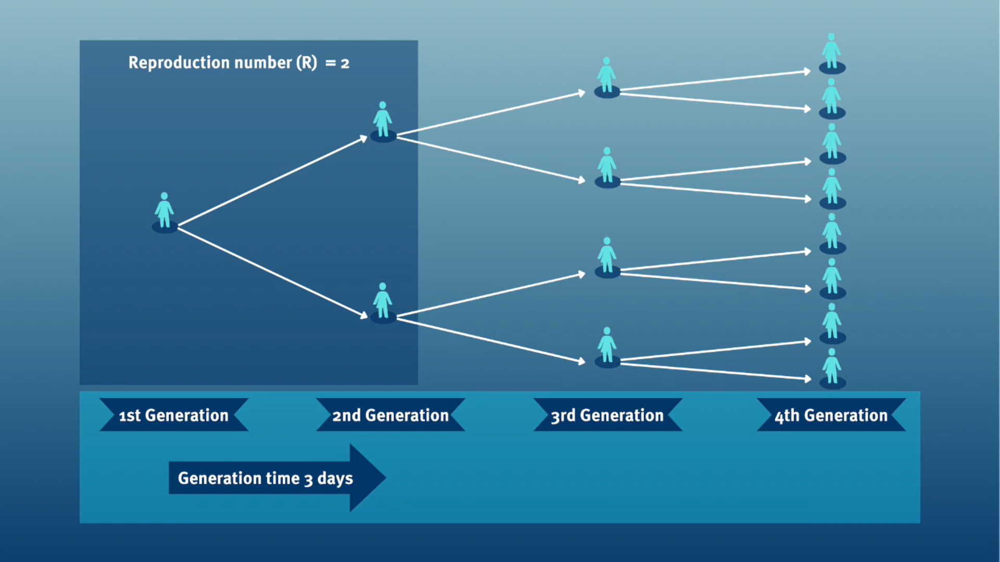
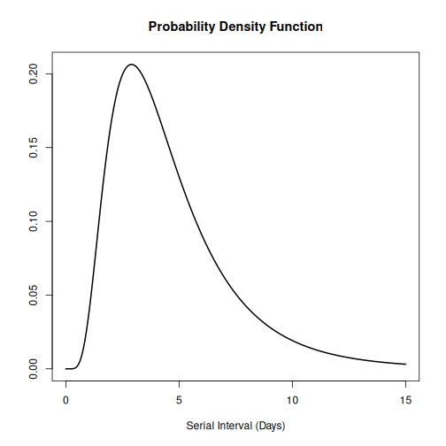

:::::::::::::::::::::::::::::::::::::: questions 

- How to get access to disease delay distributions from a pre-established database for use in analysis?

::::::::::::::::::::::::::::::::::::::::::::::::

::::::::::::::::::::::::::::::::::::: objectives

- Get delays from a literature search database with `{epiparameter}`.
- Get distribution parameters and summary statistics of delay distributions.

::::::::::::::::::::::::::::::::::::::::::::::::

::::::::::::::::::::::::::::::::::::: prereq

## Prerequisites

This episode requires you to be familiar with:

**Data science** : Basic programming with R.

**Epidemic theory** : epidemiological parameters, disease time periods, such as the incubation period, generation time, and serial interval.

:::::::::::::::::::::::::::::::::

## Introduction

Infectious diseases follow an infection cycle, which usually includes the following phases: presymptomatic period, symptomatic period and recovery period, as described by their [natural history](../learners/reference.md#naturalhistory). These time periods can be used to understand transmission dynamics and inform disease prevention and control interventions.

](fig/time-periods.jpg)


::::::::::::::::: callout

### Definitions

Look at the [glossary](../learners/reference.md) for the definitions of all the time periods of the figure above!

:::::::::::::::::::::::::

However, early in an epidemic, modelling efforts can be delayed by the lack of a centralised resource that summarises input parameters for the disease of interest ([Nash et al., 2023](https://mrc-ide.github.io/epireview/)). Projects like `{epiparameter}` and `{epireview}` are building online catalogues following literature synthesis protocols that can help parametrise models by easily accessing a comprenhensive library of previously estimated epidemiological parameters from past outbreaks.

<!-- Early models for COVID-19 used parameters from other coronaviruses. https://www.thelancet.com/article/S1473-3099(20)30144-4/fulltext -->

To exemplify how to use the `{epiparameter}` R package in your analysis pipeline, our goal in this episode will be to access one specific set of epidemiological parameters from the literature, instead of copying-and-pasting them by hand, to plug them into an `{EpiNow2}` analysis workflow.

<!-- In this episode, we'll learn how to access one specific set of epidemiological parameters from the literature and then get their **summary statistics** using `{epiparameter}`.  -->

Let's start loading the `{epiparameter}` package. We'll use the pipe `%>%` to connect some of their functions, some `{tibble}` and `{dplyr}` functions, so let's also call to the `{tidyverse}` package:


``` r
library(epiparameter)
library(tidyverse)
```

::::::::::::::::::: checklist

### The double-colon

The double-colon `::` in R let you call a specific function from a package without loading the entire package into the current environment. 

For example, `dplyr::filter(data, condition)` uses `filter()` from the `{dplyr}` package.

This help us remember package functions and avoid namespace conflicts.

:::::::::::::::::::


## The problem

If we want to estimate the transmissibility of an infection, it's common to use a package such as `{EpiEstim}` or `{EpiNow2}`. However, both require some epidemiological information as an input. For example, in `{EpiNow2}` we use `EpiNow2::Gamma()` to specify a [generation time](../learners/reference.md#generationtime) as a probability distribution adding its `mean`, standard deviation (`sd`), and maximum value (`max`). 

To specify a `generation_time` that follows a _Gamma_ distribution with mean $\mu = 4$, standard deviation $\sigma = 2$, and a maximum value of 20, we write:

```r
generation_time <- 
  EpiNow2::Gamma(
    mean = 4,
    sd = 2,
    max = 20
  )
```

It is a common practice for analysts to manually search the available literature and copy and paste the **summary statistics** or the **distribution parameters** from scientific publications. A challenge that is often faced is that the reporting of different statistical distributions is not consistent across the literature. `{epiparameter}`’s objective is to facilitate the access to reliable estimates of distribution parameters for a range of infectious diseases, so that they can easily be implemented in outbreak analytic pipelines.

In this episode, we will *access* the summary statistics of generation time for COVID-19 from the library of epidemiological parameters provided by `{epiparameter}`. These metrics can be used to estimate the transmissibility of this disease using `{EpiNow2}` in subsequent episodes.

Let's start by looking at how many entries are available in the **epidemiological distributions database** in `{epiparameter}` using `epidist_db()` for the epidemiological distribution `epi_dist` called generation time with the string `"generation"`:


``` r
epiparameter::epidist_db(
  epi_dist = "generation"
)
```

``` output
Returning 1 results that match the criteria (1 are parameterised). 
Use subset to filter by entry variables or single_epidist to return a single entry. 
To retrieve the citation for each use the 'get_citation' function
```

``` output
Disease: Influenza
Pathogen: Influenza-A-H1N1
Epi Distribution: generation time
Study: Lessler J, Reich N, Cummings D, New York City Department of Health and
Mental Hygiene Swine Influenza Investigation Team (2009). "Outbreak of
2009 Pandemic Influenza A (H1N1) at a New York City School." _The New
England Journal of Medicine_. doi:10.1056/NEJMoa0906089
<https://doi.org/10.1056/NEJMoa0906089>.
Distribution: weibull
Parameters:
  shape: 2.360
  scale: 3.180
```

Currently, in the library of epidemiological parameters, we have one `"generation"` time entry for Influenza. Instead, we can look at the `serial` intervals for `COVID`-19. Let find what we need to consider for this!

## Generation time vs serial interval

The generation time, jointly with the reproduction number ($R$), provide valuable insights on the strength of transmission and inform the implementation of control measures. Given a $R>1$, the shorter the generation time, the earlier the incidence of disease cases will grow.



In calculating the effective reproduction number ($R_{t}$), the *generation time* distribution is often approximated by the [serial interval](../learners/reference.md#serialinterval) distribution.
This frequent approximation is because it is easier to observe and measure the onset of symptoms than the onset of infectiousness.

).](fig/serial-interval-observed.jpeg)

However, using the *serial interval* as an approximation of the *generation time* is primarily valid for diseases in which infectiousness starts after symptom onset ([Chung Lau et al., 2021](https://academic.oup.com/jid/article/224/10/1664/6356465)). In cases where infectiousness starts before symptom onset, the serial intervals can have negative values, which is the case for diseases with pre-symptomatic transmission ([Nishiura et al., 2020](https://www.ijidonline.com/article/S1201-9712(20)30119-3/fulltext#gr2)).

<!-- Additionally, even if the *generation time* and *serial interval* have the same mean, their variance usually differs, propagating bias to the $R_{t}$ estimation ([Gostic et al., 2020](https://journals.plos.org/ploscompbiol/article?id=10.1371/journal.pcbi.1008409)). -->

::::::::::::::::: callout

### From time periods to probability distributions.

When we calculate the *serial interval*, we see that not all case pairs have the same time length. We will observe this variability for any case pair and individual time period, including the [incubation period](../learners/reference.md#incubation) and [infectious period](../learners/reference.md#infectiousness).

).](fig/serial-interval-pairs.jpg)

To summarise these data from individual and pair time periods, we can find the **statistical distributions** that best fit the data ([McFarland et al., 2023](https://www.eurosurveillance.org/content/10.2807/1560-7917.ES.2023.28.27.2200806)).

<!-- add a reference about good practices to estimate distributions -->

).](fig/seria-interval-fitted-distributions.jpg)

Statistical distributions are summarised in terms of their **summary statistics** like the *location* (mean and percentiles) and *spread* (variance or standard deviation) of the distribution, or with their **distribution parameters** that inform about the *form* (shape and rate/scale) of the distribution. These estimated values can be reported with their **uncertainty** (95% confidence intervals).

| Gamma | mean | shape | rate/scale |
|:--------------|:--------------|:--------------|:--------------|
| MERS-CoV | 14.13(13.9–14.7) | 6.31(4.88–8.52) | 0.43(0.33–0.60) |
| COVID-19 | 5.1(5.0–5.5) | 2.77(2.09–3.88) | 0.53(0.38–0.76) |

| Weibull | mean | shape | rate/scale |
|:--------------|:--------------|:--------------|:--------------|
| MERS-CoV | 14.2(13.3–15.2) | 3.07(2.64–3.63) | 16.1(15.0–17.1) |
| COVID-19 | 5.2(4.6–5.9) | 1.74(1.46–2.11) | 5.83(5.08–6.67) |

| Log normal | mean | mean-log | sd-log |
|:--------------|:--------------|:--------------|:--------------|
| MERS-CoV | 14.08(13.1–15.2) | 2.58(2.50–2.68) | 0.44(0.39–0.5) |
| COVID-19 | 5.2(4.2–6.5) | 1.45(1.31–1.61) | 0.63(0.54–0.74) |

Table: Serial interval estimates using Gamma, Weibull, and Log Normal distributions. 95% confidence intervals for the shape and scale (logmean and sd for Log Normal) parameters are shown in brackets ([Althobaity et al., 2022](https://www.sciencedirect.com/science/article/pii/S2468042722000537#tbl3)).

:::::::::::::::::::::::::

::::::::::::::::::::::::::::::::: challenge

### Serial interval

Assume that COVID-19 and SARS have similar reproduction number values and that the serial interval approximates the generation time. 

Given the serial interval of both infections in the figure below: 

- Which one would be harder to control? 
- Why do you conclude that?

30119-3/fulltext))](fig/serial-interval-covid-sars.jpg)

::::::::::::::::: hint

The peak of each curve can inform you about the location of the mean of each distribution. The larger the mean, the larger the serial interval.

::::::::::::::::::::::

::::::::::::::::: solution

**Which one would be harder to control?**

COVID-19

**Why do you conclude that?**

COVID-19 has the lowest mean serial interval. The approximate mean value for the serial interval of COVID-19 is around four days, and SARS is about seven days. Thus, COVID-19 will likely have newer generations in less time than SARS, assuming similar reproduction numbers.

::::::::::::::::::::::::::

:::::::::::::::::::::::::::::::::::::::::::

:::::::::::::::::::::: instructor

The objective of the assessment above is to assess the interpretation of a larger or shorter generation time.

::::::::::::::::::::::

## Choosing epidemiological parameters

In this section, we will use `{epiparameter}` to obtain the serial interval for COVID-19, as an alternative to the generation time.

Let's ask now how many parameters we have in the epidemiological distributions database (`epidist_db()`) with the `disease` named `covid`-19. Run this locally!


``` r
epiparameter::epidist_db(
  disease = "covid"
)
```

From the `{epiparameter}` package, we can use the `epidist_db()` function to ask for any `disease` and also for a specific epidemiological distribution (`epi_dist`). Run this in your console:


``` r
epiparameter::epidist_db(
  disease = "COVID",
  epi_dist = "serial"
)
```

With this query combination, we get more than one delay distribution. This output is an `<epidist>` class object.

::::::::::::::::: callout

### CASE-INSENSITIVE

`epidist_db` is [case-insensitive](https://dillionmegida.com/p/case-sensitivity-vs-case-insensitivity/#case-insensitivity). This means that you can use strings with letters in upper or lower case indistinctly. Strings like `"serial"`, `"serial interval"` or `"serial_interval"` are also valid.

:::::::::::::::::::::::::

As suggested in the outputs, to summarise an `<epidist>` object and get the column names from the underlying parameter database, we can add the `epiparameter::parameter_tbl()` function to the previous code using the pipe `%>%`:


``` r
epiparameter::epidist_db(
  disease = "covid",
  epi_dist = "serial"
) %>%
  epiparameter::parameter_tbl()
```

``` output
Returning 4 results that match the criteria (3 are parameterised). 
Use subset to filter by entry variables or single_epidist to return a single entry. 
To retrieve the citation for each use the 'get_citation' function
```

``` output
# Parameter table:
# A data frame:    4 × 7
  disease  pathogen  epi_distribution prob_distribution author  year sample_size
  <chr>    <chr>     <chr>            <chr>             <chr>  <dbl>       <dbl>
1 COVID-19 SARS-CoV… serial interval  <NA>              Alene…  2021        3924
2 COVID-19 SARS-CoV… serial interval  lnorm             Nishi…  2020          28
3 COVID-19 SARS-CoV… serial interval  weibull           Nishi…  2020          18
4 COVID-19 SARS-CoV… serial interval  norm              Yang …  2020         131
```

In the `epiparameter::parameter_tbl()` output, we can also find different types of probability distributions (e.g., Log-normal, Weibull, Normal).

`{epiparameter}` uses the `base` R naming convention for distributions. This is why **Log normal** is called `lnorm`.

::::::::::::::::: spoiler

### Why do we have an 'NA' entry?

Entries with a missing value (`<NA>`) in the `prob_distribution` column are *non-parameterised* entries. They have summary statistics but no probability distribution. Compare these two outputs:


``` r
# get an <epidist> object
distribution <-
  epiparameter::epidist_db(
    disease = "covid",
    epi_dist = "serial"
  )

distribution %>%
  # pluck the first entry in the object class <list>
  pluck(1) %>%
  # check if <epidist> object have distribution parameters
  is_parameterised()

# check if the second <epidist> object
# have distribution parameters
distribution %>%
  pluck(2) %>%
  is_parameterised()
```

### Parameterised entries have an Inference method

As detailed in `?is_parameterised`, a parameterised distribution is the entry that has a probability distribution associated with it provided by an `inference_method` as shown in `metadata`:


``` r
distribution[[1]]$metadata$inference_method
distribution[[2]]$metadata$inference_method
distribution[[4]]$metadata$inference_method
```

:::::::::::::::::::::::::


::::::::::::::::::::::::::::::::: challenge

### Find your delay distributions!

Take 2 minutes to explore the `{epiparameter}` library. 

**Choose** a disease of interest (e.g., Influenza, Measles, etc.) and a delay distribution (e.g., the incubation period, onset to death, etc.).

Find:

- How many delay distributions are for that disease?

- How many types of probability distribution (e.g., gamma, log normal) are for a given delay in that disease?

Ask:

- Do you recognise the papers?

- Should `{epiparameter}` literature review consider any other paper?

::::::::::::::::: hint

The `epidist_db()` function with `disease` alone counts the number of entries like:

- studies, and
- delay distributions.

The `epidist_db()` function with `disease` and `epi_dist` gets a list of all entries with:

- the complete citation, 
- the **type** of a probability distribution, and 
- distribution parameter values.

The combo of `epidist_db()` plus `parameter_tbl()` gets a data frame of all entries with columns like:

- the **type** of the probability distribution per delay, and
- author and year of the study.

::::::::::::::::::::::

::::::::::::::::: solution

We choose to explore Ebola's delay distributions:


``` r
# we expect 16 delays distributions for ebola
epiparameter::epidist_db(
  disease = "ebola"
)
```

``` output
Returning 17 results that match the criteria (17 are parameterised). 
Use subset to filter by entry variables or single_epidist to return a single entry. 
To retrieve the citation for each use the 'get_citation' function
```

``` output
# List of 17 <epidist> objects
Number of diseases: 1
❯ Ebola Virus Disease
Number of epi distributions: 9
❯ hospitalisation to death ❯ hospitalisation to discharge ❯ incubation period ❯ notification to death ❯ notification to discharge ❯ offspring distribution ❯ onset to death ❯ onset to discharge ❯ serial interval
[[1]]
Disease: Ebola Virus Disease
Pathogen: Ebola Virus
Epi Distribution: offspring distribution
Study: Lloyd-Smith J, Schreiber S, Kopp P, Getz W (2005). "Superspreading and
the effect of individual variation on disease emergence." _Nature_.
doi:10.1038/nature04153 <https://doi.org/10.1038/nature04153>.
Distribution: nbinom
Parameters:
  mean: 1.500
  dispersion: 5.100

[[2]]
Disease: Ebola Virus Disease
Pathogen: Ebola Virus-Zaire Subtype
Epi Distribution: incubation period
Study: Eichner M, Dowell S, Firese N (2011). "Incubation period of ebola
hemorrhagic virus subtype zaire." _Osong Public Health and Research
Perspectives_. doi:10.1016/j.phrp.2011.04.001
<https://doi.org/10.1016/j.phrp.2011.04.001>.
Distribution: lnorm
Parameters:
  meanlog: 2.487
  sdlog: 0.330

[[3]]
Disease: Ebola Virus Disease
Pathogen: Ebola Virus-Zaire Subtype
Epi Distribution: onset to death
Study: The Ebola Outbreak Epidemiology Team, Barry A, Ahuka-Mundeke S, Ali
Ahmed Y, Allarangar Y, Anoko J, Archer B, Abedi A, Bagaria J, Belizaire
M, Bhatia S, Bokenge T, Bruni E, Cori A, Dabire E, Diallo A, Diallo B,
Donnelly C, Dorigatti I, Dorji T, Waeber A, Fall I, Ferguson N,
FitzJohn R, Tengomo G, Formenty P, Forna A, Fortin A, Garske T,
Gaythorpe K, Gurry C, Hamblion E, Djingarey M, Haskew C, Hugonnet S,
Imai N, Impouma B, Kabongo G, Kalenga O, Kibangou E, Lee T, Lukoya C,
Ly O, Makiala-Mandanda S, Mamba A, Mbala-Kingebeni P, Mboussou F,
Mlanda T, Makuma V, Morgan O, Mulumba A, Kakoni P, Mukadi-Bamuleka D,
Muyembe J, Bathé N, Ndumbi Ngamala P, Ngom R, Ngoy G, Nouvellet P, Nsio
J, Ousman K, Peron E, Polonsky J, Ryan M, Touré A, Towner R, Tshapenda
G, Van De Weerdt R, Van Kerkhove M, Wendland A, Yao N, Yoti Z, Yuma E,
Kalambayi Kabamba G, Mwati J, Mbuy G, Lubula L, Mutombo A, Mavila O,
Lay Y, Kitenge E (2018). "Outbreak of Ebola virus disease in the
Democratic Republic of the Congo, April–May, 2018: an epidemiological
study." _The Lancet_. doi:10.1016/S0140-6736(18)31387-4
<https://doi.org/10.1016/S0140-6736%2818%2931387-4>.
Distribution: gamma
Parameters:
  shape: 2.400
  scale: 3.333

# ℹ 14 more elements
# ℹ Use `print(n = ...)` to see more elements.
# ℹ Use `parameter_tbl()` to see a summary table of the parameters.
# ℹ Explore database online at: https://epiverse-trace.github.io/epiparameter/dev/articles/database.html
```

Now, from the output of `epiparameter::epidist_db()`, What is an [offspring distribution](../learners/reference.md#offspringdist)?

We choose to find Ebola's incubation periods. This output list all the papers and parameters found. Run this locally if needed:


``` r
epiparameter::epidist_db(
  disease = "ebola",
  epi_dist = "incubation"
)
```

We use `parameter_tbl()` to get a summary display of all:


``` r
# we expect 2 different types of delay distributions
# for ebola incubation period
epiparameter::epidist_db(
  disease = "ebola",
  epi_dist = "incubation"
) %>%
  parameter_tbl()
```

``` output
Returning 5 results that match the criteria (5 are parameterised). 
Use subset to filter by entry variables or single_epidist to return a single entry. 
To retrieve the citation for each use the 'get_citation' function
```

``` output
# Parameter table:
# A data frame:    5 × 7
  disease   pathogen epi_distribution prob_distribution author  year sample_size
  <chr>     <chr>    <chr>            <chr>             <chr>  <dbl>       <dbl>
1 Ebola Vi… Ebola V… incubation peri… lnorm             Eichn…  2011         196
2 Ebola Vi… Ebola V… incubation peri… gamma             WHO E…  2015        1798
3 Ebola Vi… Ebola V… incubation peri… gamma             WHO E…  2015          49
4 Ebola Vi… Ebola V… incubation peri… gamma             WHO E…  2015         957
5 Ebola Vi… Ebola V… incubation peri… gamma             WHO E…  2015         792
```

We find two types of probability distributions for this query: _log normal_ and _gamma_.

How does `{epiparameter}` do the collection and review of peer-reviewed literature? We invite you to read the vignette on ["Data Collation and Synthesis Protocol"](https://epiverse-trace.github.io/epiparameter/articles/data_protocol.html)!

::::::::::::::::::::::::::

:::::::::::::::::::::::::::::::::::::::::::


## Select a single distribution

The `epiparameter::epidist_db()` function works as a filtering or subset function. Let's use the `author` argument to filter `Hiroshi Nishiura` parameters:


``` r
epiparameter::epidist_db(
  disease = "covid",
  epi_dist = "serial",
  author = "Hiroshi"
) %>%
  epiparameter::parameter_tbl()
```

``` output
Returning 2 results that match the criteria (2 are parameterised). 
Use subset to filter by entry variables or single_epidist to return a single entry. 
To retrieve the citation for each use the 'get_citation' function
```

``` output
# Parameter table:
# A data frame:    2 × 7
  disease  pathogen  epi_distribution prob_distribution author  year sample_size
  <chr>    <chr>     <chr>            <chr>             <chr>  <dbl>       <dbl>
1 COVID-19 SARS-CoV… serial interval  lnorm             Nishi…  2020          28
2 COVID-19 SARS-CoV… serial interval  weibull           Nishi…  2020          18
```

We still get more than one epidemiological parameter. We can set the `single_epidist` argument to `TRUE` to only one:


``` r
epiparameter::epidist_db(
  disease = "covid",
  epi_dist = "serial",
  author = "Hiroshi",
  single_epidist = TRUE
)
```

``` output
Using Nishiura H, Linton N, Akhmetzhanov A (2020). "Serial interval of novel
coronavirus (COVID-19) infections." _International Journal of
Infectious Diseases_. doi:10.1016/j.ijid.2020.02.060
<https://doi.org/10.1016/j.ijid.2020.02.060>.. 
To retrieve the citation use the 'get_citation' function
```

``` output
Disease: COVID-19
Pathogen: SARS-CoV-2
Epi Distribution: serial interval
Study: Nishiura H, Linton N, Akhmetzhanov A (2020). "Serial interval of novel
coronavirus (COVID-19) infections." _International Journal of
Infectious Diseases_. doi:10.1016/j.ijid.2020.02.060
<https://doi.org/10.1016/j.ijid.2020.02.060>.
Distribution: lnorm
Parameters:
  meanlog: 1.386
  sdlog: 0.568
```

::::::::::::::::: callout

### How does 'single_epidist' works?

Looking at the help documentation for `?epiparameter::epidist_db()`:

- If multiple entries match the arguments supplied and `single_epidist = TRUE`, then the parameterised
`<epidist>` with the *largest sample size* will be returned.
- If multiple entries are equal after this sorting, the *first entry* will be returned.

What is a *parametrised* `<epidist>`? Look at `?is_parameterised`.

:::::::::::::::::::::::::

Let's assign this `<epidist>` class object to the `covid_serialint` object.


``` r
covid_serialint <-
  epiparameter::epidist_db(
    disease = "covid",
    epi_dist = "serial",
    author = "Nishiura",
    single_epidist = TRUE
  )
```

<!-- to activate for EpiNow2@dist-interfase

But still, we need to extract them as usable numbers. We use `epiparameter::get_parameters()` for this:


``` r
covid_serialint_parameters <- epiparameter::get_parameters(covid_serialint)

covid_serialint_parameters
```

``` output
  meanlog     sdlog 
1.3862617 0.5679803 
```

This gets a vector of class `<numeric>` useful as input for any other package! 

:::::::::::::::::: callout

If we write the `[]` next to the last object create like in `covid_serialint_parameters[]`, within `[]` we can use the 
Tab key <kbd>↹</kbd> 
to use the [code completion feature](https://support.posit.co/hc/en-us/articles/205273297-Code-Completion-in-the-RStudio-IDE) and have a quick access to `covid_serialint_parameters["meanlog"]` and `covid_serialint_parameters["sdlog"]`. We invite you to try this out!

This only seems to work in code chunks and R console!

::::::::::::::::::

-->

You can use `plot()` to `<epidist>` objects to visualise:

- the *Probability Density Function (PDF)* and 
- the *Cumulative Distribution Function (CDF)*.


``` r
# plot <epidist> object
plot(covid_serialint)
```



With the `day_range` argument, you can change the length or number of days in the `x` axis. Explore what this looks like:


``` r
# plot <epidist> object
plot(covid_serialint, day_range = 0:20)
```


## Extract the summary statistics

We can get the `mean` and standard deviation (`sd`) from this `<epidist>` diving into the `summary_stats` object:


``` r
# get the mean
covid_serialint$summary_stats$mean
```

``` output
[1] 4.7
```

Now, we have an epidemiological parameter we can reuse! Given that the `covid_serialint` is a `lnorm` or log normal distribution, we can replace the **summary statistics** numbers we plug into the `EpiNow2::LogNormal()` function:

```r
generation_time <- 
  EpiNow2::LogNormal(
    mean = covid_serialint$summary_stats$mean, # replaced!
    sd = covid_serialint$summary_stats$sd, # replaced!
    max = 20
  )
```

In the next episode we'll learn how to use `{EpiNow2}` to correctly specify distributions, estimate transmissibility. Then, how to use **distribution functions** to get a maximum value (`max`) for `EpiNow2::LogNormal()` and use `{epiparameter}` in your analysis.

:::::::::::::::::::::::::::::: callout

### Log normal distributions

If you need the log normal **distribution parameters** instead of the summary statistics, we can use `epiparameter::get_parameters()`:


``` r
covid_serialint_parameters <-
  epiparameter::get_parameters(covid_serialint)

covid_serialint_parameters
```

``` output
  meanlog     sdlog 
1.3862617 0.5679803 
```

This gets a vector of class `<numeric>` ready to use as input for any other package!

::::::::::::::::::::::::::::::

## Challenges

:::::::::::::::::::::::::::::: challenge

### Ebola's serial interval

Take 1 minute to:

Get access to the Ebola serial interval with the highest sample size.

Answer:

- What is the `sd` of the epidemiological distribution?

- What is the `sample_size` used in that study?

::::::::: hint

Use the `$` operator plus the <kbd>tab</kbd> or <kbd>↹</kbd>  keyboard button to explore them as an expandable list:

```r
covid_serialint$
```

Use the `str()` to display the structure of the `<epidist>` R object.

::::::::::::::::::

:::::::::: solution


``` r
# ebola serial interval
ebola_serial <-
  epiparameter::epidist_db(
    disease = "ebola",
    epi_dist = "serial",
    single_epidist = TRUE
  )
```

``` output
Using WHO Ebola Response Team, Agua-Agum J, Ariyarajah A, Aylward B, Blake I,
Brennan R, Cori A, Donnelly C, Dorigatti I, Dye C, Eckmanns T, Ferguson
N, Formenty P, Fraser C, Garcia E, Garske T, Hinsley W, Holmes D,
Hugonnet S, Iyengar S, Jombart T, Krishnan R, Meijers S, Mills H,
Mohamed Y, Nedjati-Gilani G, Newton E, Nouvellet P, Pelletier L,
Perkins D, Riley S, Sagrado M, Schnitzler J, Schumacher D, Shah A, Van
Kerkhove M, Varsaneux O, Kannangarage N (2015). "West African Ebola
Epidemic after One Year — Slowing but Not Yet under Control." _The New
England Journal of Medicine_. doi:10.1056/NEJMc1414992
<https://doi.org/10.1056/NEJMc1414992>.. 
To retrieve the citation use the 'get_citation' function
```

``` r
ebola_serial
```

``` output
Disease: Ebola Virus Disease
Pathogen: Ebola Virus
Epi Distribution: serial interval
Study: WHO Ebola Response Team, Agua-Agum J, Ariyarajah A, Aylward B, Blake I,
Brennan R, Cori A, Donnelly C, Dorigatti I, Dye C, Eckmanns T, Ferguson
N, Formenty P, Fraser C, Garcia E, Garske T, Hinsley W, Holmes D,
Hugonnet S, Iyengar S, Jombart T, Krishnan R, Meijers S, Mills H,
Mohamed Y, Nedjati-Gilani G, Newton E, Nouvellet P, Pelletier L,
Perkins D, Riley S, Sagrado M, Schnitzler J, Schumacher D, Shah A, Van
Kerkhove M, Varsaneux O, Kannangarage N (2015). "West African Ebola
Epidemic after One Year — Slowing but Not Yet under Control." _The New
England Journal of Medicine_. doi:10.1056/NEJMc1414992
<https://doi.org/10.1056/NEJMc1414992>.
Distribution: gamma
Parameters:
  shape: 2.188
  scale: 6.490
```


``` r
# get the sd
ebola_serial$summary_stats$sd
```

``` output
[1] 9.6
```

``` r
# get the sample_size
ebola_serial$metadata$sample_size
```

``` output
[1] 305
```

Try to visualise this distribution using `plot()`.

Also, explore all the other nested elements within the `<epidist>` object.

Share about: 

- What elements do you find useful for your analysis?
- What other elements would you like to see in this object? How?

::::::::::::::::::::

::::::::::::::::::::::::::::::::

:::::::::::::::::::::::::::::: instructor

An interesting element is the `method_assess` nested entry, which refers to the methods used by the study authors to assess for bias while estimating the serial interval distribution.


``` r
covid_serialint$method_assess
```

``` output
$censored
[1] TRUE

$right_truncated
[1] TRUE

$phase_bias_adjusted
[1] FALSE
```

We will explore these concepts following episodes!

::::::::::::::::::::::::::::::


::::::::::::::::::::::::::::::::: challenge

### Ebola's severity parameter

A severity parameter like the duration of hospitalisation could add to the information needed about the bed capacity in response to an outbreak ([Cori et al., 2017](https://royalsocietypublishing.org/doi/10.1098/rstb.2016.0371)).

<!-- Also, `{EpiNow2}` can also include the uncertainty around each summary statistic, like the standard deviation of the standard deviation. -->

For Ebola: 

- What is the reported *point estimate* of the mean duration of health care and case isolation?

::::::::::::::::: hint

An informative delay should measure the time from symptom onset to recovery or death.

Find a way to access the whole `{epiparameter}` database and find how that delay may be stored. The `parameter_tbl()` output is a dataframe.

::::::::::::::::::::::

::::::::::::::::: solution


``` r
# one way to get the list of all the available parameters
epidist_db(disease = "all") %>%
  parameter_tbl() %>%
  as_tibble() %>%
  distinct(epi_distribution)
```

``` output
Returning 122 results that match the criteria (99 are parameterised). 
Use subset to filter by entry variables or single_epidist to return a single entry. 
To retrieve the citation for each use the 'get_citation' function
```

``` output
# A tibble: 12 × 1
   epi_distribution            
   <chr>                       
 1 incubation period           
 2 serial interval             
 3 generation time             
 4 onset to death              
 5 offspring distribution      
 6 hospitalisation to death    
 7 hospitalisation to discharge
 8 notification to death       
 9 notification to discharge   
10 onset to discharge          
11 onset to hospitalisation    
12 onset to ventilation        
```

``` r
ebola_severity <- epidist_db(
  disease = "ebola",
  epi_dist = "onset to discharge"
)
```

``` output
Returning 1 results that match the criteria (1 are parameterised). 
Use subset to filter by entry variables or single_epidist to return a single entry. 
To retrieve the citation for each use the 'get_citation' function
```

``` r
# point estimate
ebola_severity$summary_stats$mean
```

``` output
[1] 15.1
```

Check that for some `{epiparameter}` entries you will also have the *uncertainty* around the *point estimate* of each summary statistic:


``` r
# 95% confidence intervals
ebola_severity$summary_stats$mean_ci
```

``` output
[1] 95
```

``` r
# limits of the confidence intervals
ebola_severity$summary_stats$mean_ci_limits
```

``` output
[1] 14.6 15.6
```

::::::::::::::::::::::::::

:::::::::::::::::::::::::::::::::::::::::::

::::::::::::::::: discussion

### The distribution zoo

Explore this shinyapp called **The Distribution Zoo**!

Follow these steps to reproduce the form of the COVID serial interval distribution from `{epiparameter}` (`covid_serialint` object):

1. Access the <https://ben18785.shinyapps.io/distribution-zoo/> shiny app website,
2. Go to the left panel,
3. Keep the *Category of distribution*: `Continuous Univariate`,
4. Select a new *Type of distribution*: `Log-Normal`,
5. Move the **sliders**, i.e. the graphical control element that allows you to adjust a value by moving a handle along a horizontal track or bar to the `covid_serialint` parameters. 

Replicate these with the `distribution` object and all its list elements: `[[2]]`, `[[3]]`, and `[[4]]`. Explore how the shape of a distribution changes when its parameters change.

Share about:

- What other features of the website do you find helpful?

:::::::::::::::::::::::::

::::::::::::::::::::::::: instructor

In the context of user interfaces and graphical user interfaces (GUIs), like the [Distribution Zoo](https://ben18785.shinyapps.io/distribution-zoo/) shiny app, a **slider** is a graphical control element that allows users to adjust a value by moving a handle along a track or bar. Conceptually, it provides a way to select a numeric value within a specified range by visually sliding or dragging a pointer (the handle) along a continuous axis.

:::::::::::::::::::::::::

<!--
## Concept map

update it from last epiparameter test 
-->

::::::::::::::::::::::::::::::::::::: keypoints 

- Use `{epiparameter}` to access the literature catalogue of epidemiological delay distributions.
- Use `epidist_db()` to select single delay distributions.
- Use `parameter_tbl()` for an overview of multiple delay distributions.
- Reuse known estimates for unknown disease in the early stage of an outbreak when no contact tracing data is available.

::::::::::::::::::::::::::::::::::::::::::::::::

