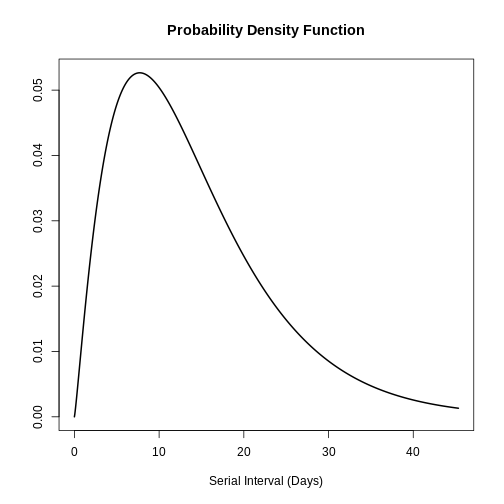

:::::::::::::::::::::::::::::::::::::: questions 

- How to reuse delays stored in the `{epiparameter}` library with my existing analysis pipeline?

::::::::::::::::::::::::::::::::::::::::::::::::

::::::::::::::::::::::::::::::::::::: objectives

- Use distribution functions to continuous and discrete distributions stored as `<epiparameter>` objects.
- Convert a continuous to a discrete distribution with `{epiparameter}`.
- Connect `{epiparameter}` outputs with `{EpiNow2}` inputs.

::::::::::::::::::::::::::::::::::::::::::::::::

::::::::::::::::::::::::::::::::::::: prereq

## Prerequisites

- Complete tutorial [Quantifying transmission](https://epiverse-trace.github.io/tutorials-middle/quantify-transmissibility.html)

This episode requires you to be familiar with:

**Data science** : Basic programming with R.

**Statistics** : Probability distributions.

**Epidemic theory** : Epidemiological parameters, time periods, Effective reproductive number.

:::::::::::::::::::::::::::::::::

## Introduction

<!-- to activate for EpiNow2@dist-interfase

:::::::::::::::::: callout

If we write the `[]` next to the last object create like in `covid_serialint_parameters[]`, within `[]` we can use the 
Tab key <kbd>↹</kbd> 
to use the [code completion feature](https://support.posit.co/hc/en-us/articles/205273297-Code-Completion-in-the-RStudio-IDE) and have a quick access to `covid_serialint_parameters["meanlog"]` and `covid_serialint_parameters["sdlog"]`. We invite you to try this out in code chunks and the R console!

::::::::::::::::::

-->

`{epiparameter}` help us to *choose* one specific set of epidemiological parameters from the literature, instead of copy/pasting them *by hand*:


``` r
covid_serialint <-
  epiparameter::epiparameter_db(
    disease = "covid",
    epi_name = "serial",
    author = "Nishiura",
    single_epiparameter = TRUE
  )
```

Now, we have an epidemiological parameter we can use in our analysis! In the chunk below we replaced one of the **summary statistics** inputs into `EpiNow2::LogNormal()`

```r
generation_time <- 
  EpiNow2::LogNormal(
    mean = covid_serialint$summary_stats$mean, # replaced!
    sd = covid_serialint$summary_stats$sd, # replaced!
    max = 20
  )
```

In this episode, we will use the **distribution functions** that `{epiparameter}` provides to get a maximum value (`max`) for this and any other package downstream in your analysis pipeline!

Let's load the `{epiparameter}` and `{EpiNow2}` package. For `{EpiNow2}`, we'll set 4 cores to be used in parallel computations. We'll use the pipe `%>%`, some `{dplyr}` verbs and `{ggplot2}`, so let's also call to the `{tidyverse}` package:


``` r
library(epiparameter)
library(EpiNow2)
library(tidyverse)

withr::local_options(list(mc.cores = 4))
```

::::::::::::::::::: checklist

### The double-colon

The double-colon `::` in R lets you call a specific function from a package without loading the entire package into the current environment. 

For example, `dplyr::filter(data, condition)` uses `filter()` from the `{dplyr}` package.

This helps us remember package functions and avoid namespace conflicts by explicitly specifying which package's function to use when multiple packages have functions with the same name.

:::::::::::::::::::

## Distribution functions

In R, all the statistical distributions have functions to access the following:

- `density()`: Probability **Density** function (PDF),
- `cdf()`: Cumulative Distribution function (**CDF**),
- `quantile()`: **Quantile** function, and
- `generate()`: **Random** values from the given distribution.

:::::::::::: checklist

### Functions for the Normal distribution

If you need it, read in detail about the [R probability functions for the normal distribution](https://sakai.unc.edu/access/content/group/3d1eb92e-7848-4f55-90c3-7c72a54e7e43/public/docs/lectures/lecture13.htm#probfunc), each of its definitions and identify in which part of a distribution they are located!

)](fig/fig5a-normaldistribution.png)

::::::::::::::::::::

If you look at `?stats::Distributions`, each type of distribution has a unique set of functions. However, `{epiparameter}` gives you the same four functions to access each of the values above for any `<epiparameter>` object you want! 


``` r
# plot this to have a visual reference
plot(covid_serialint, day_range = 0:20)
```


``` r
# the density value at quantile value of 10 (days)
density(covid_serialint, at = 10)
```

``` output
[1] 0.01911607
```

``` r
# the cumulative probability at quantile value of 10 (days)
cdf(covid_serialint, q = 10)
```

``` output
[1] 0.9466605
```

``` r
# the quantile value (day) at a cumulative probability of 60%
quantile(covid_serialint, p = 0.6)
```

``` output
[1] 4.618906
```

``` r
# generate 10 random values (days) given
# the distribution family and its parameters
generate(covid_serialint, times = 10)
```

``` output
 [1] 3.756675 2.353420 2.675375 3.047172 3.611178 4.031858 1.807294 6.278103
 [9] 3.412789 1.792092
```

::::::::: instructor

Access to the reference documentation (Help files) for these functions is accessible with the three double-colon notation: `epiparameter:::`

- `?epiparameter:::density.epiparameter()`
- `?epiparameter:::cdf.epiparameter()`
- `?epiparameter:::quantile.epiparameter()`
- `?epiparameter:::generate.epiparameter()`

::::::::::::::::::

::::::::::::::::::::::::::::::::: challenge

### Window for contact tracing and the serial interval

The **serial interval** is important in the optimisation of contact tracing since it provides a time window for the containment of a disease spread ([Fine, 2003](https://academic.oup.com/aje/article/158/11/1039/162725)). Depending on the serial interval, we can evaluate the need to increase the number of days considered for contact tracing to include more backwards contacts ([Davis et al., 2020](https://assets.publishing.service.gov.uk/media/61e9ab3f8fa8f50597fb3078/S0523_Oxford_-_Backwards_contact_tracing.pdf)).

With the COVID-19 serial interval (`covid_serialint`) calculate:

- How much more of the backward cases could be captured if the contact tracing method considered contacts up to 6 days pre-onset compared to 2 days pre-onset?

::::::::::::::::: hint

In Figure 5 from the [R probability functions for the normal distribution](https://sakai.unc.edu/access/content/group/3d1eb92e-7848-4f55-90c3-7c72a54e7e43/public/docs/lectures/lecture13.htm#probfunc), the shadowed section represents a cumulative probability of `0.997` for the quantile value at `x = 2`.

::::::::::::::::::::::

::::::::::::::::: solution


``` r
plot(covid_serialint)
```


``` r
cdf(covid_serialint, q = 2)
```

``` output
[1] 0.1111729
```

``` r
cdf(covid_serialint, q = 6)
```

``` output
[1] 0.7623645
```

Given the COVID-19 serial interval:

- A contact tracing method considering contacts up to 2 days pre-onset will capture around 11.1% of backward cases.

- If this period is extended to 6 days pre-onset, this could include 76.2% of backward contacts.

::::::::::::::::::::::::::

::::::::::::::::: solution

### What if

If we exchange the question between days and cumulative probability to: 

- When considering secondary cases, how many days following the symptom onset of primary cases can we expect 55% of symptom onset to occur?


``` r
quantile(covid_serialint, p = 0.55)
```

An interpretation could be:

- The 55% percent of the symptom onset of secondary cases will happen after 4.2 days after the symptom onset of primary cases.

::::::::::::::::::::::::::


:::::::::::::::::::::::::::::::::::::::::::


## Discretise a continuous distribution

We are getting closer to the end! `EpiNow2::LogNormal()` still needs a maximum value (`max`). 

One way to do this is to get the quantile value for the distribution's 99th percentile or `0.99` cumulative probability. For this, we need access to the set of distribution functions for our `<epiparameter>` object.

We can use the set of distribution functions for a _continuous_ distribution (as above). However, these values will be _continuous_ numbers. We can **discretise** the continuous distribution stored in our `<epiparameter>` object to get discrete values from a continuous distribution.

When we `epiparameter::discretise()` the continuous distribution we get a **discrete** distribution:


``` r
covid_serialint_discrete <-
  epiparameter::discretise(covid_serialint)

covid_serialint_discrete
```

``` output
Disease: COVID-19
Pathogen: SARS-CoV-2
Epi Parameter: serial interval
Study: Nishiura H, Linton N, Akhmetzhanov A (2020). "Serial interval of novel
coronavirus (COVID-19) infections." _International Journal of
Infectious Diseases_. doi:10.1016/j.ijid.2020.02.060
<https://doi.org/10.1016/j.ijid.2020.02.060>.
Distribution: discrete lnorm (days)
Parameters:
  meanlog: 1.386
  sdlog: 0.568
```

We identify this change in the `Distribution:` output line of the `<epiparameter>` object. Double check this line:

```
Distribution: discrete lnorm
```

While for a **continuous** distribution, we plot the *Probability Density Function (PDF)*, for a **discrete** distribution, we plot the *Probability Mass Function (PMF)*:


``` r
# continuous
plot(covid_serialint)

# discrete
plot(covid_serialint_discrete)
```

To finally get a `max` value, let's access the quantile value of the 99th percentile or `0.99` probability of the distribution with the `prob_dist$q` notation, similarly to how we access the `summary_stats` values.


``` r
covid_serialint_discrete_max <-
  quantile(covid_serialint_discrete, p = 0.99)
```

::::::::::::::::::::::::::::::::: challenge

### Length of quarantine and incubation period

The **incubation period** distribution is a useful delay to assess the length of active monitoring or quarantine ([Lauer et al., 2020](https://www.acpjournals.org/doi/10.7326/M20-0504)). Similarly, delays from symptom onset to recovery (or death) will determine the required duration of health care and case isolation ([Cori et al., 2017](https://royalsocietypublishing.org/doi/10.1098/rstb.2016.0371)).

Calculate:

- Within what exact time frame do 99% of individuals exhibiting COVID-19 symptoms exhibit them after infection?

::::::::::::::::: hint

What delay distribution measures the time between infection and the onset of symptoms?

The probability functions for `<epiparameter>` **discrete** distributions are the same that we used for the *continuous* ones!


``` r
# plot to have a visual reference
plot(covid_serialint_discrete, day_range = 0:20)

# density value at quantile value 10 (day)
density(covid_serialint_discrete, at = 10)

# cumulative probability at quantile value 10 (day)
cdf(covid_serialint_discrete, q = 10)

# In what quantile value (days) do we have the 60% cumulative probability?
quantile(covid_serialint_discrete, p = 0.6)

# generate random values
generate(covid_serialint_discrete, times = 10)
```

::::::::::::::::::::::

::::::::::::::::: solution


``` r
covid_incubation <-
  epiparameter::epiparameter_db(
    disease = "covid",
    epi_name = "incubation",
    single_epiparameter = TRUE
  )
```

``` output
Using Linton N, Kobayashi T, Yang Y, Hayashi K, Akhmetzhanov A, Jung S, Yuan
B, Kinoshita R, Nishiura H (2020). "Incubation Period and Other
Epidemiological Characteristics of 2019 Novel Coronavirus Infections
with Right Truncation: A Statistical Analysis of Publicly Available
Case Data." _Journal of Clinical Medicine_. doi:10.3390/jcm9020538
<https://doi.org/10.3390/jcm9020538>.. 
To retrieve the citation use the 'get_citation' function
```

``` r
covid_incubation_discrete <- epiparameter::discretise(covid_incubation)

quantile(covid_incubation_discrete, p = 0.99)
```

``` output
[1] 19
```

99% of those who develop COVID-19 symptoms will do so within 16 days of infection.

Now, _Is this result expected in epidemiological terms?_

::::::::::::::::::::::::::

::::::::::::::::: solution

### How to create a distribution plot?

From a maximum value with `quantile()`, we can create a sequence of quantile values as a numeric vector and calculate `density()` values for each:


``` r
# create a discrete distribution visualisation
# from a maximum value from the distribution
quantile(covid_serialint_discrete, p = 0.99) %>%
  # generate quantile values
  # as a sequence for each natural number
  seq(1L, to = ., by = 1L) %>%
  # coerce numeric vector to data frame
  as_tibble_col(column_name = "quantile_values") %>%
  mutate(
    # calculate density values
    # for each quantile in the density function
    density_values =
      density(
        x = covid_serialint_discrete,
        at = quantile_values
      )
  ) %>%
  # create plot
  ggplot(
    aes(
      x = quantile_values,
      y = density_values
    )
  ) +
  geom_col()
```


**Remember:** In infections with pre-symptomatic transmission, serial intervals can have negative values ([Nishiura et al., 2020](https://www.ijidonline.com/article/S1201-9712(20)30119-3/fulltext)). When we use the _serial interval_ to approximate the _generation time_ we need to make this distribution with positive values only!

::::::::::::::::::::::::::

:::::::::::::::::::::::::::::::::::::::::::


## Plug-in `{epiparameter}` to `{EpiNow2}`

Now we can plug everything into the `EpiNow2::LogNormal()` function!

- the **summary statistics** `mean` and `sd` of the distribution,
- a maximum value `max`,
- the `distribution` name.

When using `EpiNow2::LogNormal()` to define a **log normal** distribution like the one in the `covid_serialint` object we can specify the mean and sd as parameters. Alternatively, to get the "natural" parameters for a log normal distribution we can convert its summary statistics to distribution parameters named `meanlog` and `sdlog`. With `{epiparameter}` we can directly get the *distribution parameters* using `epiparameter::get_parameters()`:


``` r
covid_serialint_parameters <-
  epiparameter::get_parameters(covid_serialint)
```

Then, we have:


``` r
serial_interval_covid <-
  EpiNow2::LogNormal(
    meanlog = covid_serialint_parameters["meanlog"],
    sdlog = covid_serialint_parameters["sdlog"],
    max = covid_serialint_discrete_max
  )

serial_interval_covid
```

``` output
- lognormal distribution (max: 14):
  meanlog:
    1.4
  sdlog:
    0.57
```

Assuming a COVID-19 scenario, let's use the first 60 days of the `example_confirmed` data set from the `{EpiNow2}` package as `reported_cases` and the recently created `serial_interval_covid` object as inputs to estimate the time-varying reproduction number using `EpiNow2::epinow()`.


``` r
epinow_estimates_cg <- epinow(
  # cases
  data = example_confirmed[1:60],
  # delays
  generation_time = generation_time_opts(serial_interval_covid)
)
```

``` output
WARN [2025-06-17 02:18:16] epinow: There were 1 divergent transitions after warmup. See
https://mc-stan.org/misc/warnings.html#divergent-transitions-after-warmup
to find out why this is a problem and how to eliminate them. - 
WARN [2025-06-17 02:18:16] epinow: Examine the pairs() plot to diagnose sampling problems
 - 
```

``` r
base::plot(epinow_estimates_cg)
```


The `plot()` output includes the estimated cases by date of infection, which are reconstructed from the reported cases and delays.

:::::::::: callout

### Warning

Using the serial interval instead of the generation time is an alternative that can propagate bias in your estimates, even more so in diseases with reported pre-symptomatic transmission. ([Chung Lau et al., 2021](https://academic.oup.com/jid/article/224/10/1664/6356465))

::::::::::::::::::

## Adjusting for reporting delays

Estimating $R_t$ requires data on the daily number of new infections. Due to lags in the development of detectable viral loads, symptom onset, seeking care, and reporting, these numbers are not readily available. All observations reflect transmission events from some time in the past. In other words, if $d$ is the delay from infection to observation, then observations at time $t$ inform $R_{t−d}$, not $R_t$. [(Gostic et al., 2020)](https://journals.plos.org/ploscompbiol/article?id=10.1371/journal.pcbi.1008409#sec007)

](fig/disease-reporting.jpg)

The **delay distribution** could be inferred jointly with the underlying times of infection or estimated as the sum of the [incubation period](../learners/reference.md#incubation) distribution and the distribution of delays from symptom onset to observation from line list data ([reporting delay](../learners/reference.md#reportingdelay)). For `{EpiNow2}`, we can specify these two complementary delay distributions in the `delays` argument.

](fig/rt-adjusting-delays.png)

::::::::::::::::::::::::::::::::: challenge

### Use an incubation period for COVID-19 to estimate Rt

Estimate the time-varying reproduction number for the first 60 days of the `example_confirmed` data set from `{EpiNow2}`. Access to an incubation period for COVID-19 from `{epiparameter}` to use it as a reporting delay.

::::::::::::::::: hint

Use the last `epinow()` calculation using the `delays` argument and the `delay_opts()` helper function.

The `delays` argument and the `delay_opts()` helper function are analogous to the `generation_time` argument and the `generation_time_opts()` helper function.

```r
epinow_estimates <- epinow(
  # cases
  reported_cases = example_confirmed[1:60],
  # delays
  generation_time = generation_time_opts(covid_serial_interval),
  delays = delay_opts(covid_incubation_time)
)
```

::::::::::::::::::::::

::::::::::::::::: solution


``` r
# generation time ---------------------------------------------------------

# get covid serial interval
covid_serialint <-
  epiparameter::epiparameter_db(
    disease = "covid",
    epi_name = "serial",
    author = "Nishiura",
    single_epiparameter = TRUE
  )

# adapt epiparameter to epinow2
covid_serialint_discrete_max <- covid_serialint %>%
  epiparameter::discretise() %>%
  quantile(p = 0.99)

covid_serialint_parameters <-
  epiparameter::get_parameters(covid_serialint)

covid_serial_interval <-
  EpiNow2::LogNormal(
    meanlog = covid_serialint_parameters["meanlog"],
    sdlog = covid_serialint_parameters["sdlog"],
    max = covid_serialint_discrete_max
  )

# incubation time ---------------------------------------------------------

# get covid incubation period
covid_incubation <- epiparameter::epiparameter_db(
  disease = "covid",
  epi_name = "incubation",
  author = "Natalie",
  single_epiparameter = TRUE
)

# adapt epiparameter to epinow2
covid_incubation_discrete_max <- covid_incubation %>%
  epiparameter::discretise() %>%
  quantile(p = 0.99)

covid_incubation_parameters <-
  epiparameter::get_parameters(covid_incubation)

covid_incubation_time <-
  EpiNow2::LogNormal(
    meanlog = covid_incubation_parameters["meanlog"],
    sdlog = covid_incubation_parameters["sdlog"],
    max = covid_incubation_discrete_max
  )

# epinow ------------------------------------------------------------------

# run epinow
epinow_estimates_cgi <- epinow(
  # cases
  data = example_confirmed[1:60],
  # delays
  generation_time = generation_time_opts(covid_serial_interval),
  delays = delay_opts(covid_incubation_time)
)
```

``` output
WARN [2025-06-17 02:19:08] epinow: There were 140 transitions after warmup that exceeded the maximum treedepth. Increase max_treedepth above 12. See
https://mc-stan.org/misc/warnings.html#maximum-treedepth-exceeded - 
WARN [2025-06-17 02:19:08] epinow: There were 1 chains where the estimated Bayesian Fraction of Missing Information was low. See
https://mc-stan.org/misc/warnings.html#bfmi-low - 
WARN [2025-06-17 02:19:08] epinow: Examine the pairs() plot to diagnose sampling problems
 - 
WARN [2025-06-17 02:19:08] epinow: The largest R-hat is NA, indicating chains have not mixed.
Running the chains for more iterations may help. See
https://mc-stan.org/misc/warnings.html#r-hat - 
WARN [2025-06-17 02:19:09] epinow: Bulk Effective Samples Size (ESS) is too low, indicating posterior means and medians may be unreliable.
Running the chains for more iterations may help. See
https://mc-stan.org/misc/warnings.html#bulk-ess - 
WARN [2025-06-17 02:19:11] epinow: Tail Effective Samples Size (ESS) is too low, indicating posterior variances and tail quantiles may be unreliable.
Running the chains for more iterations may help. See
https://mc-stan.org/misc/warnings.html#tail-ess - 
```

``` r
base::plot(epinow_estimates_cgi)
```



Try to complement the `delays` argument with a reporting delay like the `reporting_delay_fixed` object of the previous episode.

::::::::::::::::::::::::::

:::::::::::::::::::::::::::::::::::::::::::

:::::::::::::::::::::::::::::::::::::::::::::::::::::::: discussion

### How much has it changed?

After adding the incubation period, discuss:

- Does the trend of the model fit in the "Estimate" section change?
- Has the uncertainty changed?
- How would you explain or interpret any of these changes?

Compare all the `{EpiNow2}` figures generated previously.

::::::::::::::::::::::::::::::::::::::::::::::::::::::::

## Challenges

:::::::::::::::::::::::::::::: callout

### A code completion tip

If we write the `[]` next to the object `covid_serialint_parameters[]`, within `[]` we can use the 
Tab key <kbd>↹</kbd> 
for [code completion feature](https://support.posit.co/hc/en-us/articles/205273297-Code-Completion-in-the-RStudio-IDE) 

This gives quick access to `covid_serialint_parameters["meanlog"]` and `covid_serialint_parameters["sdlog"]`. 

We invite you to try this out in code chunks and the R console!

::::::::::::::::::::::::::::::

::::::::::::::::::::::::::::::::: challenge

### Ebola's effective reproduction number adjusted by reporting delays 

Download and read the [Ebola dataset](data/ebola_cases.csv):

- Estimate the effective reproduction number using `{EpiNow2}` 
- Adjust the estimate by the available reporting delays in `{epiparameter}`
- Why did you choose that parameter?

::::::::::::::::: hint

To calculate the $R_t$ using `{EpiNow2}`, we need:

- Aggregated incidence `data`, with confirmed cases per day, and
- The `generation` time distribution.
- Optionally, reporting `delays` distributions when available (e.g., incubation period).

To get delay distribution using `{epiparameter}` we can use functions like:

- `epiparameter::epiparameter_db()`
- `epiparameter::parameter_tbl()`
- `discretise()`
- `quantile()` 

::::::::::::::::::::::

::::::::::::::::: solution


``` r
# read data
# e.g.: if path to file is data/raw-data/ebola_cases.csv then:
ebola_confirmed <-
  read_csv(here::here("data", "raw-data", "ebola_cases.csv")) %>%
  incidence2::incidence(
    date_index = "date",
    counts = "confirm",
    count_values_to = "confirm",
    date_names_to = "date",
    complete_dates = TRUE
  ) %>%
  dplyr::select(-count_variable)

# list distributions
epiparameter::epiparameter_db(disease = "ebola") %>%
  epiparameter::parameter_tbl()
```


``` r
# generation time ---------------------------------------------------------

# subset one distribution for the generation time
ebola_serial <- epiparameter::epiparameter_db(
  disease = "ebola",
  epi_name = "serial",
  single_epiparameter = TRUE
)

# adapt epiparameter to epinow2
ebola_serial_discrete <- epiparameter::discretise(ebola_serial)

serial_interval_ebola <-
  EpiNow2::Gamma(
    mean = ebola_serial$summary_stats$mean,
    sd = ebola_serial$summary_stats$sd,
    max = quantile(ebola_serial_discrete, p = 0.99)
  )

# incubation time ---------------------------------------------------------

# subset one distribution for delay of the incubation period
ebola_incubation <- epiparameter::epiparameter_db(
  disease = "ebola",
  epi_name = "incubation",
  single_epiparameter = TRUE
)

# adapt epiparameter to epinow2
ebola_incubation_discrete <- epiparameter::discretise(ebola_incubation)

incubation_period_ebola <-
  EpiNow2::Gamma(
    mean = ebola_incubation$summary_stats$mean,
    sd = ebola_incubation$summary_stats$sd,
    max = quantile(ebola_serial_discrete, p = 0.99)
  )

# epinow ------------------------------------------------------------------

# run epinow
epinow_estimates_egi <- epinow(
  # cases
  data = ebola_confirmed,
  # delays
  generation_time = generation_time_opts(serial_interval_ebola),
  delays = delay_opts(incubation_period_ebola)
)
```

``` output
WARN [2025-06-17 02:19:48] epinow: There were 1 divergent transitions after warmup. See
https://mc-stan.org/misc/warnings.html#divergent-transitions-after-warmup
to find out why this is a problem and how to eliminate them. - 
WARN [2025-06-17 02:19:48] epinow: Examine the pairs() plot to diagnose sampling problems
 - 
```

``` r
plot(epinow_estimates_egi)
```


::::::::::::::::::::::::::

:::::::::::::::::::::::::::::::::::::::::::


::::::::::::::::::::::::::::::::: challenge

### What to do with Weibull distributions?

Use the `influenza_england_1978_school` dataset from the `{outbreaks}` package to calculate the effective reproduction number using `{EpiNow2}` adjusting by the available reporting delays in `{epiparameter}`.

::::::::::::::::: hint

`EpiNow2::NonParametric()` accepts Probability Mass Functions (PMF) from any distribution family. Read the reference guide on [Probability distributions](https://epiforecasts.io/EpiNow2/reference/Distributions.html).

::::::::::::::::::::::

::::::::::::::::: solution


``` r
# What parameters are available for Influenza?
epiparameter::epiparameter_db(disease = "influenza") %>%
  epiparameter::parameter_tbl() %>%
  count(epi_name)
```

``` output
# Parameter table:
# A data frame:    3 × 2
  epi_name              n
  <chr>             <int>
1 generation time       1
2 incubation period    15
3 serial interval       1
```

``` r
# generation time ---------------------------------------------------------

# Read the generation time
influenza_generation <-
  epiparameter::epiparameter_db(
    disease = "influenza",
    epi_name = "generation"
  )

influenza_generation
```

``` output
Disease: Influenza
Pathogen: Influenza-A-H1N1
Epi Parameter: generation time
Study: Lessler J, Reich N, Cummings D, New York City Department of Health and
Mental Hygiene Swine Influenza Investigation Team (2009). "Outbreak of
2009 Pandemic Influenza A (H1N1) at a New York City School." _The New
England Journal of Medicine_. doi:10.1056/NEJMoa0906089
<https://doi.org/10.1056/NEJMoa0906089>.
Distribution: weibull (days)
Parameters:
  shape: 2.360
  scale: 3.180
```

``` r
# EpiNow2 currently accepts Gamma or LogNormal
# other can pass the PMF function

influenza_generation_discrete <-
  epiparameter::discretise(influenza_generation)

influenza_generation_max <-
  quantile(influenza_generation_discrete, p = 0.99)

influenza_generation_pmf <-
  density(
    influenza_generation_discrete,
    at = 0:influenza_generation_max
  )

influenza_generation_pmf
```

``` output
[1] 0.00000000 0.06312336 0.22134988 0.29721220 0.23896828 0.12485164 0.04309454
```

``` r
# EpiNow2::NonParametric() can also accept the PMF values
generation_time_influenza <-
  EpiNow2::NonParametric(
    pmf = influenza_generation_pmf
  )

# incubation period -------------------------------------------------------

# Read the incubation period
influenza_incubation <-
  epiparameter::epiparameter_db(
    disease = "influenza",
    epi_name = "incubation",
    single_epiparameter = TRUE
  )

# Discretize incubation period
influenza_incubation_discrete <-
  epiparameter::discretise(influenza_incubation)

influenza_incubation_max <-
  quantile(influenza_incubation_discrete, p = 0.99)

influenza_incubation_pmf <-
  density(
    influenza_incubation_discrete,
    at = 0:influenza_incubation_max
  )

influenza_incubation_pmf
```

``` output
[1] 0.00000000 0.05749151 0.16687705 0.22443092 0.21507632 0.16104546 0.09746609
[8] 0.04841928
```

``` r
# EpiNow2::NonParametric() can also accept the PMF values
incubation_time_influenza <-
  EpiNow2::NonParametric(
    pmf = influenza_incubation_pmf
  )

# epinow ------------------------------------------------------------------

# Read data
influenza_cleaned <-
  outbreaks::influenza_england_1978_school %>%
  select(date, confirm = in_bed)

# Run epinow()
epinow_estimates_igi <- epinow(
  # cases
  data = influenza_cleaned,
  # delays
  generation_time = generation_time_opts(generation_time_influenza),
  delays = delay_opts(incubation_time_influenza)
)

plot(epinow_estimates_igi)
```


::::::::::::::::::::::::::

:::::::::::::::::::::::::::::::::::::::::::

## Next steps

::::::::::::::::: testimonial

### How to get distribution parameters from statistical distributions?

How to get the mean and standard deviation from a generation time with *only* distribution parameters but no summary statistics like `mean` or `sd` for `EpiNow2::Gamma()` or `EpiNow2::LogNormal()`?

Look at the `{epiparameter}` vignette on [parameter extraction and conversion](https://epiverse-trace.github.io/epiparameter/articles/extract_convert.html) and its [use cases](https://epiverse-trace.github.io/epiparameter/articles/extract_convert.html#use-cases)!

:::::::::::::::::::::::::::::

::::::::::::::::: testimonial

### How to estimate delay distributions for Disease X?

Refer to this excellent tutorial on estimating the serial interval and incubation period of Disease X accounting for *censoring* using Bayesian inference with packages like `{rstan}` and `{coarseDataTools}`.

- Tutorial in English: <https://rpubs.com/tracelac/diseaseX> <!-- to request -->
- Tutorial en Español: <https://epiverse-trace.github.io/epimodelac/EnfermedadX.html>

**Then,** after you get your estimated values, you can manually create your own` <epiparameter>` class objects with `epiparameter::epiparameter()`! Take a look at its [reference guide on "Create an `<epiparameter>` object"](https://epiverse-trace.github.io/epiparameter/reference/epiparameter.html#ref-examples)!

Lastly, take a look at the latest [`{epidist}` R package](https://epidist.epinowcast.org/) which provide methods to address key challenges in estimating distributions, including truncation, interval censoring, and dynamical biases.

:::::::::::::::::::::::::::::


<!--
## Concept map

update it from last epiparameter test 
-->

::::::::::::::::::::::::::::::::::::: keypoints 

- Use distribution functions with `<epiparameter>` objects to get summary statistics and informative parameters for public health interventions like the Window for contact tracing and Length of quarantine.
- Use `discretise()` to convert continuous to discrete delay distributions.
- Use `{epiparameter}` to get reporting delays required in transmissibility estimates. 

::::::::::::::::::::::::::::::::::::::::::::::::

