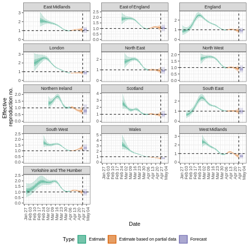

:::::::::::::::::::::::::::::::::::::: questions

- Comment puis-je estimer le nombre de reproduction variable dans le temps ($Rt$) et le taux de croissance à partir d'une série chronologique de données de cas ?
- Comment quantifier l'hétérogénéité géographique à partir de ces paramètres de transmission ?

::::::::::::::::::::::::::::::::::::::::::::::::

::::::::::::::::::::::::::::::::::::: objectives

- Apprenez à estimer les paramètres de transmission à partir d'une série chronologique de données sur les cas à l'aide du package `EpiNow2`.

::::::::::::::::::::::::::::::::::::::::::::::::

::::::::::::::::::::::::::::::::::::: prereq

## Conditions préalables

Les étudiants doivent se familiariser avec les concepts suivants avant de suivre ce tutoriel :

**Statistiques**: distributions de probabilités, principe de l'analyse bayésienne.

**Théorie des épidémies**: Nombre de reproduction effectif.

**Science des données**: la transformation et la visualisation des données. Vous pouvez revoir l'épisode sur [Agréger et visualiser](https://epiverse-trace.github.io/tutorials-early/describe-cases.html) les données d'incidence.

:::::::::::::::::::::::::::::::::

::::::::::::::::::::::::::::::::::::: callout

### Rappel : le nombre de reproduction effectif, $R_t$

Le [nombre de reproduction de base](../learners/reference.md#basic), $R_0$ est le nombre moyen de cas causés par un individu infectieux dans une population entièrement susceptible.

Mais dans une épidémie en cours, la population ne reste pas entièrement susceptible, car les personnes qui se remettent de l'infection sont généralement immunisées. En outre, il peut y avoir des changements de comportement ou d'autres facteurs qui affectent la transmission. Lorsque nous voulons surveiller les changements dans la transmission, nous nous intéressons donc davantage à la valeur du **nombre de reproduction effectif**, $R_t$ qui représente le nombre moyen de cas causés par un individu infectieux dans la population au temps $t$ compte tenu de l'état actuel de la population (y compris les niveaux d'immunité et les mesures de contrôle).

::::::::::::::::::::::::::::::::::::::::::::::::

## Introduction

L'intensité de la transmission d'une épidémie est quantifiée à l'aide de deux paramètres clés : le nombre de reproduction, qui renseigne sur la force de la transmission en indiquant le nombre de nouveaux cas attendus pour chaque cas existant, et le nombre de décès. [taux de croissance](../learners/reference.md#growth) qui renseigne sur la vitesse de transmission en indiquant la rapidité avec laquelle l'épidémie se propage ou décline (temps de doublement/dédoublement) au sein d'une population. Pour plus de détails sur la distinction entre la vitesse et la force de la transmission et les implications pour la lutte, consultez le site [Dushoff \& Park, 2021](https://royalsocietypublishing.org/doi/full/10.1098/rspb.2020.1556).

Pour estimer ces paramètres clés à l'aide des données relatives aux cas, nous devons tenir compte des délais entre les dates d'infections et les dates de cas déclarés. Lors d'une épidémie, les données ne sont généralement disponibles qu'à partir des dates déclarées. Nous devons donc utiliser des méthodes d'estimation pour tenir compte de ces retards lorsque nous essayons de comprendre les changements dans la transmission au fil du temps.

Dans les prochains tutoriels, nous nous concentrerons sur la manière d'utiliser les fonctions de `{EpiNow2}` pour estimer les paramètres de transmission des données de cas. Nous ne couvrirons pas le contexte théorique des modèles ou du cadre d'inférence, pour plus de détails sur ces concepts, consultez la [vignette.](https://epiforecasts.io/EpiNow2/dev/articles/estimate_infections.html).

Dans ce tutoriel, nous allons apprendre à utiliser le package `{EpiNow2}` pour estimer le nombre de reproduction variable dans le temps. Nous obtiendrons les données d'entrée de `{incidence2}`. Nous utiliserons le package `{tidyr}` et `{dplyr}` pour organiser certains de ses résultats, `{ggplot2}` pour visualiser la distribution des cas, et le tuyau `%>%` pour relier certaines de leurs fonctions, alors appelons aussi la fonction `{tidyverse}` package :

```r
library(EpiNow2)
library(incidence2)
library(tidyverse)
```

```{r, echo=FALSE, eval=TRUE, message=FALSE, warning=FALSE}
library(tidyverse)
```

::::::::::::::::::: checklist

### Le double point-virgule

Le double deux-points `::` dans R vous permet d'appeler une fonction spécifique d'un package sans charger l'ensemble du package dans l'environnement actuel.

Par exemple, vous pouvez appeler une fonction spécifique d'un package sans charger le package entier dans l'environnement actuel, `dplyr::filter(data, condition)` utilise `filter()` à partir du package `{dplyr}`.

Cela nous permet de nous souvenir des fonctions du package et d'éviter les conflits d'espace de noms.

:::::::::::::::::::

:::::::::::::::::::::::::::::::::::::::::::::::::::::::::::::::::::: instructor

Ce tutoriel illustre l'utilisation de `epinow()` pour estimer le nombre de reproduction et les durées d'infection variables dans le temps. Les étudiants doivent comprendre les données d'entrée nécessaires au modèle et les limites des résultats du modèle.

::::::::::::::::::::::::::::::::::::::::::::::::::::::::::::::::::::::::::::::::

::::::::::::::::::::::::::::::::::::: callout

### Inférence bayésienne

Le package R `EpiNow2` utilise une méthode d'inférence bayésienne [inférence bayésienne](../learners/reference.md#bayesian) pour estimer les nombres de reproduction et les durées d'infection sur la base des dates déclarées. En d'autres termes, il estime la transmission en fonction de la date à laquelle les personnes ont été effectivement infectées (plutôt que de l'apparition des symptômes), en tenant compte des retards dans les données observées. En revanche, l'approche `{EpiEstim}` permet une estimation en temps réel plus rapide et plus simple du nombre de reproductions en utilisant uniquement les données de cas au fil du temps, reflétant la façon dont la transmission change en fonction du moment où les symptômes apparaissent.

Dans l'inférence bayésienne, nous utilisons les connaissances a priori (distributions a priori) et les données (via une fonction de vraisemblance) pour obtenir la probabilité a posteriori :

$\text{Probabilité a posteriori} \propto \text{vraisemblance} \times \text{probabilité a priori}$

::::::::::::::::::::::::::::::::::::::::::::::::

:::::::::::::::::::::::::::::::::::::::::::::::: instructor

Faites référence à la distribution de probabilité a priori et à la [probabilité a posteriori](https://en.wikipedia.org/wiki/Posterior_probability) a posteriori.

Dans la ["`Expected change in reports`", l'appel](#expected-change-in-daily-cases) par "la probabilité a posteriori que $R_t < 1$"nous nous référons spécifiquement à la [aire sous la courbe de distribution de la probabilité a posteriori](https://www.nature.com/articles/nmeth.3368/figures/1).

::::::::::::::::::::::::::::::::::::::::::::::::

## Distributions de délais et données de cas

### Données de cas

Pour illustrer les fonctions des `EpiNow2` nous utiliserons les données relatives au début de la pandémie de COVID-19 au Royaume-Uni. Les données sont disponibles dans le package R `{incidence2}`.

```{r}
dplyr::as_tibble(incidence2::covidregionaldataUK)
```

Pour utiliser les données, nous devons les formater de manière à ce qu'elles comportent deux colonnes :

- `date` la date (en tant qu'objet date, voir `?is.Date()`),
- `confirm`: nombre de cas déclarés (confirmés) à cette date.

Utilisons `{tidyr}` et `{incidence2}` pour cela :

```{r, warning=FALSE, message=FALSE}
cases <- incidence2::covidregionaldataUK %>%
  # Preprocess missing values
  tidyr::replace_na(base::list(cases_new = 0)) %>%
  # Compute the daily incidence
  incidence2::incidence(
    date_index = "date",
    counts = "cases_new",
    count_values_to = "confirm",
    date_names_to = "date",
    complete_dates = TRUE
  ) %>%
  # Drop column for {EpiNow2} input format
  dplyr::select(-count_variable) %>%
  # Keep the first 90 dates
  dplyr::slice_head(n = 90)

cases
```

Avec `incidence2::incidence()` nous agrégeons des cas sur différentes périodes de temps (*intervalles*, c'est-à-dire des jours, des semaines ou des mois) ou par groupe. Nous pouvons également obtenir les dates complètes pour tous les intervalles de dates par catégorie de groupe à l'aide de la fonction
`complete_dates = TRUE`
Explorez plus tard les [`incidence2::incidence()` manuel de référence](https://www.reconverse.org/incidence2/reference/incidence.html)

::::::::::::::::::::::::: spoiler

### Pouvons-nous reproduire {incidence2} avec {dplyr}?

Nous pouvons obtenir un objet similaire à `cases` à partir de l'objet `incidence2::covidregionaldataUK` à l'aide du package `{dplyr}`.

```{r, warning=FALSE, message=FALSE, eval=FALSE}
incidence2::covidregionaldataUK %>%
  dplyr::select(date, cases_new) %>%
  dplyr::group_by(date) %>%
  dplyr::summarise(confirm = sum(cases_new, na.rm = TRUE)) %>%
  dplyr::ungroup() %>%
  dplyr::slice_head(n = 90)
```

Cependant, `incidence2::incidence()` contient des arguments pratiques comme `complete_dates` qui facilitent l'obtention d'un objet d'incidence avec le même intervalle de dates pour chaque groupe sans nécessiter de lignes de code supplémentaires ou un package de séries temporelles.

:::::::::::::::::::::::::

Dans une situation d'épidémie, il est probable que nous n'ayons accès qu'au début de l'ensemble des données d'entrée. Nous supposons donc que nous ne disposons que des 90 premiers jours de ces données.

```{r, echo=FALSE}
cases %>%
  # use ggplot2
  ggplot(aes(x = date, y = confirm)) +
  geom_col() +
  theme_grey(
    base_size = 15
  )
```

### Distribution des délais

Nous supposons qu'il existe des délais entre le moment de l'infection et le moment où un cas est signalé. Nous spécifions ces délais sous forme de distributions pour tenir compte de l'incertitude des différences au niveau individuel. Le délai peut impliquer plusieurs types de processus. Un délai typique entre le moment de l'infection et la déclaration du cas peut consister en ce qui suit

> **le temps écoulé entre l'infection et l'apparition des symptômes** (le [période d'incubation](../learners/reference.md#incubation)) + **délai entre l'apparition des symptômes et la notification du cas** (délai de déclaration)
> .

La distribution des délais pour chacun de ces processus peut être estimée à partir de données ou obtenue à partir de la littérature. Nous pouvons exprimer l'incertitude quant aux paramètres corrects des distributions en supposant que les distributions ont **fixe** fixes ou qu'elles ont **variables** variables. Pour comprendre la différence entre **fixe** et **variables** considérons la période d'incubation.

::::::::::::::::::::::::::::::::::::: callout

### Délais et données

Le nombre de retards et le type de retard sont des données flexibles qui dépendent des données. Les exemples ci-dessous montrent comment les délais peuvent être spécifiés pour différentes sources de données :

<center>

| Source de données                | Délai (s)                                                                                 | 
| -------------------------------- | ----------------------------------------------------------------------------------------- |
| Heure d'apparition des symptômes | Période d'incubation                                                                      | 
| Date de la déclaration du cas    | Période d'incubation + délai entre l'apparition des symptômes et la notification du cas   | 
| Durée de l'hospitalisation       | Période d'incubation + temps écoulé entre l'apparition des symptômes et l'hospitalisation | 

</center>

::::::::::::::::::::::::::::::::::::::::::::::::

#### Distribution de la période d'incubation

La distribution de la période d'incubation pour de nombreuses maladies peut généralement être obtenue à partir de la littérature. L'ensemble `{epiparameter}` contient une bibliothèque de paramètres épidémiologiques pour différentes maladies, obtenus à partir de la littérature.

Nous spécifions une distribution gamma (fixe) avec moyenne $\mu = 4$ et un écart-type $\sigma = 2$ (forme = $4$, échelle = $1$) en utilisant la fonction `Gamma()` comme suit :

```{r}
incubation_period_fixed <- EpiNow2::Gamma(
  mean = 4,
  sd = 2,
  max = 20
)

incubation_period_fixed
```

L'argument `max` est la valeur maximale que la distribution peut prendre ; dans cet exemple, 20 jours.

::::::::::::::::::::::::::::::::::::: callout

### Pourquoi une distribution gamma ?

La période d'incubation doit être une valeur positive. Nous devons donc spécifier une distribution en `{EpiNow2}` qui ne concerne que les valeurs positives.

`Gamma()` prend en charge les distributions Gamma et `LogNormal()` les distributions log-normales, qui sont des distributions pour les valeurs positives uniquement.

Pour tous les types de retard, nous devrons utiliser des distributions pour les valeurs positives uniquement - nous ne voulons pas inclure les retards de jours négatifs dans notre analyse !

::::::::::::::::::::::::::::::::::::::::::::::::

#### Prise en compte de l'incertitude de la distribution

Pour spécifier une distribution **variable** nous incluons l'incertitude autour de la moyenne $\mu$ et de l'écart-type $\sigma$ de notre distribution gamma. Si notre distribution de la période d'incubation a une moyenne $\mu$ et un écart-type $\sigma$ nous supposons que la moyenne ($\mu$) suit une distribution normale avec un écart type $\sigma_{\mu}$:

$$\mbox{Normal}(\mu,\sigma_{\mu}^2)$$

et un écart-type ($\sigma$) suit une distribution normale avec un écart type $\sigma_{\sigma}$:

$$\mbox{Normal}(\sigma,\sigma_{\sigma}^2).$$

Nous spécifions ceci en utilisant `Normal()` pour chaque argument : la moyenne ($\mu = 4$ avec $\sigma_{\mu} = 0.5$) et l'écart-type ($\sigma = 2$ avec $\sigma_{\sigma} = 0.5$).

```{r, warning=FALSE, message=FALSE}
incubation_period_variable <- EpiNow2::Gamma(
  mean = EpiNow2::Normal(mean = 4, sd = 0.5),
  sd = EpiNow2::Normal(mean = 2, sd = 0.5),
  max = 20
)

incubation_period_variable
```

#### Retards dans l'établissement des rapports

Après la période d'incubation, il s'écoule un délai supplémentaire entre l'apparition des symptômes et la notification du cas : le délai de déclaration. Nous pouvons le spécifier comme une distribution fixe ou variable, ou estimer une distribution à partir de données.

Lorsque vous spécifiez une distribution, il est utile de visualiser la densité de probabilité pour voir le pic et l'étendue de la distribution. Dans cet example, nous allons utiliser une distribution *log normale*.

Si nous voulons supposer que le délai de déclaration moyen est de 2 jours (avec une incertitude de 0,5 jour) et que l'écart type est de 1 jour (avec une incertitude de 0,5 jour), nous pouvons spécifier une distribution variable à l'aide de la commande `LogNormal()` comme précédemment :

```{r, warning=FALSE, message=FALSE}
reporting_delay_variable <- EpiNow2::LogNormal(
  meanlog = EpiNow2::Normal(mean = 2, sd = 0.5),
  sdlog = EpiNow2::Normal(mean = 1, sd = 0.5),
  max = 10
)
```

:::::::::::::::::::::: spoiler

### Visualisez une distribution log-normale en utilisant {epiparameter}

En utilisant `epiparameter::epiparameter()` nous pouvons créer une distribution personnalisée. La distribution normale à logarithme fixe aura l'aspect suivant :

```r
library(epiparameter)
```

```{r, message=FALSE, warning=FALSE}
epiparameter::epiparameter(
  disease = "covid",
  epi_name = "reporting delay",
  prob_distribution =
    epiparameter::create_prob_distribution(
      prob_distribution = "lnorm",
      prob_distribution_params = c(
        meanlog = 2,
        sdlog = 1
      )
    )
) %>%
  plot()
```

::::::::::::::::::::::

Nous pouvons tracer les distributions simples et combinées générées par `{EpiNow2}` en utilisant `plot()`. Combinons dans un même graphique le délai entre l'infection et la déclaration, qui comprend la période d'incubation et le délai de déclaration :

```{r}
plot(incubation_period_variable + reporting_delay_variable)
```

:::::::::::::::::: callout

Si l'on dispose de données sur le délai entre l'apparition des symptômes et la déclaration, on peut utiliser la fonction `estimate_delay()` pour estimer une distribution log-normale à partir d'un vecteur de délais. Le code ci-dessous illustre comment utiliser la fonction `estimate_delay()` avec des données synthétiques sur les délais.

```{r, eval=FALSE}
delay_data <- rlnorm(500, log(5), 1) # synthetic delay data

reporting_delay <- EpiNow2::estimate_delay(
  delay_data,
  samples = 1000,
  bootstraps = 10
)
```

::::::::::::::::::

#### Temps de génération

Nous devons également spécifier une distribution pour le temps de génération. Nous utiliserons ici une distribution log-normale avec une moyenne de 3,6 et un écart-type de 3,1 ([Ganyani et al. 2020](https://doi.org/10.2807/1560-7917.ES.2020.25.17.2000257)).

```{r, warning=FALSE, message=FALSE}
generation_time_variable <- EpiNow2::LogNormal(
  mean = EpiNow2::Normal(mean = 3.6, sd = 0.5),
  sd = EpiNow2::Normal(mean = 3.1, sd = 0.5),
  max = 20
)
```

## Trouver des estimations

La fonction `epinow()` est une "enveloppe" pour la fonction `estimate_infections()` utilisée pour estimer les cas par date d'infection. La distribution du temps de génération et la distribution des délais doivent être transmises à l'aide des fonctions ` generation_time_opts()` et `delay_opts()` respectivement.

Il existe de nombreuses autres entrées qui peuvent être transmises à `epinow()` voir `?EpiNow2::epinow()` pour plus de détails.
Une entrée optionnelle consiste à spécifier un a priori *log-normal* pour le nombre de reproduction effectif $R_t$ au début de l'épidémie. Nous spécifions une moyenne de 2 jours et un écart-type de 2 jours comme arguments de la commande `prior` dans `rt_opts()`:

```{r, eval=TRUE}
# define Rt prior distribution
rt_prior <- EpiNow2::rt_opts(prior = EpiNow2::LogNormal(mean = 2, sd = 2))
```

::::::::::::::::::::::::::::::::::::: callout

### Inférence bayésienne à l'aide de Stan

L'inférence bayésienne est réalisée à l'aide de méthodes MCMC avec le programme [Stan](https://mc-stan.org/). Les fonctions Stan disposent d'un certain nombre d'entrées par défaut, notamment le nombre de chaînes et le nombre d'échantillons par chaîne (voir `?EpiNow2::stan_opts()`).

Pour réduire le temps de calcul, nous pouvons exécuter les chaînes en parallèle. Pour ce faire, nous devons définir le nombre de cœurs à utiliser. Par défaut, 4 chaînes MCMC sont exécutées (voir `stan_opts()$chains`), nous pouvons donc définir un nombre égal de cœurs à utiliser en parallèle comme suit :

```{r, warning=FALSE, message=FALSE}
withr::local_options(base::list(mc.cores = 4))
```

Pour connaître le nombre maximal de cœurs disponibles sur votre machine, utilisez la commande `parallel::detectCores()`.

::::::::::::::::::::::::::::::::::::::::::::::::

::::::::::::::::::::::::: checklist

**Note :** Dans le code ci-dessous `_fixed` les distributions sont utilisées à la place de `_variable` (distributions de retard avec incertitude). Cela permet d'accélérer le temps de calcul. Il est généralement recommandé d'utiliser des distributions variables qui tiennent compte d'une incertitude supplémentaire.

```{r, echo=TRUE}
# fixed alternatives
generation_time_fixed <- EpiNow2::LogNormal(
  mean = 3.6,
  sd = 3.1,
  max = 20
)

reporting_delay_fixed <- EpiNow2::LogNormal(
  mean = 2,
  sd = 1,
  max = 10
)
```

:::::::::::::::::::::::::

Vous êtes maintenant prêt à exécuter `EpiNow2::epinow()` pour estimer le nombre de reproduction variable dans le temps pour les 90 premiers jours :

```{r, message=FALSE, eval=TRUE, echo=TRUE}
estimates <- EpiNow2::epinow(
  # reported cases
  data = cases,
  # delays
  generation_time = EpiNow2::generation_time_opts(generation_time_fixed),
  delays = EpiNow2::delay_opts(incubation_period_fixed + reporting_delay_fixed),
  # prior
  rt = rt_prior
)
```

<!-- ``{r, message = FALSE,warning=FALSE, eval = TRUE, echo=FALSE} -->

<!-- estimates <- EpiNow2::epinow( -->

<!-- # cas rapportés -->

<!-- données = cas, -->

<!-- # retards -->

<!-- generation_time = EpiNow2::generation_time_opts(generation_time_fixed), -->

<!-- delays = EpiNow2::delay_opts(incubation_period_fixed + reporting_delay_fixed), -->

<!-- # prior -->

<!-- rt = rt_prior, -->

<!-- stan = EpiNow2::stan_opts(method = "vb") -->

<!-- ) -->

<!-- ``` -->

::::::::::::::::::::::::::::::::: callout

### N'attendez pas que cela se poursuive

Pour les besoins de ce tutoriel, nous pouvons optionnellement utiliser `EpiNow2::stan_opts()` pour réduire le temps de calcul. Nous pouvons spécifier un nombre fixe de `samples = 1000` et `chains = 2` aux `stan` l'argument de la `EpiNow2::epinow()` de la fonction. Cette opération devrait prendre environ 3 minutes.

<Nous pouvons optionnellement définir `stan = stan_opts(method = "vb")` pour utiliser une méthode d'échantillonnage approximative. Cela devrait prendre moins d'une minute. -->

```r
# you can add the `stan` argument
EpiNow2::epinow(
  ...,
  stan = EpiNow2::stan_opts(samples = 1000, chains = 3)
)
```

**Rappelez-vous :** En utilisant un nombre approprié d' *échantillons* et de *chaînes* est cruciale pour garantir la convergence et obtenir des estimations fiables dans les calculs bayésiens utilisant Stan. L'obtention de résultats plus précis se fait au détriment de la vitesse.

:::::::::::::::::::::::::::::::::

### Résultats

Nous pouvons extraire et visualiser des estimations du nombre de reproductions effectives au fil du temps :

```{r}
estimates$plots$R
```

L'incertitude des estimations augmente avec le temps. Cela s'explique par le fait que les estimations sont fondées sur des données antérieures, c'est-à-dire sur les périodes de retard. Cette différence d'incertitude est classée dans les catégories suivantes **Estimation** (vert) utilise toutes les données et **Estimation basée sur des données partielles** (orange) des estimations basées sur moins de données (parce que les infections qui se sont produites à l'époque sont plus susceptibles de ne pas avoir encore été observées) et qui ont donc des intervalles de plus en plus larges vers la date du dernier point de données. Enfin, les **Prévision** (violet) est une projection dans le temps.

Nous pouvons également visualiser l'estimation du taux de croissance dans le temps :

```{r}
estimates$plots$growth_rate
```

Pour extraire un résumé des principaux paramètres de transmission à dernière date* dans les données :

```{r}
summary(estimates)
```

Ces estimations étant basées sur des données partielles, elles présentent un large intervalle d'incertitude.

- Le résumé de notre analyse montre que le changement attendu dans les déclarations est de `r summary(estimates)$estimate[summary(estimates)$measure=="Expected change in reports"]` avec l'estimation des nouvelles infections `r summary(estimates)$estimate[summary(estimates)$measure=="New infections per day"]`.

- Le nombre effectif de reproduction $R_t$ (à la dernière date des données) est de `r summary(estimates)$estimate[summary(estimates)$measure=="Effective reproduction no."]`.

- Le taux de croissance exponentiel du nombre de cas est de `r summary(estimates)$estimate[summary(estimates)$measure=="Rate of growth"]`.

- Le temps de doublement (le temps nécessaire pour que le nombre de cas double) est de `r summary(estimates)$estimate[summary(estimates)$measure=="Doubling/halving time (days)"]`.

::::::::::::::::::::::::::::::::::::: callout

### `Expected change in reports`

Un facteur décrivant l'évolution attendue des déclarations sur la base de la probabilité a posteriori que $R_t < 1$.

<center>
| Probabilité ($p$) | Changement attendu ($p$)
| ------------- |-------------|
|p < 0.05$ |Augmentation |p < 0.05$ |Augmentation
| 0,05$ \leq p< 0,4$ |Augmentation probable |
| 0,4$ \leq p< 0,6$ |Stable |
| 0,6$ \leq p < 0,95$ |Vraisemblablement décroissante |
| 0,95$ \leq p \leq 1$ |Décroissante |
</center>

::::::::::::::::::::::::::::::::::::::::::::::::

::::::::::::::::::::::::: callout

### Intervalles crédibles

En tout `{EpiNow2}` les régions ombrées reflètent les intervalles de crédibilité de 90 %, 50 % et 20 %, du plus clair au plus foncé.

::::::::::::::::::::::::::

::::::::::: checklist

`EpiNow2` peut être utilisé pour estimer les paramètres de transmission à partir des données relatives aux cas, à tout moment de l'évolution d'une épidémie. La fiabilité de ces estimations dépend de la qualité des données et du choix approprié des distributions de délais. Dans le prochain tutoriel, nous apprendrons à faire des prévisions et nous étudierons certaines des options d'inférence supplémentaires disponibles dans le logiciel `EpiNow2`.

:::::::::::

## Défi

::::::::::::::::::: challenge

**Quantifier l'hétérogénéité géographique**

Les données relatives au début de la pandémie de COVID-19 au Royaume-Uni proviennent du package R `{incidence2}` comprennent la région dans laquelle les cas ont été enregistrés. Pour obtenir des estimations régionales du nombre effectif de reproductions et de cas, nous devons formater les données de manière à ce qu'elles comportent trois colonnes :

- `date` la date,
- `region`: la région,
- `confirm` le nombre de déclarations de maladies (confirmées) pour une région à une date donnée.

Générer des estimations régionales de Rt à partir des `incidence2::covidregionaldataUK` à partir de la base de données :

- utiliser `{incidence2}` pour convertir les données agrégées en données d'incidence par la variable `region`,
- conserver les 90 premières dates pour toutes les régions,
- estimer le Rt par région en utilisant le temps de génération défini et les retards dans cet épisode.

```{r}
regional_cases <- incidence2::covidregionaldataUK %>%
  # use {tidyr} to preprocess missing values
  tidyr::replace_na(base::list(cases_new = 0))
```

::::::::: hint

Pour manipuler les données, vous pouvez

```{r}
regional_cases <- incidence2::covidregionaldataUK %>%
  # use {tidyr} to preprocess missing values
  tidyr::replace_na(base::list(cases_new = 0)) %>%
  # use {incidence2} to convert aggregated data to incidence data
  incidence2::incidence(
    date_index = "date",
    groups = "region",
    counts = "cases_new",
    count_values_to = "confirm",
    date_names_to = "date",
    complete_dates = TRUE
  ) %>%
  dplyr::select(-count_variable) %>%
  dplyr::filter(date < ymd(20200301))
```

Pour apprendre à faire l'estimation régionale de Rt, lisez la section de la vignette "Get started" sur `regional_epinow()` à l'adresse <https://epiforecasts.io/EpiNow2/articles/EpiNow2.html#regional_epinow>

:::::::::

:::::::::::: solution

Pour obtenir des estimations régionales, nous utilisons les mêmes arguments de `epinow()` dans la fonction `regional_epinow()`:

```{r, message=FALSE, eval=FALSE}
estimates_regional <- EpiNow2::regional_epinow(
  # cases
  data = regional_cases,
  # delays
  generation_time = EpiNow2::generation_time_opts(generation_time_fixed),
  delays = EpiNow2::delay_opts(incubation_period_fixed + reporting_delay_fixed),
  # prior
  rt = rt_prior
)
```

Visualisez les résultats avec :

```{r, message=FALSE, eval=FALSE}
estimates_regional$summary$summarised_results$table

estimates_regional$summary$plots$R
```



::::::::::::

:::::::::::::::::::

<!-- ::::::::::::::::::::::::: : testimonial -->

<!-- ### le package i2extras -->

<!-- ::::::::::::::::::::::::: : -->

::::::::::::::::::::::::::::::::::::: keypoints

- Les paramètres de transmission peuvent être estimés à partir des données du cas après prise en compte des retards.
- L'incertitude peut être prise en compte dans la distribution des retards.

::::::::::::::::::::::::::::::::::::::::::::::::

