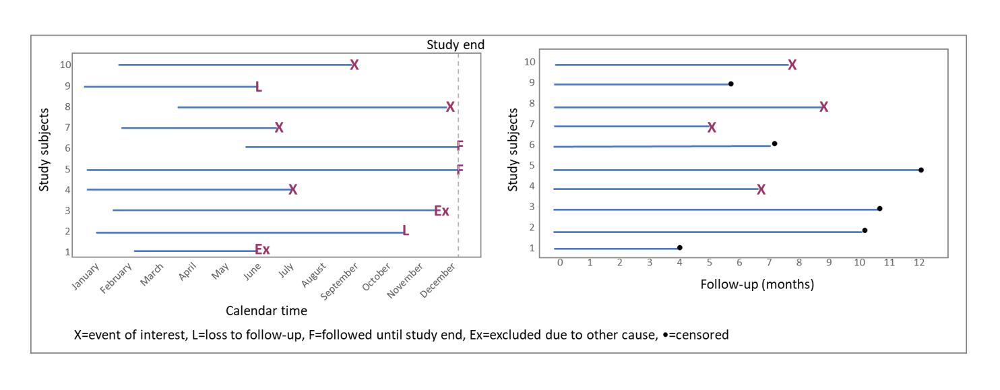
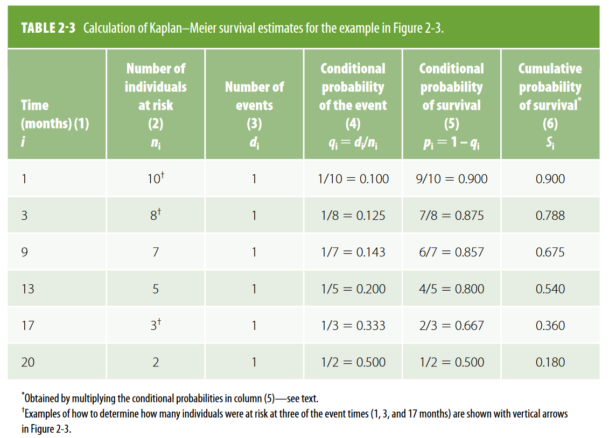
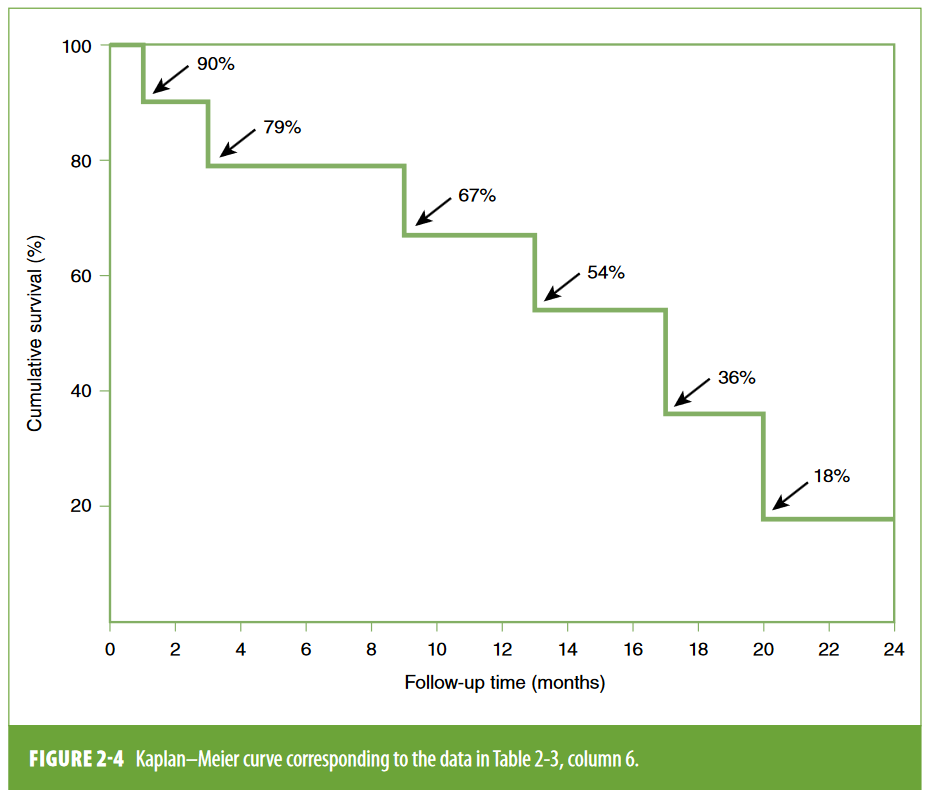

:::::::::::::::::::::::::::::::::::::: questions 

- How to estimate the Case Fatality Ratio (CFR)?

- Why to adjust a CFR with a delay distribution?

- How does the CFR adjusting method works?

::::::::::::::::::::::::::::::::::::::::::::::::

::::::::::::::::::::::::::::::::::::: objectives

- Estimate the CFR from aggregated case data using `{cfr}`.

- Estimate a delay-adjusted CFR using `{epiparamater}` and `{cfr}`.

- Estimate severity measurements like IFR or HFR using `{cfr}`.

::::::::::::::::::::::::::::::::::::::::::::::::

::::::::::::::::::::::::::::::::::::: prereq

## Prerequisites

- `{epiparameter}`

:::::::::::::::::::::::::::::::::

## Introduction

What is the likely public health impact of the outbreak? Is this being or going to be a public health problem? These are common questions at the early stage of an epidemic.

The clinical severity is one of the key measurements to estimate the pandemic potential ([Fraser et al., 2009](https://www.science.org/doi/full/10.1126/science.1176062)) useful for planning scenarios ([CDC, 2016](https://www.cdc.gov/flu/pandemic-resources/national-strategy/severity-assessment-framework-508.html))

).](fig/cfr-hhs-scenarios-psaf.png){alt='The horizontal axis is the scaled measure of clinical severity, ranging from 1 to 7, where 1 is low, 4 is moderate, and 7 is very severe. The vertical axis is the scaled measure of transmissibility, ranging from 1 to 5, where 1 is low, 3 is moderate, and 5 is highly transmissible. On the graph, HHS pandemic planning scenarios are labeled across four quadrants (A, B, C and D). From left to right, the scenarios are “seasonal range,” “moderate pandemic,” “severe pandemic” and “very severe pandemic.” As clinical severity increases along the horizontal axis, or as transmissibility increases along the vertical axis, the severity of the pandemic planning scenario also increases.'}

One measure of severity is the case fatality ratio or CFR. This is defined as the ratio of deaths from an infectious disease to the number of cases. However, calculating this directly from the cumulative number of deaths to cases during the course of an epidemic tends to result in a biased CFR ([Nishiura et al., 2009](https://journals.plos.org/plosone/article?id=10.1371/journal.pone.0006852)).

In this tutorial we are going to learn how to use `{cfr}` to correct a CFR estimation using an appropriate [delay distribution](../learners/reference.md#delaydist) from `{epiparameter}` or elsewhere. Also, this will show how it works in the inside next to the theory behind it, and how we can reuse its functions for other severity measurements. 

We’ll use the pipe `%>%` to connect some of their functions, so let’s also call to the `{tidyverse}` package:

```{r,message=FALSE,warning=FALSE}
library(cfr)
library(epiparameter)
library(tidyverse)
```

## Naive CFR

Disease severity is measured in terms of case fatality ratio ($cfr$) --total number of deaths $D$ divided by total number of cases $C$. We can refer to the naive cfr as $nCFR$:

$$ nCFR =  \frac{D}{C}. $$

![At the top of the pyramid, those meeting the WHO case criteria for severe or critical cases are likely to be identified in the hospital setting, presenting with atypical viral pneumonia. These cases will have been identified in mainland China and among those categorised internationally as local transmission. Many more cases are likely to be symptomatic (ie, with fever, cough, or myalgia), but might not require hospitalisation. These cases will have been identified through links to international travel to high-risk areas and through contact-tracing of contacts of confirmed cases. They might also be identified through population surveillance of, for example, influenza-like illness. The bottom part of the pyramid represents mild (and possibly asymptomatic) cases. These cases might be identified through contact tracing and subsequently via serological testing ([Verity et al., 2020](https://www.thelancet.com/journals/laninf/article/PIIS1473-3099(20)30243-7/fulltext)).](fig/cfr-spectrum-cases-covid19.jpg)

To calculate this, the `cfr` package requires a data frame with three columns,`date`, `cases`, and `deaths`, giving the daily number of reported cases and deaths. The below code chuck creates such data frame from the simulated Ebola dataset.

```{r}
# Load the Ebola 1976 data provided with the package
data("ebola1976")

# view top data
ebola1976 %>% as_tibble()
```

The `cfr_static()`

```{r}
# Calculate the static CFR without correcting for delays ----
cfr_static(data = ebola1976)
```

:::::::::::::::::::: challenge

Load the `ebola_kikwit_1995` from `{outbreaks}` and estimate the naive CFR using the appropriate distribution delay

```{r}
library(outbreaks)

outbreaks::ebola_kikwit_1995 %>% glimpse()

outbreaks::ebola_kikwit_1995 %>% 
  rename("cases" = onset,
         "deaths" = death) %>% 
  cfr::cfr_static()
```

::::::::::::::::::::


## Bias due to delayed reporting

During an ongoing epidemic, there is a delay between the time someone dies and the time their death is reported. Therefore, at any moment in time, the list of cases includes people who will die and whose death has not yet occurred, or has occurred but not yet been reported. 

This delays generates censored observations. Censoring occurs when we don’t know the exact time-to-event for an included observation. Right-censoring refers when we know that the time-to-event is greater than a certain value.

| Date | April 2| April 9| April 16| April 23| April 30| May 7| May 14 |
|:--------------|:-------|:-------|:-------|:-------|:-------|:-------|:-------|
| No. of cases | 925| 1,201| 1,367| 1,489| 1,547| 1,582| 1,607 |
| % of observations censored| 85.9| 81.2| 71.5| 51.6| 35.1| 25.2| 17.3 |

Table: Summary of the number of cases and the degree of censoring at different time points for the epidemic of severe acute respiratory syndrome in Hong Kong, 2003.

::::::::::::::: callout

### Does this sound to survival analysis?

in a prospective epidemiological research, 
we need to estimate the hazard ratio of an event within a set of included observations. 
given studies time and budget, it is expected to have censored observations, and calculate the ratios accounting for right-censored observations



During an ongoing outbreak, we can have the same events that generate censored observations at the day of the analysis. 

given how data is collected, it is possible to unintentionally exclude observations given their time-to-event, with respect to the time of analysis. this needs to be taken into account for the estimation of the case fatality ratio to avoid underestimations.


also have included the data observation into the dataset, but will not be able to see the event (dead or recovery) given that time takes more time in average than the moment we decided to analyze the data. in this situation we have right censored observations

:::::::::::::::

Actually, several methods have been used before, including Kaplan-Meier, to adjust naive CFR estimates.

![a) Estimates of the case fatality ratio and 95 percent confidence intervals over the course of the epidemic of severe acute respiratory syndrome in Hong Kong in 2003. Black square, case fatality ratio eventually observed for patients admitted to the hospital by the time denoted on the x-axis; black diamond, first simple estimate (deaths/cases); black triangle, second simple estimate (deaths/(deaths + recovered)); white square, adapted Kaplan-Meier (KM) method; black dotted line, range obtained from the adapted KM method; white circle, gamma mixture model. ([Ghani et al., 2005](https://academic.oup.com/aje/article/162/5/479/82647?login=false#620743))](fig/cfr-m_amjepidkwi230f03_lw-top_a.jpeg)

If we adapt a Kaplan-Meier method for an epidemic showing 1 minus the estimated survivorship function for the time from hospital admission to death (bottom line) and the estimated survivorship function for the time from hospital admission to recovery (top line). When the epidemic is complete, these two curves meet. Before this time, they do not meet, and the case fatality ratio is estimated on the basis of the past pattern of deaths/recovery (dotted line). ([Ghani et al., 2005](https://academic.oup.com/aje/article/162/5/479/82647?login=false#620743))

)](fig/cfr-m_amjepidkwi230f03_lw-top_b.jpeg)

:::::::::::::: spoiler

### Kaplan Meier reminder

If we remember how a kaplan meier curve is build





::::::::::::::

Another way to see this is...[find figure description]

)](fig/cfr-pntd.0003846.g001.png)

Thus dividing the cumulative number of reported deaths by the cumulative number of reported cases at any moment will underestimate the true CFR. 

The key determinants of the magnitude of the bias are the epidemic growth rate and the distribution of delays from case-reporting to death-reporting; the longer the delays and the faster the growth rate, the greater the bias. Heuristically, the underestimation will be proportionate to the expansion of the epidemic during the delay between the time a case enters the database to the time the death of that case enters the database (if it occurs) ([Lipsitch et al., 2015](https://journals.plos.org/plosntds/article?id=10.1371/journal.pntd.0003846))


## Estimate a delay-adjusted CFR

Given that censored data is generated by the delay distribution between onset and death, a preliminary step is to estimate the delay distribution between onset and death of the disease. 

For this task we can reuse delays from systematic reviews like `{epiparameter}`

```{r, message=FALSE, warning=FALSE}
# Get delay distribution 
onset_to_death_ebola <- epiparameter::epidist_db(
  disease = "Ebola",
  epi_dist = "onset_to_death",
  single_epidist = TRUE)

onset_to_death_ebola
```

Now, we use  `cfr_static()` to calculate overall disease severity with the `delay_density` argument. When using an `<epidist>` class object we can use this expression as a template `function(x) density(<EPIDIST_OBJECT>, x)`:

```{r}
# Calculate the static CFR while correcting for delays
cfr_static(
  data = ebola1976,
  delay_density = function(x) density(onset_to_death_ebola, x)
)
```

This analysis indicated that the overall disease severity is, roughly, between $49\%$ and $51\%$. The function can also calculate unbiased $cfr$ if distribution of delays between cases being reported and knowing their outcome (death or recovery), which can be obtained from `epiparameter` package, is provided.

This analysis indicated that the overall disease severity is between $49\%$ and $53\%$, slightly higher than the static one.

:::::::::::::::::::: challenge

Load the `ebola_kikwit_1995` from `{outbreaks}` and estimate the corrected CFR using the appropriate distribution delay

- find the approapriate epiparameter!

- compare with the previous solution!

```{r}
library(outbreaks)

outbreaks::ebola_kikwit_1995 %>% glimpse()

outbreaks::ebola_kikwit_1995 %>% 
  rename("cases" = onset,
         "deaths" = death) %>% 
  cfr::cfr_static()
```

::::::::::::::::::::


:::::::::::::::::::: discussion

what would you do if your distribution is not in epiparameter?

briefly review the methods in `{cfr}` vignette on [A primer on working with delay distributions](https://epiverse-trace.github.io/cfr/articles/delay_distributions.html)

what approach would you prefer to do?

::::::::::::::::::::

<!-- retake here!  -->

However, this is a naive, biased estimates value for the true $cfr$; because it does not account for the delay between case being reported and knowing its outcome. 

cases = recovered + death + unknown status

right-censoring refers to the unknown status

[1] one way to solve this was removing the unknown status (suggesting in Ghani)


- time static

- right-censoring bias


> During the outbreak of severe acute respiratory syndrome (SARS) in 2002–03, it was shown that this estimator, bt, considerably underestimates the cCFR [8]. This is easily demonstrated by relating Ct and Dt to the incidence function ct (i.e. the number of new confirmed cases on day t), and the conditional probability density function fs of the time from onset to death, given death. ([Nishiura et al. 2009](https://journals.plos.org/plosone/article?id=10.1371/journal.pone.0006852#s2))

```{r}
# show nishiura example, if possible
```


## Method: Adjusted CFR

[2] other method scale the number of cases in the denominator

ct = daily incidence *
ft = proportion of cases with delay between onset and death
ut = underestimation of known outcomes

ut is used to *scale* the value of the cumulative number of cases in the denominator, when calculating cfr

cfr = deaths / (cases * ut)

- what do we need to estimate it?

```{r, message=FALSE, warning=FALSE}
# Get delay distribution 
onset_to_death_ebola <- epiparameter::epidist_db(
  disease = "Ebola",
  epi_dist = "onset_to_death",
  single_epidist = TRUE)

onset_to_death_ebola
```


```{r}
cfr::estimate_outcomes(
  data = ebola1976, 
  delay_density = function(x) density(onset_to_death_ebola, x)
)
```

As you 

## Method: Censoring or Delays?

The delay adjustment can be adjusted by censoring

```{r}
epiparameter::epidist_db(
  epi_dist = "onset_to_death",
  # disease = "COVID-19"
  ) %>% 
  list_distributions()

onset_to_death <- 
  epiparameter::epidist_db(
  disease = "Marburg",
  epi_dist = "onset_to_death",
  single_epidist = TRUE)

onset_to_death$method_assess
```


for early stage of epidemic, by delays instead of censoring

Ghani

[Ghani et al., 2005](https://academic.oup.com/aje/article/162/5/479/82647)


```{r}
# methods
```

- naive CFR vs adjusted CFR

### limitation

> Our unbiased estimation of the cCFR does not address all sources of error in data (e.g. underdiagnosis of infected individuals) and we summarize the relevant issues in the discussion. 

### Use any distribution

For a distributions refresher

<https://github.com/epiverse-trace/tutorials/blob/md-outputs-PR-104/read-delays.md#functions-for-the-normal-distribution>

To use any distribution, refer to vignette

- distirbutional
- distcrete
- epiparameter

<https://epiverse-trace.github.io/cfr/articles/delay_distributions.html>

::::::::::::::::::::::: callout

### Should we remove unknown outcomes from the linelist?

- linelist vs incidence estimation

Refer to: <https://github.com/epiverse-trace/cfr/issues/79>

```{r}
# show if possible
```

:::::::::::::::::::::::

### why to use discrete distributions over continuous distributions

From <https://epiverse-trace.github.io/cfr/articles/delay_distributions.html>
> Note that discretised distributions are the more appropriate choice to be passed to cfr_*(), as we are usually working with daily case and death data. We do use continuous distributions in many examples as we do not expect this difference to bias the estimates excessively.

## Severity heterogeneity

From <https://royalsocietypublishing.org/doi/10.1098/rstb.2016.0371>

> The CFR may differ across populations (e.g. age, space, treatment); quantifying these heterogeneities can help target resources appropriately and compare different care regimens. 


### Assessment: estimate CFR by age group

```{r}
#find data
```

## Rolling CFR


- cumulative sum

```{r}
# last rolling equal to the static estimate
cfr_static(
  data = ebola1976,
  delay_density = function(x) dgamma(x, shape = 2.40, scale = 3.33)
)
```


Also,  severity of a disease can change over time. The `cfr` package provides functions to estimate biased and unbiased (by considering the delays), static, and time-varying $cfr$s. 

```{r}
# Calculate the rolling daily CFR while correcting for delays --------------------
rolling_cfr_corrected <- cfr::cfr_rolling(
  data = ebola1976,
  delay_density = function(x) density(onset_to_death_ebola, x)
)

tail(rolling_cfr_corrected)
```

```{r}
rolling_cfr_corrected$method <- "corrected"

# visualise both corrected and uncorrected rolling estimates
ggplot(rolling_cfr_corrected) +
  geom_ribbon(
    aes(
      date,
      ymin = severity_low, ymax = severity_high,
      fill = method
    ),
    alpha = 0.2, show.legend = FALSE
  ) +
  geom_line(
    aes(date, severity_mean, colour = method)
  )
```


### assessment: explain the bias

```{r}
# Calculate the CFR without correcting for delays on each day of the outbreak ----
rolling_cfr_naive <- cfr_rolling(
  data = ebola1976
)

tail(rolling_cfr_naive)

rolling_cfr_naive$method <- "naive"

# combine the data for plotting
data_cfr <- bind_rows(
  rolling_cfr_naive,
  rolling_cfr_corrected
)

# visualise both corrected and uncorrected rolling estimates
ggplot(data_cfr) +
  geom_ribbon(
    aes(
      date,
      ymin = severity_low, ymax = severity_high,
      fill = method
    ),
    alpha = 0.2, show.legend = FALSE
  ) +
  geom_line(
    aes(date, severity_mean, colour = method)
  )

```

![a) Estimates of the case fatality ratio and 95 percent confidence intervals over the course of the epidemic of severe acute respiratory syndrome in Hong Kong in 2003. Black square, case fatality ratio eventually observed for patients admitted to the hospital by the time denoted on the x-axis; black diamond, first simple estimate (deaths/cases); black triangle, second simple estimate (deaths/(deaths + recovered)); white square, adapted Kaplan-Meier (KM) method; black dotted line, range obtained from the adapted KM method; white circle, gamma mixture model. ([Ghani et al., 2005](https://academic.oup.com/aje/article/162/5/479/82647?login=false#620743))](fig/cfr-m_amjepidkwi230f03_lw-top_a.jpeg)


### estimate HFR

hfr
daily incidence * proportion of cases with delay between hospitalization and death

- hospitalization fatality ratio

HFR in figure
<https://www.nature.com/articles/s41467-020-19238-2>

- look for parameters from epiparameter

```{r}
library(epiparameter)

epidist_db() %>% 
  list_distributions() %>% 
  count(epi_distribution)

epidist_db(epi_dist = "onset to death") %>% 
  list_distributions()

epidist_db(
  epi_dist = "hospitalisation to death") %>% 
  list_distributions()
```

::::::::::::::::: callout

### How to rearrange my input data?

Rearranging the input data can take the most of the time while doing a data analysis.

If you are using aggregated case data, we encourage you to use `{incidence2}`! Refer to the `{cfr}` vignette on [Handling data from `{incidence2}`](https://epiverse-trace.github.io/cfr/articles/data_from_incidence2.html)

:::::::::::::::::

::::::::::::::::: challenge

After looking to the vignette.

- What is the function?

- Load the `fluH7N9_china_2013` from `{outbreaks}` and estimate the naive and corrected CFR using the appropriate distribution delay

```{r,eval=FALSE}
# to-do
# find any other source similar to covid_uk data
# aggregated case data 
# ideally stratified by regions or any other category
# if not, rearrange those inputs

library(outbreaks)

outbreaks::influenza_england_1978_school %>% glimpse()

ebola_kikwit_incidence <- 
  outbreaks::fluH7N9_china_2013 %>% 
  incidence2::incidence(
    date_index = "date",
    counts = c("count","death")
  )

cfr::prepare_data(
  data = ebola_kikwit_incidence,
  cases_variable = "onset",
  deaths_variable = "death"
)
```

:::::::::::::::::


## Recommendations

- when the degree of censoring is high (greater than 60 percent), as was true very early in the epidemic, it is more appropriate to present a range rather than a single point estimate.

::::::::::::::::::::::::::::::::::::: keypoints 

- Use `{cfr}` to estimate severity

::::::::::::::::::::::::::::::::::::::::::::::::

