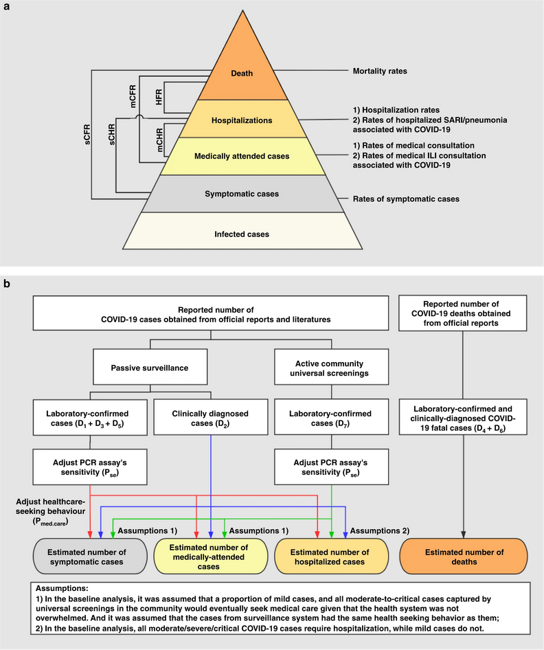
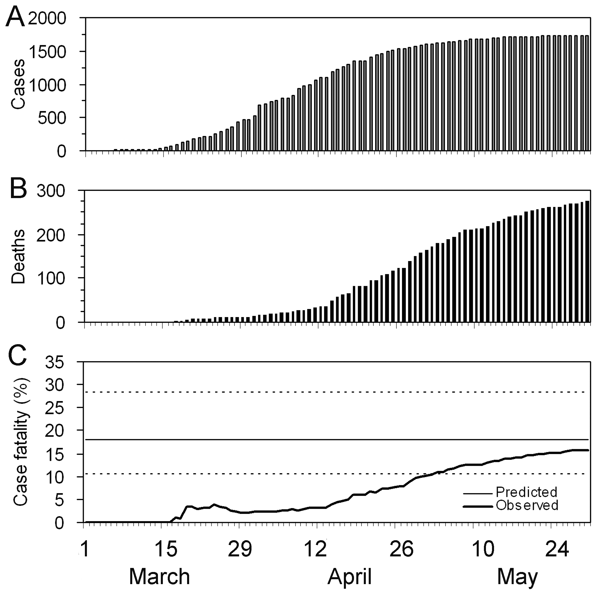

:::::::::::::::::::::::::::::::::::::: questions 

- How to estimate the Case Fatality Ratio (CFR)?

- Why to adjust a CFR with a delay distribution?

- How does the CFR adjusting method works?

::::::::::::::::::::::::::::::::::::::::::::::::

::::::::::::::::::::::::::::::::::::: objectives

- Estimate the CFR from aggregated case data using `{cfr}`.

- Estimate a delay-adjusted CFR using `{epiparameter}` and `{cfr}`.

- Estimate severity measurements like IFR or HFR using `{cfr}`.

::::::::::::::::::::::::::::::::::::::::::::::::

::::::::::::::::::::::::::::::::::::: prereq

## Prerequisites

<!-- fill following the epikit pillars -->
- `{epiparameter}`

:::::::::::::::::::::::::::::::::

## Introduction

Common questions at the early stage of an epidemic include:

- What is the likely public health impact of the outbreak? 
- Is this being or going to be a public health problem?
- whether the virus has the potential to cause a devastating pandemic?

The pandemic potential of an epidemic is assessed with two critical measurements: the transmissibility and the clinical severity. ([Fraser et al., 2009](https://www.science.org/doi/full/10.1126/science.1176062), [CDC, 2016](https://www.cdc.gov/flu/pandemic-resources/national-strategy/severity-assessment-framework-508.html))

).](fig/cfr-hhs-scenarios-psaf.png){alt='The horizontal axis is the scaled measure of clinical severity, ranging from 1 to 7, where 1 is low, 4 is moderate, and 7 is very severe. The vertical axis is the scaled measure of transmissibility, ranging from 1 to 5, where 1 is low, 3 is moderate, and 5 is highly transmissible. On the graph, HHS pandemic planning scenarios are labeled across four quadrants (A, B, C and D). From left to right, the scenarios are “seasonal range,” “moderate pandemic,” “severe pandemic” and “very severe pandemic.” As clinical severity increases along the horizontal axis, or as transmissibility increases along the vertical axis, the severity of the pandemic planning scenario also increases.'}

One epidemiological approach to estimate the clinical severity is to quantify the Case Fatality Ratio or CFR. The CFR is defined as the ratio of deaths from an infectious disease to the number of confirmed diagnosed cases. However, calculating this directly from the cumulative number of deaths to cases during the course of an epidemic tends to result in a biased CFR given the time-delay from onset to death, varying substantially as the epidemic progresses only stabilizing at the later stages of the outbreak ([Ghani et al., 2005](https://academic.oup.com/aje/article/162/5/479/82647?login=false#620743)).

![Observed biased confirmed case fatality ratio (cCFR) estimates as a function of time (thick line) calculated as the ratio of the cumulative number of confirmed cases to deaths at time t. The estimate at the end of an outbreak (i.e. 302/1755 = 17.2 %) is the realized cCFR by the end of the epidemic. The horizontal continuous line and dotted lines show the expected value and the 95% confidence intervals (95% CI) of the predicted unbiased cCFR estimate (based on Nishiura et al., 2009) only by using the observed data until 27 Mar 2003 (estimated at 18.1 % (95% CI: 10.5, 28.1).](fig/cfr-pone.0006852.g003-fig_c.png)

In this tutorial we are going to learn how to use the `{cfr}` package to calculate and adjust a CFR estimation using [delay distributions](../learners/reference.md#delaydist) from `{epiparameter}` or elsewhere, based on the methods developed by [Nishiura et al., 2009](https://journals.plos.org/plosone/article?id=10.1371/journal.pone.0006852). Also, this will show how it works in the inside and how we can reuse its functions for other severity measurements. 

We’ll use the pipe `%>%` to connect some of their functions, so let’s also call to the `{tidyverse}` package:

```{r,message=FALSE,warning=FALSE}
library(cfr)
library(epiparameter)
library(tidyverse)
```

## Naive CFR

Disease severity is measured in terms of case fatality ratio (CFR) --which is given by the ratio of the cumulative number of deaths $D_{t}$ to the cumulative number of confirmed cases $C_{t}$. We can refer to the _naive CFR_ (also crude or biased $b_{t}$):

$$ b_{t} =  \frac{D_{t}}{C_{t}} $$

<!-- total number of deaths $D$ divided by total number of confirmed cases $C$ -->

:::::::::::::: callout

### What are data sources to estimate CFR?

[Verity et al., 2020](https://www.thelancet.com/journals/laninf/article/PIIS1473-3099(20)30243-7/fulltext) summaries the spectrum of COVID-19 cases.


- At the top of the pyramid, those meeting the WHO case criteria for **severe** or critical cases are likely to be identified in the hospital setting, presenting with atypical viral pneumonia. These cases will have been identified in mainland China and among those categorised internationally as local transmission. 
- Many more cases are likely to be **symptomatic** (ie, with fever, cough, or myalgia), but might not require hospitalisation. These cases will have been identified through links to international travel to high-risk areas and through contact-tracing of contacts of confirmed cases. They might also be identified through population surveillance of, for example, influenza-like illness. 
- The bottom part of the pyramid represents **mild** (and possibly **asymptomatic**) cases. These cases might be identified through contact tracing and subsequently via serological testing.

<!-- 
alternative figure 
https://www.nature.com/articles/s41467-020-19238-2/figures/1



(a) Severity levels of infections with SARS-CoV-2 and parameters of interest. Each level is assumed to be a subset of the level below. 

- sCFR symptomatic case-fatality risk, 
- sCHR symptomatic case-hospitalization risk, 
- mCFR medically attended case-fatality risk, 
- mCHR medically attended case-hospitalization risk, 
- HFR hospitalization-fatality risk. 

(b) Schematic diagram of the baseline analyses. 

Red, blue, and green arrows separately denote the data flow from laboratory-confirmed cases of passive surveillance, clinically-diagnosed cases, and laboratory-confirmed cases of active screenings.

Data source of COVID-19 cases in Wuhan: D1) 32,583 laboratory-confirmed COVID-19 cases as of March 84, D2) 17,365 clinically-diagnosed COVID-19 cases during February 9–194, D3)daily number of laboratory-confirmed cases on March 9–April 243, D4) total number of COVID-19 deaths as of April 24 obtained from the Hubei Health Commission3, D5) 325 laboratory-confirmed cases and D6) 1290 deaths were added as of April 16 through a comprehensive and systematic verification by Wuhan Authorities3, and D7) 16,781 laboratory-confirmed cases identified through universal screening10,11. Pse: RT-PCR sensitivity12. Pmed.care: proportion of seeking medical assistance among patients suffering from acute respiratory infections13.

-->

::::::::::::::

To calculate the naive CFR, the `cfr` package requires a data frame with three columns named:

- `date`
- `cases`
- `deaths`

:::::::::::::::::: callout

### We need daily data

These should give the **daily** number of reported cases and deaths. 

We emphasize **daily** because this needs to show all the observations for all the days in the time frame of your analysis, even if the amount of observations is zero or missing values.

Also, this currently only works for **daily** data, not weekly data.

<!-- suggest ways to deal with raw input weekly data -->
<!-- https://github.com/epiverse-trace/cfr/issues/117 -->

::::::::::::::::::

Let's explore the `ebola1976` dataset, which comes from the first Ebola outbreak in Zaire in 1976 as analysed in Camacho et al. (2014).

```{r}
# Load the Ebola 1976 data provided with the package
data("ebola1976")

# view top data
ebola1976 %>% as_tibble()
```

When we use `cfr_static()` to `data` only, we calculate the naive CFR:

```{r}
# Calculate the static CFR without adjusting for delays
cfr_static(data = ebola1976)
```

:::::::::::::::::::::::::::::::::::::::: challenge

Load the `ebola_kikwit_1995` from the `{outbreaks}` package and estimate the naive CFR.

:::::::::::::::::::: hint

Inspect the format of the data input.

- Does it contains daily data?
- Does the column names are as required by `cfr_static()`?
- How would you rename column names from a data frame?

::::::::::::::::::::

:::::::::::::::::::: solution

We can use `dplyr::rename()` to adapt the external data to fit the data input for `cfr_static()`.

```{r}
library(outbreaks)

outbreaks::ebola_kikwit_1995 %>% 
  glimpse()

outbreaks::ebola_kikwit_1995 %>% 
  dplyr::rename(
    "cases" = onset,
    "deaths" = death
  ) %>% 
  cfr::cfr_static()
```

::::::::::::::::::::

::::::::::::::::::::::::::::::::::::::::

## Biases that affect CFR estimation

[Lipsitch et al., 2015](https://journals.plos.org/plosntds/article?id=10.1371/journal.pntd.0003846) describe two potential biases that can affect the estimation of CFR (and its potential solutions):

### Preferential ascertainment of severe cases

For diseases that have a _spectrum_ of clinical presentation, those cases that come to the attention of public health authorities and are entered into surveillance databases, will typically be people with the most severe symptoms, who seek medical care, are admitted to hospital, or die. 

Therefore, the CFR will typically be higher among _detected cases_ than among the entire population of cases, given that the latter may include individuals with mild, subclinical, and (under some definitions of “case”) asymptomatic presentations.

### Bias due to delayed reporting of death

During an _ongoing_ epidemic, there is a delay between the time someone dies and the time their death is reported. Therefore, at any moment in time, the list of cases includes people who will die and whose death has not yet occurred, or has occurred but not yet been reported. Thus dividing the cumulative number of reported deaths by the cumulative number of reported cases at any moment will underestimate the true CFR. 

The key determinants of the magnitude of the bias are the epidemic _growth rate_ and the _distribution of delays_ from case-reporting to death-reporting; the longer the delays and the faster the growth rate, the greater the bias.

:::::::::::::::::::: testimonial

Improving an _early_ epidemiological assessment of an unbiased cCFR is crucial for the initial determination of virulence, shaping the level and choices of public health intervention, and providing advice to the general public. 

In 2009, during the swine-flu virus, Influenza A (H1N1), Mexico had an early biased estimation of the CFR. Initial reports from the government of Mexico suggested a virulent infection, whereas in other countries the same virus was perceived as mild ([TIME, 2009](https://content.time.com/time/health/article/0,8599,1894534,00.html)). 

In the USA and Canada there were no deaths attributed to the virus in the first 10 days following a declaration of a public health emergency by the World Health Organization. Even under similar circumstances at the early stage of the global pandemic, public health officials, policy makers and the general public want to know the virulence of an emerging infectious agent. 

[Fraser et al., 2009](https://www.science.org/doi/full/10.1126/science.1176062) reinterpreted the data assessing the biases and getting a clinical severity lower than the 1918 influenza pandemic but comparable with that seen in the 1957 pandemic.

::::::::::::::::::::

:::::::::::::::::::: discussion

Based on your experience:

- Share any previous outbreak you participated in its response.

Answer to these questions:

- Do you think it may suffered of any of these biases?
- What did you do to solve the bias?
- What complementary analysis would you do to solve the bias?

:::::::::::::::::::: 

## Delay-adjusted CFR

[Nishiura et al., 2009](https://journals.plos.org/plosone/article?id=10.1371/journal.pone.0006852) developed a method that takes into account the time delay from the onset of symptoms to death. This method differs from other published statistical methods employing censoring techniques like [Ghani et al., 2005](https://academic.oup.com/aje/article/162/5/479/82647?login=false#620743).

<!-- should we show the censoring-based methods? -->

Real-time outbreaks may have a number of deaths insufficient to determine the distribution of time between onset to death. Therefore, we can estimate the _distribution delay_ from historical outbreaks or reuse the ones available in systematic reviews from repositories like `{epiparameter}` or `{epireview}`.

Let's use `{epiparameter}`:

```{r, message=FALSE, warning=FALSE}
# Get delay distribution 
onset_to_death_ebola <- 
  epiparameter::epidist_db(
    disease = "Ebola",
    epi_dist = "onset_to_death",
    single_epidist = TRUE
  )

onset_to_death_ebola
```

To calculate the delay-adjusted CFR, we can use the `cfr_static()` function with the `data` and `delay_density` arguments. 

```{r}
# Calculate the static CFR while adjusting for delays
cfr_static(
  data = ebola1976,
  delay_density = function(x) density(onset_to_death_ebola, x)
)
```

:::::::::::::::::: callout

### Use the `<epidist>` class

When using an `<epidist>` class object we can use this expression as a template `function(x) density(<EPIDIST_OBJECT>, x)`

For your own distribution functions, we suggest you to use: 

- Create an `<epidist>` class object to plug into other R packages of the outbreak analytics pipeline. Read the [reference documentation of `epiparameter::epidist()`](https://epiverse-trace.github.io/epiparameter/reference/epidist.html).

- Read `{cfr}` vignette for [a primer on working with delay distributions](https://epiverse-trace.github.io/cfr/articles/delay_distributions.html).

BTW, What approach would you prefer to apply?

::::::::::::::::::

```{r,echo=FALSE}
out_delay_adjusted <- 
  cfr_static(
    data = ebola1976,
    delay_density = function(x) density(onset_to_death_ebola, x)
  )

out_mean <- out_delay_adjusted %>% pull(severity_mean)
out_low <- out_delay_adjusted %>% pull(severity_low)
out_high <- out_delay_adjusted %>% pull(severity_high)
```

The delay-adjusted CFR indicated that the overall disease severity _at end of the outbreak_ or with the _latest data available at the moment_ is `r out_mean` with a 95% confidence interval between `r out_low` and `r out_high`, slightly higher than the naive one.

:::::::::::::::::::::::::::::::::::::::: challenge

Load the `ebola_kikwit_1995` from `{outbreaks}` and estimate the delay-adjusted CFR using the appropriate distribution delay. Then:

- Compare the naive and the delay-adjusted CFR solutions!

:::::::::::::::::::: hint

- Find the appropriate `<epidist>` object!

::::::::::::::::::::

:::::::::::::::::::: solution

```{r}
library(outbreaks)

outbreaks::ebola_kikwit_1995 %>% glimpse()

outbreaks::ebola_kikwit_1995 %>% 
  rename("cases" = onset,
         "deaths" = death) %>% 
  cfr::cfr_static(
    delay_density = function(x) density(onset_to_death_ebola, x)
  )
```

::::::::::::::::::::

::::::::::::::::::::::::::::::::::::::::


## Early-stage unbiased CFR

We just found that the difference between the _naive_ and _delay-adjusted_ CFR estimates using `cfr_static()` are _just slightly_ different. So, what is the main difference?!

With [Nishiura et al., 2009](https://journals.plos.org/plosone/article?id=10.1371/journal.pone.0006852) we can use a method for assessing the virulence of an emerging infectious disease at the **early stage** of an epidemic. Particularly useful when an _epidemic curve of confirmed cases_ is the only data available (i.e. when individual data from onset to death are not available, especially, during the early stage of the epidemic).

The main benefit of using the method from  is to reduce the time to get an _unbiased CFR_

In the figure bellow, Figures A and B show the cumulative numbers of cases and deaths of SARS, and Figure C the observed (biased) CFR estimates as a function of time, i.e. the ratio of the cumulative number of cases to deaths at time $t$. Due to the delay from onset of symptoms to death, the biased estimate of CFR at time $t$ underestimates the realized CFR at the end of an outbreak (i.e. 302/1755 = 17.2 %). 



Nevertheless, even by only using the observed data for the period 19 March to 2 April, the method in `{cfr}` can yield an appropriate prediction (Figure D), e.g. the unbiased CFR at 27 Mar is 18.1 % (95% CI: 10.5, 28.1). An overestimation is seen in the very early stages of the epidemic, but the 95% confidence limits in the later stages include the realized CFR (i.e. 17.2 %).


We can explore this behavior by using the `cfr_rolling()` function. With `tail()` we show that the latest CFR estimates are equal to the `cfr_static()` outputs: 

```{r}
# Calculate the rolling daily naive CFR
rolling_cfr_naive <- cfr::cfr_rolling(data = ebola1976)

tail(rolling_cfr_naive)
```

```{r}
# Calculate the rolling daily delay-adjusted CFR
rolling_cfr_adjusted <- cfr::cfr_rolling(
  data = ebola1976,
  delay_density = function(x) density(onset_to_death_ebola, x)
)

tail(rolling_cfr_adjusted)
```

Now let's visualize how the naive and delay-adjusted CFR estimates perform in real-time:

```{r}

# get the latest delay-adjusted CFR
rolling_cfr_adjusted_end <- 
  rolling_cfr_adjusted %>% 
  dplyr::slice_tail()

# bind by rows both output data frames
bind_rows(
  rolling_cfr_naive %>%
    mutate(method = "naive"),
  rolling_cfr_adjusted %>% 
    mutate(method = "adjusted")
) %>% 
  # visualise both adjusted and unadjusted rolling estimates
  ggplot() +
  geom_ribbon(
    aes(
      date,
      ymin = severity_low, 
      ymax = severity_high,
      fill = method
    ),
    alpha = 0.2, show.legend = FALSE
  ) +
  geom_line(
    aes(date, severity_mean, colour = method)
  ) +
  geom_hline(data = rolling_cfr_adjusted_end,
             aes(yintercept = severity_mean)) +
  geom_hline(data = rolling_cfr_adjusted_end,
             aes(yintercept = severity_low),lty = 2) +
  geom_hline(data = rolling_cfr_adjusted_end,
             aes(yintercept = severity_high),lty = 2)
```

Horizontal line represents the delay-adjusted CFR estimated at the end of the outbreak. The dotted-line represents the 95% confidence intervals (95% CI) of that estimate.

:::::::::::::::::::::::::::::::::::::::::::: challenge

### Interpret the early-stage CFR estimate

Based in the figure above:

- How much difference in days are between the date in which the 95% CI of the estimated _delay-adjusted CFR_ vs _naive CFR_ cross the with the CFR estimated at the end of the outbreak?

:::::::::::::::::::::: hint

We can use either visual inspection or be analyzing the output data frames.

::::::::::::::::::::::

:::::::::::::::::::::: solution

There is almost one month of difference.

Note that at the beginning of the time series, there is a huge uncertainty of the estimate. After two weeks the delay-adjusted CFR starts to approach to the overall CFR estimate at the end of the outbreak.

<!--  
evaluate to share sth from this discussion in solution

[Nishiura et al., 2009](https://doi.org/10.1371/journal.pone.0006852.g003) discuss that it is striking to see that the biased cCFR during the very early stage (i.e. from late April to mid-May) showed a declining trend following a single spike. The biased cCFR estimates at later time points show a slight increase as a function of time, which is consistent with our knowledge of underestimation of the cCFR [8]. The early spike may be explained by a time-varying coverage of confirmed diagnoses which could have increased as a function of time (i.e. cases in the very beginning of the epidemic were less likely to be confirmed). Other plausible explanations include (1) demographic stochasticity, (2) effective treatment, and (3) heterogeneous risk of death among subpopulations. As for (1), because the number of deaths in the USA and Canada was very small during the early stage, the spike may reflect (unpredictable) probabilistic variations in the number of deaths among a small number of confirmed cases. If that is the case, our unbiased cCFR estimate for the USA (with data until May 1) may be too high, not because of a systematic bias but just by chance. In relation to factor (2), it is plausible that cases diagnosed in later stages of the epidemic receive treatment at an early stage of illness (or even before symptom onset). With respect to (3), the risk of dying is likely to be different for different subpopulations [8], [10], [22], [23]. It should be noted that the composition of sub-populations (e.g. age-groups and those with a specific underlying disease) is likely to vary as a function of time, and a cCFR estimate for the entire population, such as ours, is influenced by this variation.
-->

::::::::::::::::::::::


::::::::::::::::::::::::::::::::::::::::::::

:::::::::::::::::::::: checklist

By following [Nishiura et al., 2009](https://doi.org/10.1371/journal.pone.0006852.g003), with `{cfr}` we estimate the CFR as the proportion of deaths among **confirmed** cases. 

This is to fit the aim to use the minimally available data, and so we are not able to estimate:

- the proportion of deaths among all symptomatic cases, and 
- the proportion of deaths among all those infected (symptomatic and asymptomatic). 

By only using **confirmed** cases, it is clear that all cases will be missed that do not seek medical treatment or are not notified, as well as all cases that are asymptomatic. 

This means that the CFR estimate is higher than the proportion of deaths among infected.

::::::::::::::::::::::

## The underlying method

To adjust the CFR, Nishiura et al., 2009 use the case and death incidence data to estimate the number of cases with known outcomes:

$$
  u_t = \dfrac{\sum_{i = 0}^t
        \sum_{j = 0}^\infty c_{i - j} f_{j}}{\sum_{i = 0} c_i},
$$

where $c_{t}$ is the daily case incidence at time, $t$, $f_{t}$ is the value of the probability mass function of the delay distribution between onset and death. $u_{t}$ represents the underestimation of the known outcomes and is used to **scale** the value of the cumulative number of cases in the denominator in the calculation of the CFR. 

The numerator for $u_{t}$ is represented in `estimated_outcomes`, while $u_{t}$ in `u_t`:

```{r}
ut_outcomes <- 
  cfr::estimate_outcomes(
    data = ebola1976, 
    delay_density = function(x) density(onset_to_death_ebola, x)
  ) %>% 
  slice_tail()

ut_outcomes
```

The estimator for CFR can be written as: 

$$p_{t} = b_{t} / u_{t}$$

where $p_{t}$ is the realized proportion of confirmed cases to die from the infection (or the unbiased CFR), and $b_{t}$, the crude and biased estimate of CFR (also naive CFR).

```{r}
ebola1976 %>% 
  reframe(
    date_max = max(date),
    cases_cumsum = cumsum(cases),
    deaths_cumsum = cumsum(deaths)
    ) %>% 
  slice_tail() %>% 
  mutate(b_t = deaths_cumsum/cases_cumsum) %>% 
  mutate(p_t = b_t/(ut_outcomes %>% pull(u_t)))
```


In `cfr_static()` and `cfr_rolling()`, $u_{t}$ is used in a likelihood function to estimate the severity:

```{r}
cfr::cfr_rolling(
  data = ebola1976, 
  delay_density = function(x) density(onset_to_death_ebola, x)
) %>% 
  slice_tail()
```

:::::::::::::::::::::::::: checklist

### Limitations

- The delay-adjusted CFR does not address all sources of error in data like the underdiagnosis of infected individuals.

::::::::::::::::::::::::::

## More severity measures

For less severe emerging pathogens, the case definition typically only encompasses a small fraction of all infected individuals, and hence the infection fatality rate (i.e. the proportion of infected individuals who die, rather than the proportion of cases who die—as per the case definition, which may not be equivalent to infection) may be a more useful measure of severity [Nicoll et al., 2012](https://www.eurosurveillance.org/content/10.2807/ese.17.18.20162-en?crawler=true).

If for a Case fatality risk (CFR) we require: 
  - case and death incidence data, with a 
  - case-to-death delay distribution (or close approximation, such as symptom onset-to-death).

Then, the Infection fatality risk (IFR) requires: 
  - infection and death incidence data, with an 
  - exposure-to-death delay distribution (or close approximation).

:::::::::::::::::::::::::::: callout

### Data sources for more severity measures

Similarly, for the Hospitalisation Fatality Risk (HFR) we require: 
  - hospitalisation and death incidence data, and a
  - hospitalization-to-death delay distribution.

[Yang et al., 2020](https://www.nature.com/articles/s41467-020-19238-2) summarises different definitions and data sources:


- sCFR symptomatic case-fatality risk, 
- sCHR symptomatic case-hospitalization risk, 
- mCFR medically attended case-fatality risk, 
- mCHR medically attended case-hospitalization risk, 
- HFR hospitalization-fatality risk. 

{alt='Data source of COVID-19 cases in Wuhan: D1) 32,583 laboratory-confirmed COVID-19 cases as of March 84, D2) 17,365 clinically-diagnosed COVID-19 cases during February 9–194, D3)daily number of laboratory-confirmed cases on March 9–April 243, D4) total number of COVID-19 deaths as of April 24 obtained from the Hubei Health Commission3, D5) 325 laboratory-confirmed cases and D6) 1290 deaths were added as of April 16 through a comprehensive and systematic verification by Wuhan Authorities3, and D7) 16,781 laboratory-confirmed cases identified through universal screening10,11. Pse: RT-PCR sensitivity12. Pmed.care: proportion of seeking medical assistance among patients suffering from acute respiratory infections13.'}

Red, blue, and green arrows separately denote the data flow from laboratory-confirmed cases of passive surveillance, clinically-diagnosed cases, and laboratory-confirmed cases of active screenings.

::::::::::::::::::::::::::::

:::::::::::::::::::::::::::::::::: challenge

### Hospitalisation Fatality Risk (HFR)

After looking to the vignette.

- What is the function?

- Load the `fluH7N9_china_2013` from `{outbreaks}` and estimate the naive and adjusted CFR using the appropriate distribution delay

::::::::::::::::: hint

Use `{epiparameter}` to find the required delay distribution.

```{r,eval=FALSE}
epiparameter::epidist_db(
  epi_dist = "hospitalisation to death"
) %>% 
  list_distributions()
```

:::::::::::::::::

::::::::::::::::: solution

```{r,eval=FALSE}
# to-do
# find any other source similar to covid_uk data
# aggregated case data 
# ideally stratified by regions or any other category
# if not, rearrange those inputs

library(outbreaks)

outbreaks::influenza_england_1978_school %>% glimpse()

outbreaks::influenza_england_1978_school %>% 
  dplyr::rename(
    "cases" = in_bed,
    "deaths" = convalescent
  ) %>% 
  cfr::cfr_static()
```


:::::::::::::::::

::::::::::::::::::::::::::::::::::


::::::::::::::::: callout

### How to rearrange my input data?

Rearranging the input data can take the most of the time while doing a data analysis.

If you are using _aggregated case data_, we encourage you to use `{incidence2}`! Refer to the `{cfr}` vignette on [Handling data from `{incidence2}`](https://epiverse-trace.github.io/cfr/articles/data_from_incidence2.html)

:::::::::::::::::


:::::::::::::::::::::::::::::::::::::::::::::::::: challenge

### Severity heterogeneity

The CFR may differ across populations (e.g. age, space, treatment); quantifying these heterogeneities can help target resources appropriately and compare different care regimens ([Cori et al., 2017](https://royalsocietypublishing.org/doi/10.1098/rstb.2016.0371)). 

Use the `incidence2::covidregionaldataUK` dataframe to estimate an stratified delay-adjusted CFR

```{r}
incidence2::covidregionaldataUK %>% glimpse()
```

::::::::::::::::::::::::: hint

- Read the `{cfr}` vignette on [Handling data from `{incidence2}`](https://epiverse-trace.github.io/cfr/articles/data_from_incidence2.html)

- Look for delay distributions from `{epiparameter}`

```{r,eval=FALSE}
epiparameter::epidist_db(
  epi_dist = "onset to death"
) %>% 
  list_distributions()
```

:::::::::::::::::::::::::

::::::::::::::::::::::::: solution

```{r}
covid_data_incidence <- 
  incidence2::covidregionaldataUK %>% 
  incidence2::incidence(
    date_index = "date",
    counts = c("cases_total","deaths_total"),
    groups = "region"
  )

covid_data_incidence

covid_data_prepared <- 
  cfr::prepare_data(
    data = covid_data_incidence,
    cases_variable = "cases_total",
    deaths_variable = "deaths_total",
    fill_NA = TRUE
  )

covid_data_prepared %>% glimpse()

covid_data_prepared %>% 
  group_by(region) %>% 
  nest() %>% 
  # map(.f = cfr_static) %>% # fix this
  identity()
```


:::::::::::::::::::::::::

::::::::::::::::::::::::::::::::::::::::::::::::::


::::::::::::::::::::::::::::::::::::: keypoints 

- Use `{cfr}` to estimate severity

- Use `cfr_static()` to estimate the overall CFR with the latest data available.

- Use `cfr_rolling()` to show what the estimated CFR would be on each day of the outbreak.

- Use the `delay_density` argument to adjust the CFR by the corresponding delay distribution.

::::::::::::::::::::::::::::::::::::::::::::::::

