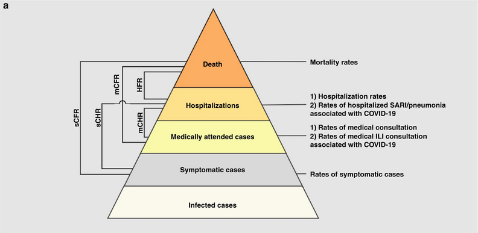
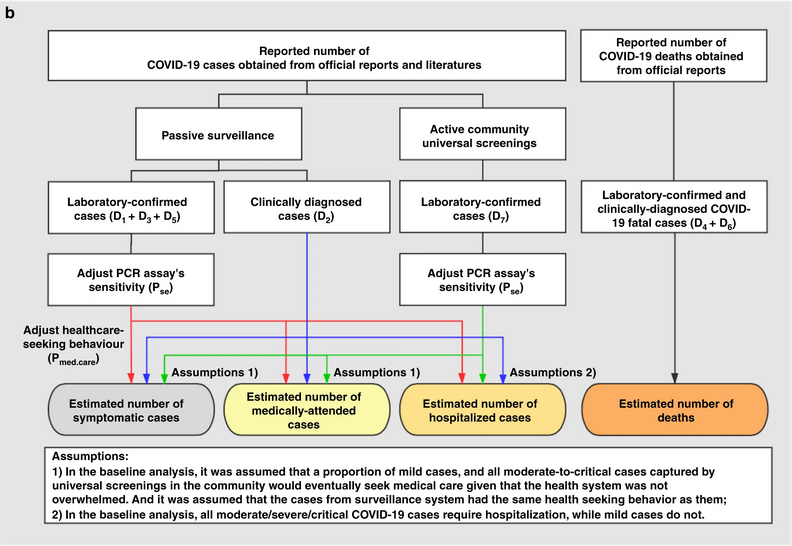

:::::::::::::::::::::::::::::::::::::: questions 

- Why do we estimate the clinical severity of an epidemic?

- How can the Case Fatality Risk (CFR) be estimated early in an ongoing epidemic?

- How do we estimate other severity measurements from different data sources?

::::::::::::::::::::::::::::::::::::::::::::::::

::::::::::::::::::::::::::::::::::::: objectives

- Estimate the CFR from aggregated case data using `{cfr}`.

- Estimate a delay-adjusted CFR using `{epiparameter}` and `{cfr}`.

- Estimate severity measurements like the Hospitalization Fatality Risk (HFR) using `{cfr}`.

::::::::::::::::::::::::::::::::::::::::::::::::

::::::::::::::::::::::::::::::::::::: prereq

## Prerequisites

This episode requires you to be familiar with:

**Data science** : Basic programming with R.

**Epidemic theory** : [Delay distributions](../learners/reference.md#delaydist).

:::::::::::::::::::::::::::::::::

## Introduction

Common questions at the early stage of an epidemic include:

- What is the likely public health impact of the outbreak in terms of clinical severity? 
- What are the most severely affected groups?
- Does the outbreak have the potential to cause a very severe pandemic?

We can assess the pandemic potential of an epidemic with two critical measurements: the transmissibility and the clinical severity. ([Fraser et al., 2009](https://www.science.org/doi/full/10.1126/science.1176062), [CDC, 2016](https://www.cdc.gov/flu/pandemic-resources/national-strategy/severity-assessment-framework-508.html))

).](fig/cfr-hhs-scenarios-psaf.png){alt='The horizontal axis is the scaled measure of clinical severity, ranging from 1 to 7, where 1 is low, 4 is moderate, and 7 is very severe. The vertical axis is the scaled measure of transmissibility, ranging from 1 to 5, where 1 is low, 3 is moderate, and 5 is highly transmissible. On the graph, HHS pandemic planning scenarios are labeled across four quadrants (A, B, C and D). From left to right, the scenarios are “seasonal range,” “moderate pandemic,” “severe pandemic” and “very severe pandemic.” As clinical severity increases along the horizontal axis, or as transmissibility increases along the vertical axis, the severity of the pandemic planning scenario also increases.'}

One epidemiological approach to estimating the clinical severity is quantifying the Case Fatality Risk or CFR. CFR is the conditional probability of death given confirmed diagnosis, calculated as the cumulative number deaths from an infectious disease over the number of confirmed diagnosed cases. However, calculating this directly during the course of an epidemic tends to result in a naive or biased CFR given the time [delay](../learners/reference.md#delaydist) from onset to death, varying substantially as the epidemic progresses and stabilising at the later stages of the outbreak ([Ghani et al., 2005](https://academic.oup.com/aje/article/162/5/479/82647?login=false#620743)).

![Observed biased confirmed case fatality risk (CFR) estimates as a function of time (thick line) calculated as the cumulative number of deaths over confirmed cases at time t. The estimate at the end of an outbreak (~May 30) is the realised CFR by the end of the epidemic. The horizontal continuous line and dotted lines show the expected value and the 95% confidence intervals (95% CI) of the predicted delay-adjusted CFR estimate only by using the observed data until 27 Mar 2003. ([Nishiura et al., 2009](https://journals.plos.org/plosone/article?id=10.1371/journal.pone.0006852))](fig/cfr-pone.0006852.g003-fig_c.png){alt='The periods are relevant: Period 1 -- 15 days where CFR is zero to indicate this is due to no reported deaths; Period from Mar 15 -- Apr 26 where CFR appears to be rising; Period Apr 30 -- May 30 where the CFR estimate stabilises.'}

::::::::::::::::::::::: instructor

The periods are relevant: Period 1 -- 15 days where CFR is zero to indicate this is due to no reported deaths; Period from Mar 15 -- Apr 26 where CFR appears to be rising; Period Apr 30 -- May 30 where the CFR estimate stabilises.

:::::::::::::::::::::::

More generally, estimating severity can be helpful even outside of a pandemic planning scenario and in the context of routine public health. Knowing whether an outbreak has or had a different severity from the historical record can motivate causal investigations, which could be intrinsic to the infectious agent (e.g. a new, more severe strain) or due to underlying factors in the population (e.g. reduced immunity or morbidity factors) ([Lipsitch et al., 2015](https://journals.plos.org/plosntds/article?id=10.1371/journal.pntd.0003846)).

In this tutorial we are going to learn how to use the `{cfr}` package to calculate and adjust a CFR estimation using [delay distributions](../learners/reference.md#delaydist) from `{epiparameter}` or elsewhere, based on the methods developed by [Nishiura et al., 2009](https://journals.plos.org/plosone/article?id=10.1371/journal.pone.0006852), also, how we can reuse `{cfr}` functions for more severity measurements.

We’ll use the pipe `%>%` to connect some of their functions, so let’s also call to the `{tidyverse}` package:

```{r,message=FALSE,warning=FALSE}
library(cfr)
library(epiparameter)
library(tidyverse)
```

## Data sources for clinical severity

What are data sources can we use to estimate the clinical severity of a disease outbreak? [Verity et al., 2020](https://www.thelancet.com/journals/laninf/article/PIIS1473-3099(20)30243-7/fulltext) summaries the spectrum of COVID-19 cases:

30243-7/fulltext#gr1))](fig/cfr-spectrum-cases-covid19.jpg)

- At the top of the pyramid, those meeting the WHO case criteria for **severe** or critical cases will likely be identified in the hospital setting, presenting with atypical viral pneumonia. These cases will have been identified in mainland China and among those categorised internationally as local transmission. 
- Many more cases are likely to be **symptomatic** (i.e., with fever, cough, or myalgia) but might not require hospitalisation. These cases will have been identified through links to international travel to high-risk areas and through contact-tracing of contacts of confirmed cases. They might also be identified through population surveillance of, for example, influenza-like illness. 
- The bottom part of the pyramid represents **mild** (and possibly **asymptomatic**) cases. These cases might be identified through contact tracing and subsequently via serological testing.


## Naive CFR

We measure disease severity in terms of case fatality risk (CFR). The CFR is interpreted as the conditional probability of death given confirmed diagnosis, calculated as the cumulative number of deaths $D_{t}$ over the cumulative number of confirmed cases $C_{t}$ at a certain time $t$. We can refer to the _naive CFR_ (also crude or biased CFR, $b_{t}$):

$$ b_{t} =  \frac{D_{t}}{C_{t}} $$

This calculation is _naive_ because it tends to yield a biased and mostly underestimated CFR due to the time-delay from onset to death, only stabilising at the later stages of the outbreak.

<!-- add here the callout on ratio or risk?  -->
<!-- https://github.com/epiverse-trace/cfr/issues/130 -->

To calculate the naive CFR, the `{cfr}` package requires an input data frame with three columns named:

- `date`
- `cases`
- `deaths`

Let's explore the `ebola1976` dataset, which comes from the first Ebola outbreak in what was then called Zaire (now the Democratic Republic of the Congo) in 1976, as analysed by Camacho et al. (2014).

```{r}
# Load the Ebola 1976 data provided with the package
data("ebola1976")

# view top data
ebola1976 %>% as_tibble()
```

:::::::::::::::::: callout

### We need aggregated incidence data

`{cfr}` reads **aggregated** incidence data. Similar to the `{EpiNow2}` with the difference that for `{cfr}` we need one more column named `deaths`.

```{r}
EpiNow2::example_confirmed %>% as_tibble()
```

This data input should be **aggregated** by day, which means one observation *per day*, containing the *daily* number of reported cases and deaths. Observations with zero or missing values should also be included, similar to a time-series data.

Also, `{cfr}` currently works for *daily* data only, not weekly data.

<!-- suggest ways to deal with raw input weekly data -->
<!-- https://github.com/epiverse-trace/cfr/issues/117 -->

### Aggregated differs from Linelist

Lastly, *aggregated* incidence data differs from **linelist** data, where each observation contains subject-level data.

```{r}
outbreaks::ebola_sierraleone_2014 %>% as_tibble()
```

::::::::::::::::::


When we use `cfr_static()` to `data` only, we calculate the naive CFR:

```{r}
# Calculate the static CFR without adjusting for delays
cfr_static(data = ebola1976)
```

:::::::::::::::::::::::::::::::::::::::: challenge

Load the `ebola_kikwit_1995` from the `{outbreaks}` package and estimate the naive CFR.

:::::::::::::::::::: hint

Inspect the format of the data input.

- Does it contain daily data?
- Does the column names are as required by `cfr_static()`?
- How would you rename column names from a data frame?

::::::::::::::::::::

:::::::::::::::::::: solution

We can use `dplyr::rename()` to adapt the external data to fit the data input for `cfr_static()`.

```{r}
library(outbreaks)

outbreaks::ebola_kikwit_1995 %>%
  glimpse()

outbreaks::ebola_kikwit_1995 %>%
  dplyr::rename(
    cases = onset,
    deaths = death
  ) %>%
  cfr::cfr_static()
```

::::::::::::::::::::

::::::::::::::::::::::::::::::::::::::::

## Biases that affect CFR estimation

[Lipsitch et al., 2015](https://journals.plos.org/plosntds/article?id=10.1371/journal.pntd.0003846) describe two potential biases that can affect the estimation of CFR (and its possible solutions):

### Preferential ascertainment of severe cases

For diseases with a _spectrum_ of clinical presentation, those cases that come to the attention of public health authorities and registered into surveillance databases will typically be people with the most severe symptoms who seek medical care, are admitted to a hospital, or die. 

Therefore, the CFR will typically be higher among _detected cases_ than among the entire population of cases, given that the latter may include individuals with mild, subclinical, and (under some definitions of “case”) asymptomatic presentations.

### Bias due to delayed reporting of death

During an _ongoing_ epidemic, there is a delay between the time someone dies and the time their death is reported. Therefore, at any moment in time, the list of cases includes people who will die and whose death has not yet occurred or has occurred but not yet been reported. Thus, dividing the cumulative number of reported deaths by the cumulative number of reported cases at any moment will underestimate the true CFR.

The key determinants of the magnitude of the bias are the epidemic _growth rate_ and the _distribution of delays_ from case-reporting to death-reporting; the longer the delays and the faster the growth rate, the greater the bias.

:::::::::::::::::::: instructor

We can showcase this last bias using the [concept described in this `{cfr}` vignette](https://epiverse-trace.github.io/cfr/articles/cfr.html#concept-how-reporting-delays-bias-cfr-estimates).

<!-- create code and then a .gif? -->

::::::::::::::::::::

:::::::::::::::::::: testimonial

### Biases during the Influenza A (H1N1) outbreak in Mexico, 2009

Improving an _early_ epidemiological assessment of a delay-adjusted CFR is crucial for determining virulence, shaping the level and choices of public health intervention, and providing advice to the general public. 

In 2009, during the swine-flu virus, Influenza A (H1N1), Mexico had an early biased estimation of the CFR. Initial reports from the government of Mexico suggested a virulent infection, whereas, in other countries, the same virus was perceived as mild ([TIME, 2009](https://content.time.com/time/health/article/0,8599,1894534,00.html)).

In the USA and Canada, no deaths were attributed to the virus in the first ten days following the World Health Organization's declaration of a public health emergency. Even under similar circumstances at the early stage of the global pandemic, public health officials, policymakers and the general public want to know the virulence of an emerging infectious agent.

[Fraser et al., 2009](https://www.science.org/doi/full/10.1126/science.1176062) reinterpreted the data assessing the biases and getting a clinical severity lower than the 1918 influenza pandemic but comparable with that seen in the 1957 pandemic.

::::::::::::::::::::

:::::::::::::::::::: discussion

Based on your experience:

- Share any previous outbreak in which you participated in its response.

Answer to these questions:

- How did you assess the clinical severity of the outbreak?
- What were the primary sources of bias?
- What did you do to take into account the identified bias?
- What complementary analysis would you do to solve the bias?

:::::::::::::::::::: 

## Delay-adjusted CFR

[Nishiura et al., 2009](https://journals.plos.org/plosone/article?id=10.1371/journal.pone.0006852) developed a method that considers the **time delay** from the onset of symptoms to death.

Real-time outbreaks may have a number of deaths that are insufficient to determine the time distribution between onset and death. Therefore, we can estimate the _distribution delay_ from historical outbreaks or reuse the ones accessible via R packages like `{epiparameter}` or `{epireview}`, which collects them from literature searches and systematic reviews.

Let's use `{epiparameter}`:

```{r, message=FALSE, warning=FALSE}
# Get delay distribution
onset_to_death_ebola <-
  epiparameter::epidist_db(
    disease = "Ebola",
    epi_dist = "onset_to_death",
    single_epidist = TRUE
  )

# Plot <epidist> object
plot(onset_to_death_ebola, day_range = 0:40)
```

To calculate the delay-adjusted CFR, we can use the `cfr_static()` function with the `data` and `delay_density` arguments.

```{r}
# Calculate the static CFR while adjusting for delays
cfr_static(
  data = ebola1976,
  delay_density = function(x) density(onset_to_death_ebola, x)
)
```

```{r,echo=FALSE}
out_delay_adjusted <-
  cfr_static(
    data = ebola1976,
    delay_density = function(x) density(onset_to_death_ebola, x)
  )

out_mean <- out_delay_adjusted %>% pull(severity_mean)
out_low <- out_delay_adjusted %>% pull(severity_low)
out_high <- out_delay_adjusted %>% pull(severity_high)
```

The delay-adjusted CFR indicated that the overall disease severity _at the end of the outbreak_ or with the _latest data available at the moment_ is `r out_mean` with a 95% confidence interval between `r out_low` and `r out_high`, slightly higher than the naive one.

::::::::::::::::::::::::::: spoiler

### How does {cfr} works?

To adjust the CFR, [Nishiura et al., 2009](https://journals.plos.org/plosone/article?id=10.1371/journal.pone.0006852) use the case and death incidence data to estimate the number of cases with known outcomes:

$$
  u_t = \dfrac{\sum_{i = 0}^t
        \sum_{j = 0}^\infty c_{i - j} f_{j}}{\sum_{i = 0} c_i},
$$

where:

- $c_{t}$ is the daily case incidence at time $t$, 
- $f_{t}$ is the value of the Probability Mass Function (PMF) of the **delay distribution** between onset and death, and
- $u_{t}$ represents the underestimation factor of the known outcomes.

$u_{t}$ is used to **scale** the value of the cumulative number of cases in the denominator in the calculation of the CFR. This is calculated internally with the [`estimate_outcomes()`](https://epiverse-trace.github.io/cfr/reference/estimate_outcomes.html) function.

The estimator for CFR can be written as: 

$$p_{t} = b_{t} / u_{t}$$

where $p_{t}$ is the realized proportion of confirmed cases to die from the infection (or the unbiased CFR), and $b_{t}$, the crude and biased estimate of CFR (also naive CFR).

From this last equation, we observe that the unbiased CFR $p_{t}$ is larger than biased CFR $b_{t}$ because in $u_{t}$ the numerator is smaller than the denominator (note that $f_{t}$ is the probability distribution of the *delay distribution* between onset and death). Therefore, we refer to $b_{t}$ as the biased estimator of CFR.

When we observe the entire course of an epidemic (from $t \rightarrow \infty $), $b_{t}$ tends to $p_{t}$ and becomes an unbiased estimator ([Nishiura et al., 2009](https://journals.plos.org/plosone/article?id=10.1371/journal.pone.0006852)).

:::::::::::::::::::::::::::

:::::::::::::::::: callout

### Use the `<epidist>` class

When using an `<epidist>` class object we can use this expression as a template:

`function(x) density(<EPIDIST_OBJECT>, x)`

For distribution functions with parameters not available in `{epiparameter}`, we suggest you two alternatives: 

- Create an `<epidist>` class object, to plug into other R packages of the outbreak analytics pipeline. Read the [reference documentation of `epiparameter::epidist()`](https://epiverse-trace.github.io/epiparameter/reference/epidist.html), or

- Read `{cfr}` vignette for [a primer on working with delay distributions](https://epiverse-trace.github.io/cfr/articles/delay_distributions.html).

::::::::::::::::::

:::::::::::::::::::::::::::::::::::::::: challenge

Load the `ebola_kikwit_1995` from `{outbreaks}` and estimate the delay-adjusted CFR using the appropriate distribution delay. Then:

- Compare the naive and the delay-adjusted CFR solutions!

:::::::::::::::::::: hint

- Find the appropriate `<epidist>` object!

::::::::::::::::::::

:::::::::::::::::::: solution

```{r}
library(outbreaks)

outbreaks::ebola_kikwit_1995 %>% glimpse()

outbreaks::ebola_kikwit_1995 %>%
  rename(
    cases = onset,
    deaths = death
  ) %>%
  cfr::cfr_static(
    delay_density = function(x) density(onset_to_death_ebola, x)
  )
```

::::::::::::::::::::

::::::::::::::::::::::::::::::::::::::::


## An early-stage CFR estimate

We just found that the difference between the _naive_ and _delay-adjusted_ CFR estimates using `cfr_static()` are _just slightly_ different. So, what is the main difference?

`{cfr}` method obtains an unbiased estimator "well before" observing the entire course of the outbreak. For this `{cfr}` uses the underestimation factor $u_{t}$ to estimate the unbiased CFR $p_{t}$ using maximum-likelihood methods, given the sampling process defined by [Nishiura et al., 2009](https://journals.plos.org/plosone/article?id=10.1371/journal.pone.0006852).

:::::::::::::::::::::::::: spoiler

### What is the sampling process?

)](fig/cfr-pone.0006852.g001.png)

From our *aggregated incidence data*, at time $t$ we know the cumulative number of confirmed cases and deaths, $C_{t}$ and $D_{t}$, and wish to estimate the unbiased CFR $\pi$, by way of the factor of underestimation $u_{t}$. 

If we knew the factor of underestimation $u_{t}$ we could specify the size of the population no longer at risk ($u_{t}C_{t}$, **shaded**), although we do not know which surviving individuals belong to this group. A proportion $\pi$ of those in the group of cases still at risk (size $(1- u_{t})C_{t}$, **unshaded**) is expected to die.

Because each case no longer at risk had an independent probability of dying, $\pi$, the number of deaths, $D_{t}$, is a sample from a binomial distribution with sample size $u_{t}C_{t}$, and probability $p_{t}$ = $\pi$.

This is represented by the following likelihood function to obtain the maximum likelihood estimate of the unbiased CFR $p_{t}$ = $\pi$:

$$
  {\sf L}(\pi | C_{t},D_{t},u_{t}) = \log{\dbinom{u_{t}C_{t}}{D_{t}}} + D_{t} \log{\pi} +
  (u_{t}C_{t} - D_{t})\log{(1 - \pi)},
$$

This estimation is performed by the internal function `?cfr:::estimate_severity()`.

::::::::::::::::::::::::::

The main benefit of using `cfr_static()` is to reduce the time to get a _delay-adjusted CFR_ estimate closer to the overall CFR of the epidemic. 

`cfr_static()` can assess the virulence of an emerging infectious disease at an epidemic's **early stage**. This is particularly useful when an _epidemic curve of confirmed cases_ is the only data available (i.e. when individual data from onset to death are unavailable, especially during the early stage of the epidemic). [Nishiura et al., 2009](https://journals.plos.org/plosone/article?id=10.1371/journal.pone.0006852) depict this in the figures below.

Figures A and B show the cumulative numbers of cases and deaths of SARS, and Figure C shows the observed (biased) CFR estimates as a function of time, i.e. the cumulative number of deaths over cases at time $t$. Due to the delay from the onset of symptoms to death, the biased estimate of CFR at time $t$ underestimates the realised CFR at the end of an outbreak (i.e. 302/1755 = 17.2 %). 

)](fig/cfr-pone.0006852.g003-fig_abc.png)

Nevertheless, even by only using the observed data for the period March 19 to April 2, `cfr_static()` can yield an appropriate prediction (Figure D), e.g. the delay-adjusted CFR at March 27 is 18.1 % (95% CI: 10.5, 28.1). An overestimation is seen in the very early stages of the epidemic, but the 95% confidence limits in the later stages include the realised CFR (i.e. 17.2 %).

)](fig/cfr-pone.0006852.g003-fig_d.png)

We can explore this behaviour using the `cfr_rolling()` function. With `tail()`, we show that the latest CFR estimates are equal to the `cfr_static()` outputs:  

```{r}
# Calculate the rolling daily naive CFR
rolling_cfr_naive <- cfr::cfr_rolling(data = ebola1976)

tail(rolling_cfr_naive)
```

```{r}
# Calculate the rolling daily delay-adjusted CFR
rolling_cfr_adjusted <- cfr::cfr_rolling(
  data = ebola1976,
  delay_density = function(x) density(onset_to_death_ebola, x)
)

tail(rolling_cfr_adjusted)
```

Now, let's visualise both results in a time series. How would the naive and delay-adjusted CFR estimates perform in real time?

```{r,echo=FALSE,warning=FALSE,message=FALSE}

# get the latest delay-adjusted CFR
rolling_cfr_adjusted_end <-
  rolling_cfr_adjusted %>%
  dplyr::slice_tail()

# bind by rows both output data frames
bind_rows(
  rolling_cfr_naive %>%
    mutate(method = "naive"),
  rolling_cfr_adjusted %>%
    mutate(method = "adjusted")
) %>%
  # visualise both adjusted and unadjusted rolling estimates
  ggplot() +
  geom_ribbon(
    aes(
      date,
      ymin = severity_low,
      ymax = severity_high,
      fill = method
    ),
    alpha = 0.2, show.legend = FALSE
  ) +
  geom_line(
    aes(date, severity_mean, colour = method)
  ) +
  geom_hline(data = rolling_cfr_adjusted_end,
             aes(yintercept = severity_mean)) +
  geom_hline(data = rolling_cfr_adjusted_end,
             aes(yintercept = severity_low), lty = 2) +
  geom_hline(data = rolling_cfr_adjusted_end,
             aes(yintercept = severity_high), lty = 2)
```

The horizontal line represents the delay-adjusted CFR estimated at the outbreak's end. The dotted line means the estimate has a 95% confidence interval (95% CI).

:::::::::::::::::::::::::::::::::::::::::::: challenge

### Interpret the early-stage CFR estimate

Based on the figure above:

- How much difference in days is between the date in which the 95% CI of the estimated _delay-adjusted CFR_ vs _naive CFR_ cross with the CFR estimated at the end of the outbreak?

:::::::::::::::::::::: hint

We can use either visual inspection or analysis of the output data frames.

::::::::::::::::::::::

:::::::::::::::::::::: solution

There is almost one month of difference.

Note that the estimate has considerable uncertainty at the beginning of the time series. After two weeks, the delay-adjusted CFR approaches the overall CFR estimate at the outbreak's end.

Is this pattern similar to other outbreaks? We can use the data sets in this episode's challenges. We invite you to find it out!

::::::::::::::::::::::


::::::::::::::::::::::::::::::::::::::::::::


::::::::::::::::: spoiler

### rolling or time-varying?

The `{cfr}` package has a function called `cfr_time_varying()` with different functionality that makes them not comparable.

#### `cfr_rolling()`

`cfr_rolling()` shows the estimated CFR on each outbreak day, given that future data on cases and deaths is unavailable at the time. The final value of `cfr_rolling()` estimates is identical to `cfr_static()` on the same data.

Remember, as shown above, `cfr_rolling()` is helpful to get early-stage CFR estimates and check whether an outbreak's CFR estimate has stabilised. Thus, `cfr_rolling()` is not sensitive to the length or size of the epidemic.

#### `cfr_time_varying()`

On the other hand, `cfr_time_varying()` calculates the CFR over a moving window and helps to understand changes in CFR due to changes in the epidemic, e.g. due to a new variant or increased immunity from vaccination.

However, `cfr_time_varying()` is sensitive to sampling uncertainty. Thus, it is sensitive to the size of the outbreak. The higher the number of cases with expected outcomes on a given day, the more reasonable estimates of the time-varying CFR we will get. But if we have a small number of cases throughout the epidemic, we probably need to rely on `cfr_rolling()` that uses the cumulative data.

We invite you to read this [vignette about the `cfr_time_varying()` function](https://epiverse-trace.github.io/cfr/articles/estimate_time_varying_severity.html).

:::::::::::::::::


:::::::::::::::::::::: checklist

With `{cfr}`, we estimate the CFR as the proportion of deaths among **confirmed** cases. 

By only using **confirmed** cases, it is clear that all cases that do not seek medical treatment or are not notified will be missed, as well as all asymptomatic cases. This means that the CFR estimate is higher than the proportion of deaths among the infected.

::::::::::::::::::::::

:::::::::::::::::::::::::::::::::::::::::::::::::: challenge

### Severity heterogeneity

The CFR may differ across populations (e.g. age, space, treatment); quantifying these heterogeneities can help target resources appropriately and compare different care regimens ([Cori et al., 2017](https://royalsocietypublishing.org/doi/10.1098/rstb.2016.0371)). 

Use the `cfr::covid_data` data frame to estimate a delay-adjusted CFR stratified by country.

::::::::::::::::::::::::: hint

One way to do a _stratified analysis_ is to apply a model to nested data. This [`{tidyr}` vignette](https://tidyr.tidyverse.org/articles/nest.html#nested-data-and-models) shows you how to apply the `group_by()` + `nest()` to nest data, and then `mutate()` + `map()` to apply the model.

:::::::::::::::::::::::::

::::::::::::::::::::::::: solution

```{r,message=FALSE,warning=FALSE}
library(cfr)
library(epiparameter)
library(tidyverse)

covid_data %>% glimpse()

delay_onset_death <-
  epidist_db(
    disease = "covid",
    epi_dist = "onset to death",
    single_epidist = TRUE
  )

covid_data %>%
  group_by(country) %>%
  nest() %>%
  mutate(
    temp =
      map(
        .x = data,
        .f = cfr::cfr_static,
        delay_density = function(x) density(delay_onset_death, x)
      )
  ) %>%
  unnest(cols = temp)
```

Great! Now you can use similar code for any other stratified analysis like age, regions or more!

But, how can we interpret that there is a country variability of severity from the same diagnosed pathogen?

Local factors like testing capacity, the case definition, and sampling regime can affect the report of cases and deaths, thus affecting case ascertainment. Take a look to the `{cfr}` vignette on [Estimating the proportion of cases that are ascertained during an outbreak](https://epiverse-trace.github.io/cfr/articles/estimate_ascertainment.html)!

:::::::::::::::::::::::::

::::::::::::::::::::::::::::::::::::::::::::::::::


:::::::::::::::::::::::::: checklist

### Limitations

- The delay-adjusted CFR does not address all sources of error in data like the underdiagnosis of infected individuals.

::::::::::::::::::::::::::

## More severity measures

Suppose we need to assess the clinical severity of the epidemic in a context different from surveillance data, like the severity among cases that arrive at hospitals or cases you collected from a representative serological survey. 

Using `{cfr}`, we can change the inputs for the numerator (`cases`) and denominator (`deaths`) to estimate more severity measures like the Infection fatality risk (IFR) or the Hospitalisation Fatality Risk (HFR). We can follow this analogy: 

If for a _Case_ fatality risk (CFR), we require: 

- _case_ and death incidence data, with a 
- case-to-death delay distribution (or close approximation, such as symptom onset-to-death).

Then, the _Infection_ fatality risk (IFR) requires: 

- _infection_ and death incidence data, with an 
- exposure-to-death delay distribution (or close approximation).

Similarly, the _Hospitalisation_ Fatality Risk (HFR) requires: 

- _hospitalisation_ and death incidence data, and a
- hospitalisation-to-death delay distribution.

:::::::::::::::::::::::::::: callout

### Data sources for more severity measures

[Yang et al., 2020](https://www.nature.com/articles/s41467-020-19238-2/figures/1) summarises different definitions and data sources:



- sCFR symptomatic case-fatality risk, 
- sCHR symptomatic case-hospitalisation risk, 
- mCFR medically attended case-fatality risk, 
- mCHR medically attended case-hospitalisation risk, 
- HFR hospitalisation-fatality risk. 

{alt='Data source of COVID-19 cases in Wuhan: D1) 32,583 laboratory-confirmed COVID-19 cases as of March 84, D2) 17,365 clinically-diagnosed COVID-19 cases during February 9–194, D3)daily number of laboratory-confirmed cases on March 9–April 243, D4) total number of COVID-19 deaths as of April 24 obtained from the Hubei Health Commission3, D5) 325 laboratory-confirmed cases and D6) 1290 deaths were added as of April 16 through a comprehensive and systematic verification by Wuhan Authorities3, and D7) 16,781 laboratory-confirmed cases identified through universal screening10,11. Pse: RT-PCR sensitivity12. Pmed.care: proportion of seeking medical assistance among patients suffering from acute respiratory infections13.'}

::::::::::::::::::::::::::::

::::::::::::::::: callout

### How to rearrange my input data?

Rearranging the input data for data analysis can take most of the time.

For _aggregated case data_, we encourage you to use `{incidence2}`! Refer to the `{cfr}` vignette on [Handling data from `{incidence2}`](https://epiverse-trace.github.io/cfr/articles/data_from_incidence2.html).

<!-- cite howto entry one lineslist + incidence2 + cfr connection -->

:::::::::::::::::

:::::::::::::::::::::::::::::::::: challenge

### Hospitalisation Fatality Risk (HFR)

From the `{covidregionaldata}` package, load COVID cases from the region England from country UK to estimate the delay-adjusted HFR using the corresponding distribution delay.

::::::::::::::::: hint

Use `covidregionaldata::get_regional_data()` to get COVID data from the region England from the country UK.

```{r,eval=FALSE}
covid_england <-
  covidregionaldata::get_regional_data(
    country = "uk",
    regions = "England",
    verbose = FALSE
  )
```

:::::::::::::::::

::::::::::::::::: solution

```{r,message=FALSE,warning=FALSE}
library(cfr)
library(covidregionaldata)

covid_england <-
  covidregionaldata::get_regional_data(
    country = "uk",
    regions = "England",
    verbose = FALSE
  )

covid_england %>% glimpse()

covid_data_incidence <-
  covid_england %>%
  incidence2::incidence(
    date_index = "date",
    counts = c("hosp_total", "deaths_total")
  )

covid_data_incidence

covid_data_prepared <-
  cfr::prepare_data(
    data = covid_data_incidence,
    cases_variable = "hosp_total",
    deaths_variable = "deaths_total",
    fill_NA = TRUE
  )

covid_data_prepared %>% glimpse()

delay_hosp_death <-
  epiparameter::epidist_db(
    disease = "covid",
    epi_dist = "hospitalisation to death",
    single_epidist = TRUE
  )

covid_data_prepared %>%
  cfr::cfr_static(
    delay_density = function(x) density(delay_hosp_death, x)
  )
```


:::::::::::::::::

::::::::::::::::::::::::::::::::::


::::::::::::::::::::::::::::::::::::: keypoints 

- Use `{cfr}` to estimate severity

- Use `cfr_static()` to estimate the overall CFR with the latest data available.

- Use `cfr_rolling()` to show what the estimated CFR would be on each day of the outbreak.

- Use the `delay_density` argument to adjust the CFR by the corresponding delay distribution.

::::::::::::::::::::::::::::::::::::::::::::::::

