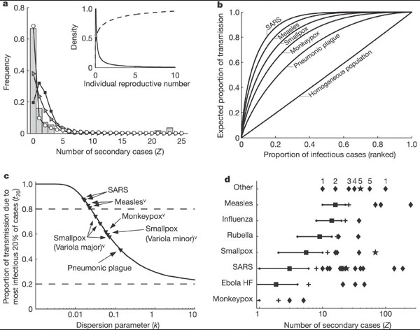

```{r setup, echo= FALSE, message = FALSE, warning = FALSE}
library(webshot)
webshot::install_phantomjs(force = TRUE)
```


:::::::::::::::::::::::::::::::::::::: questions 

- How to evaluate for transmission heterogeneity from contact tracing data?
- How to account for transmission heterogeneity in decision-making?

::::::::::::::::::::::::::::::::::::::::::::::::

::::::::::::::::::::::::::::::::::::: objectives

- Create the offspring distribution from outbreak data using `{epicontacts}`.
- Estimate the dispersion parameter from the offspring distribution using `{fitdistrplus}`.
- Estimate the proportion of transmission accounting for superspreading events using `{superspreading}`.

::::::::::::::::::::::::::::::::::::::::::::::::

::::::::::::::::::::::::::::::::::::: prereq

## Prerequisites

Learners should familiarise themselves with following concept dependencies before working through this tutorial: 

**Statistics**: probability distributions. 

**Epidemic theory**: Reproduction number.

:::::::::::::::::::::::::::::::::

## Introduction

<!-- we know -->

<!-- we dont know -->

<!-- we want -->

```{r,message=FALSE,warning=FALSE}
library(outbreaks)
library(epicontacts)
library(fitdistrplus)
library(superspreading)
library(tidyverse)
```


## questions {to remove}

- What is the offspring distribution?
- How to assess for heterogeneity in transmission?
- How to estimate the mean reproduction number and dispersion parameter from an offspring distribution?
- The definition of a 99th-percentile SSE (not directly cover by the package)

## Transmission heterogeneity

individual reproductive number

distributions for transmission heterogeneity

Heterogeneity is in the variance of the number of secondary cases generated by each infected individual

## The individual reproduction number

- interpretation: is the concept, not yet a distribution
- as a random variable representing the expected number of secondary cases caused by a particular infected individual. 

- Values for ν are drawn from a continuous probability distribution with
    - population mean R0
        + that encodes all variation in infectious histories of individuals
    - dispersion parameter k
        + smaller values of k indicate greater heterogeneity
        + larger values of k indicate less heterogeneity

## The offspring distribution

- Stochastic effects in transmission are modelled using a Poisson process, so that the number of secondary infections caused by each case, Z, is described by an ‘offspring distribution’ Pr(Z = k) where Z∼Poisson(ν).

- interpretation: it describes properly as a distribution the ‘individual reproductive number’

the offspring distribution, 

- can be characterized by a statistical distribution
    - negative binomial, usually
- with distribution parameters given by 
    - R0 as the mean and 
        + average number of (secondary) cases produced by a single individual in an entirely susceptible population
    - k as the dispersion parameter, 
        +degree of heterogeneity in transmission by single individuals

negative binomial

mean, size or (inverse-)dispersion

variance

heterogeneity

mean/variance ratio

read linelist + contact data

secondary transmission distribution

get vector of secondary cases per id

[appliedepi](https://community.appliedepi.org/t/estimating-the-degree-of-super-spreading-from-transmission-chain-data/103/2)

[Figure 1A](https://www.nature.com/articles/nature04153/figures/1)

- our context: the offspring distribution
    + the x value is the: 
        + number of secondary cases
        + individual reproductive number

```{r}
## make epicontact object
epi <- make_epicontacts(
  linelist = mers_korea_2015$linelist,
  contacts = mers_korea_2015$contacts
)
```

```{r,eval=FALSE}
# visualise contact tree
epicontacts::vis_epicontacts(epi)
```

```{r,echo=FALSE}
# visualise contact tree
network <-
  epicontacts::vis_epicontacts(epi) %>%
  visNetwork::visPhysics(solver = "barnesHut")

fname <- "network.html"

visNetwork::visSave(network, fname)

webshot::webshot(
  fname,
  delay = 5,
  zoom = 10
)
```


```{r}
# no infector-infectee pairs are replicated
epi %>%
  pluck("contacts") %>%
  group_by(from, to) %>%
  filter(n() > 1)

# count secondary cases per infectee
infector_secondary <- epi %>%
  pluck("contacts") %>%
  count(from, name = "secondary_cases")

epi_secondary <-
  epi %>%
  # extract ids in contact *and* linelist using "which" argument
  get_id(which = "all") %>%
  enframe(name = NULL, value = "from") %>%
  # join count secondary cases per infectee
  left_join(infector_secondary) %>%
  # infectee with missing secondary cases are replaced with zero
  replace_na(
    replace = list(secondary_cases = 0)
  )

# count of secondary cases per individual
epi_secondary

# arrange in descendant order of secondary cases
epi_secondary %>%
  arrange(desc(secondary_cases))

## plot the distribution
epi_secondary %>%
  ggplot(aes(secondary_cases)) +
  geom_histogram(binwidth = 1) +
  labs(
    xlab = "Individual reproduction number",
    ylab = "Number of individuals"
  )
```

## Estimate the dispersion parameter

fit distribution to data using {fitdistrplus}
provide maximum likelihood estimates

the estimated value of k
suggest that
SSE are an expected feature of the
individual level variation in infectiousness


```{r}
library(fitdistrplus)

conflicted::conflict_scout()
conflicted::conflict_prefer(
  name = "filter",
  winner = "dplyr"
)
conflicted::conflict_prefer(
  name = "lag",
  winner = "dplyr"
)
conflicted::conflict_prefer(
  name = "select",
  winner = "dplyr"
)
conflicted::conflict_scout()

## fit distribution
offspring_fit <- epi_secondary %>%
  pull(secondary_cases) %>%
  fitdist(distr = "nbinom")

offspring_fit

## extract the "size" parameter
mid <- offspring_fit$estimate[["size"]]

## calculate the 95% confidence intervals using the standard error estimate and
## the 0.025 and 0.975 quantiles of the normal distribution.
lower <- mid + offspring_fit$sd[["size"]] * qnorm(0.025)
upper <- mid + offspring_fit$sd[["size"]] * qnorm(0.975)

round(mid, 4)
round(lower, 4)
round(upper, 4)
```

We can see that the
dispersion parameter is estimated as
0.020 (95% CI 0.006 - 0.035).

As this value is significantly lower
than one, we can conclude that
the degree of super-spreading is high.

This is in line with visual inspection
of the histogram made above.

```{r}
# calculate density fit
fit_density <-
  tibble(quantile = 0:40) %>%
  mutate(
    density = dnbinom(
      x = quantile,
      mu = offspring_fit$estimate[["mu"]],
      size = mid
    )
  )

# plot offspring distribution with density fit
ggplot() +
  geom_histogram(
    data = epi_secondary,
    mapping =
      aes(
        x = secondary_cases,
        y = after_stat(density)
      ),
    binwidth = 1
  ) +
  geom_point(
    data = fit_density,
    mapping = aes(x = quantile, y = density),
    alpha = 0.3, color = "red"
  ) +
  labs(
    xlab = "Individual reproduction number",
    ylab = "Number of individuals"
  )
```

## Interpret the dispersion parameter

<!-- from draft -->

- for occurrences of associated discrete events we can use Poisson or negative binomial discrete distributions.
- in a Poisson distribution, mean is equal to variance.
- when variance is higher than the mean, this is called over-dispersion.
- in biological applications, over-dispersion occurs and so a negative binomial may be worth considering as an alternative to Poisson distribution.

- in epidemiology, negative binomial have being used to model disease transmission for infectious diseases where the likely number of onward infections may vary considerably from individual to individual and from setting to setting

- In a sequence of independent Bernoulli trials, in each trial the probability of success is $p$ and of failure is $1-p$. We observe this sequence until a predefined number $r$ of successes occurs. Then the random number of observed failures follows the negative binomial distribution.
- some authors refer to $\alpha = \frac{1}{r}$ and express variance in terms of $\alpha$: $variance = m + \alpha m^2$ where mean $ m = \frac{r(1-p)}{p}$
- depending on the author, either the parameter  or its the reciprocal of $r$, $\alpha$, is refereed to as the "dispersion parameter".

- From Lloyd-Smith, in a more general formulation, we let $v$ be gamma-distributed with mean $R_{o}$ and dispersion parameter $k$, yielding $Z$~negative binomial($R_{o}, k$). The negative binomial model includes the conventional Poisson ($k \rightarrow \inf$) as an special case. It has variance $R_{o}(1 + R_{o}/k)$, so smaller values of $k$ indicate (greater variance, thus) greater heterogeneity.

- To sync up with Lloyd-Smith and R base function for negative binomial, $k = r = {size} = {inverse-dispersion}$

- negative binomial distribution is specially useful for discrete data over an unbounded positive range whose sample variance exceeds the sample mean. In such terms, the observations are overdispersed with respect to a Poisson distribution, for which the mean is equal to the variance.
- The additional parameter of the negative binomial distribution ($r$) can be used to adjust the variance independently of the mean.

<!-- paste from 37-nbinom-dispersion.R -->

the "dispersion" parameter
refers to the "size" for base R
or
refer to the "k" parameter for Lloyd-Smith
of the negative binomial distribution

k is inversely-proportional
to variance (i.e, to heterogeneity)
- high k -> get low variance (low heterogeneity)
- low k -> get high variance (high heterogeneity)

when k approches infinity,
the negative binomial approaches poisson

negative binomial
two parameters:
- mean (or R0, in offspring distribution)
- size (or k, named also dispersion)

variance =
mean(1 + mean/k)

higher k,
(higher inverse-dispersion),
lower variance,
(variance closer to mean)
lower heterogeneity

lower k
(lower the inverse-dispersion),
higher the variance,
(variance further from mean)
higher  heterogeneity

useful when variance is higher than mean
for discrete data
when observations exceed a positive range
whose sample variance exceeds the
sample mean.
thus, the observations are overdispersed
with respect to a Poisson distribution

a Poisson distribution can be defined as
an special case of Negative Binomial
when k approaches infinity
or
variance gets closer to mean
or
when mean/variance ratio gets closer to 1

<!-- summary -->

In a Negative Binomial distribution, the relationship between mean (Ro), dispersion (k), variance and heterogeneity is given by:

$$ \uparrow heterogeneity = \uparrow variance = R_{o}(1+\frac{R_{o}}{\downarrow k})$$

The Poisson distribution is an special case of the Negative Binomial. When k approximates infinity $k \rightarrow \infty$ the variance equals the mean because $\frac{R_{o}}{\infty}=0$


:::::::::::::::::::::::: callout

### Use epiparameter

```{r}
library(epiparameter)

epidist_db(
  epi_dist = "offspring distribution"
) %>%
  list_distributions() %>%
  select(disease, prob_distribution)

# Load parameters
sars <- epidist_db(
  disease = "SARS",
  epi_dist = "offspring_distribution",
  single_epidist = TRUE
)
sars_params <- get_parameters(sars)
sars_params
```

::::::::::::::::::::::::

:::::::::::::::::::::::: callout

### Select the best model

assess fit performance w/ model comparison AIC, BIC

Using Information criteria for the best fit. Read further in vignette using helper functions

<https://epiverse-trace.github.io/superspreading/articles/estimate_individual_level_transmission.html>

:::::::::::::::::::::::::

::::::::::::::::::::::::: spoiler

### Define SSE

code this up lloyds definition

::::::::::::::::::::::::

## Superspreading events (SSEs)

- are important realizations from the right-hand tail of a distribution of ν
- define an SSE as any infected individual who infects more than Z(n) others, where Z(n) is the nth percentile of the Poisson(R) distribution. 
- A 99th-percentile SSE is then any case causing more infections than would occur in 99% of infectious histories in a homogeneous population

## Effect of heterogeneity

Heterogeneity affects epidemic establishment and the ease of control

understanding offspring distribution overdispersion is superspreading!

individual variation of transmission informs the frequency of superspreading events (SSE)

- heterogeneity at the individual level of transmission reduce chance of an emerging outbreak

- but it can also make it hard to control when there is a lot of SSE 

+ difficulty of establishment
+ ease to control
+ mass vs targeted interventions

+ Greater heterogeneity reduces the chance of an outbreak emerging from single case [NOTE: DIFICULT INTUITION] [EXAMPLE: lots of individual with individual reproduction number around 1 or below]

+ However, this heterogeneity can make an established outbreak hard to control using mass interventions, as a single uncontrolled case can generate a large number of secondary cases. [INTERPRETATION: if the outbreak gets established, then it is hard to control assuming homogeneity of transmission]

Conversely, heterogeneity in transmission may provide opportunities for targeting interventions if the individuals who contribute more to transmission (due to biological, environmental or behavuoral factors) share socia-demographic or geographical characteristics that can be defined [INTERPRETATION: ones identified, this can help targetted interventions to this population]

<https://royalsocietypublishing.org/doi/10.1098/rstb.2016.0371>

## Proportion of transmission

#### Proportion of cases resposible of 80% of infection

+ [figure 1B](https://www.nature.com/articles/nature04153/figures/1)
+ [Figure 1C](https://www.nature.com/articles/nature04153/figures/1)
+ pareto rule

show from figure (not available in vignette)

- focus on the cumulative probability distribution of the most infectious cases
    + if there is a 0.2 proportion of (the most infectious) cases contributing to the 0.8 proportion of transmission, this is a highly heterogeneous distribution. (e.g. SARS)
    + if there is a 0.6 proportion of (the most infectious) cases contributing to the 0.8 of transmission, this is a less heterogeneous distribution (compared to the above one, e.g. pneumonic plague)
    


```{r}
# estimate prop cases cause transmission ----------------------------------

## text ---------------------------------

# proportion of cases that
# generate 80% of transmission
proportion_transmission(
  R = sars_params[["mean"]],
  k = sars_params[["dispersion"]],
  percent_transmission = 0.8
)

## assessment ---------------------------------

# proportion of cases that
# generate 80% of transmission
proportion_transmission(
  R = offspring_fit$estimate["mu"],
  k = offspring_fit$estimate["size"],
  percent_transmission = 0.8
)

## assessment --------------------------------------------------------------

#' estimate for ebola

```


## Backward and forward contact tracing

Reconstruction of transmission trees (whom infected whom) can provide an understanding of who contributes more to transmission. This can be done qith detailed case investigations and/or genetic data. [EXAMPLE: case data paired with contact data to visualize and find the patterns]

<https://royalsocietypublishing.org/doi/10.1098/rstb.2016.0371>

### Proportion of events in a given cluster size

the proportion of new cases that originated within a transmission event of a given size. What proportion of all transmission events were part of secondary case clusters from a set of initial cases

useful to inform backwards contact tracing efforts

Given the observed number of new cases, cluster of cases, what proportion of them came from same index case

cluster is the transmission from primary to secondary case

Given a set of cases, what proportion of them (transmission events) where part of secondary case clusters (from the same primary case)

prevent superspreading events

```{r}
# estimate prop cluster size ----------------------------------------------

## text --------------------------

#' Given a set of cases,
#' what proportion of them
#' (transmission events)
#' where part of
#' secondary case clusters
#' (from the same primary case)
#' useful for
#' backward contact traicing

proportion_cluster_size(
  R = offspring_fit$estimate["mu"],
  k = offspring_fit$estimate["size"],
  cluster_size = 10
)

```

## Superspreading in decision making

- How to estimate the probability of large outbreak?
- How to estimate the proportion of cases responsible of the 80% of transmission?

Early understanding of disease epidemic potential from R0 and dispersion

ease of control with either mass or targeted interventions

**Probability of a large epidemic**

The more heterogeneity, less probability to stablish.

But the higher the number of introductions, the higher the likelihood

:::::::::::::::::::: challenge

```{r}
## assessment -------------------------------------

# Estimate probability of large outbreak
# with 5 independent imported cases
probability_epidemic(
  R = offspring_fit$estimate["mu"],
  k = offspring_fit$estimate["size"],
  num_init_infect = 5
)


## assessment --------------------------------------------------------------

#' get ebola params
```

:::::::::::::::::::

**Probability of extintion**

more heterogeneity, more difficult to go extinct.


**Probability to contain**

not exceed 100 cases

```{r}
# estimate prob to contain ------------------------------------------------


## text ----------------------------------

probability_contain(
  R = offspring_fit$estimate["mu"],
  k = offspring_fit$estimate["size"],
  num_init_infect = 1,
  case_threshold = 100
)
```


### Go to vignette

Given initial conditions or a range of plausible scenarios or R and k, you can use

Look at them in the {superspreading} vignette

<https://epiverse-trace.github.io/superspreading/articles/epidemic_risk.html>

## Challenges

::::::::::::::::::::::::::: challenge

use mers to estimate ...

:::::::::::::::::::::::::::

:::::::::::::::::::::::::: challenge

inform backward contact tracing strategy

:::::::::::::::::::::::::

::::::::::::::::::::::::::::: testimonial

### Going viral

<https://kucharski.substack.com/p/going-viral>

:::::::::::::::::::::::::::::

::::::::::::::::::::::::::::::::::::: keypoints 

- Use `{epicontacts}`
- Use `{fitdistplus}`
- Use `{superspreading}` to 

::::::::::::::::::::::::::::::::::::::::::::::::

