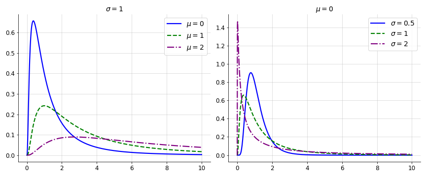

:::::::::::::::::::::::::::::::::::::: questions 

- What is the estimated amount of superespreading events?
- What is the level of individual variation of transmission?
- can you reconstruct transmission chains?

::::::::::::::::::::::::::::::::::::::::::::::::

::::::::::::::::::::::::::::::::::::: objectives

- Quantify transmission heterogeneity
- Estimate overdispersion from early outbreak data
- Estimate R0
- Estimate k
- Estimate the proportion of superspreading events

- Create a Short term forecast using branching process
- Create simulation of interventions

::::::::::::::::::::::::::::::::::::::::::::::::

::::::::::::::::::::::::::::::::::::: prereq

## Prerequisites

List (and hyperlink) the lessons/packages which need to be covered before this lesson

:::::::::::::::::::::::::::::::::

## my questions

- does the count of 0-1 secondary cases also biased by delays or interventions when secondary cases measured? [DISCUSSION: potential callout]

- is size equal to dispersion parameter? or inverse-dispersion? [MISCONCEPTION: review in wiki]

- what is the difference between superspreading and epichains? is creating projects is the key feature that differenciates them?

## pre material not to overlap

- https://www.epirhandbook.com/en/transmission-chains.html
- if needed to redirect https://lshtm.zoom.us/j/7845692710

## Introduction

Effort to control

## summarized order of topics to show

### episode 01: estimate superspreading from parameters

new reference: <https://michaeldewittjr.com/programming/2020-08-30-negative-binomial-distribution-and-epidemics/>

- transmission heterogeneity
    + individual reproductive number (+1 -> gather content from lloyds-smith paper)
    + effect of heterogeneity
        + difficulty of establishment
        + ease to control
    + mass vs targeted interventions
    + tree reconstruction
    + resource: [key questions Cori et al paper](https://royalsocietypublishing.org/doi/10.1098/rstb.2016.0371)

- distributions for transmission heterogeneity
    + offspring distribution
    + negative binomial
    + mean, size or (inverse-)dispersion
    + variance
    + [extra: poisson, mean/variance ratio, overdispersion]
    + [37-nbinom-dispersion.R](https://github.com/avallecam/epicatador/blob/main/37-nbinom-dispersion.R)
    + resource: <https://ben18785.shinyapps.io/distribution-zoo/>

- reuse offspring distributions from historical outbreaks
    + use epiparameter

- summ01: estimate probability of large outbreak
    + number of imported cases
    + how "large" is defined?
    + resource: <https://epiverse-trace.github.io/superspreading/articles/superspreading.html>
    + resource: <https://epiverse-trace.github.io/superspreading/articles/epidemic_risk.html>
    + refer to external on the internal machinery - branching process: <https://epiverse-trace.github.io/epichains/articles/interventions.html>

- summ02: estimate proportion of cases that cause proportion of transmissions
    + [figure 1B](https://www.nature.com/articles/nature04153/figures/1)
    + [Figure 1C](https://www.nature.com/articles/nature04153/figures/1)
    + pareto rule

### episode 02: estimate parameters from data

- summ03: estimate R0 and k from data
    + read linelist + contact data
    + question: isolate primary (index) and secondary transmission (not in code example)?
    + get vector of secondary cases per id
    + fit distributions to data using {fitdistrplus}
    + assess fit performance w/ model comparison AIC, BIC
    + resource: <https://epiverse-trace.github.io/superspreading/articles/estimate_individual_level_transmission.html>
    + resource: [appliedepi](https://community.appliedepi.org/t/estimating-the-degree-of-super-spreading-from-transmission-chain-data/103/2)
    + resource: [Figure 1A](https://www.nature.com/articles/nature04153/figures/1)
    + refer to external link: networks are heterogeneous <https://epiverse-trace.github.io/superspreading/articles/heterogeneous_network_outbreaks.html>
        * how to get input data from linelist+contacts?

### episode 03: simulate transmission tree from parameters

- example: https://www.ncbi.nlm.nih.gov/pmc/articles/PMC7158960/ (suggested by adam)
- example (of how many of simulated outbreaks can be controleed): https://www.thelancet.com/article/S2214-109X(20)30074-7/fulltext (ringbp tailor offspreing distribution)
- new zealand: https://pubmed.ncbi.nlm.nih.gov/33311501/ (suggested by adam)

- good example: simulation of uncontrolled outbreaks

- branching process
    + To assess the effect of individual variation on disease outbreaks, we analyse a branching process model with negative binomial offspring distribution

- estimate tree parameters using branching process
    + estimate size
    + estimate length

- summ04: projecting cases
    + aim: interoperability example?
        * epiparameter
        * epichains
    + resource <https://epiverse-trace.github.io/epichains/articles/projecting_incidence.html>

- questions: how case projection from epichains differ from epinow2?

## issues to fill

- why to estimate R and k for index cases on README?
- create internal data to express more clearly the index and secondary infector-infectee data?

epichains
- reduce lenght of first lines of text within chunks? I can not read the full line when mouse is inside. example <https://epiverse-trace.github.io/epichains/reference/simulate_chains.html#ref-examples>

## summatives

### reuse epiparameter

Load packages

```{r}
# Get libraries
library(epiparameter)
library(superspreading)
library(tidyverse)
```

Reuse distributions

```{r}
epidist_db(
  epi_dist = "offspring distribution"
  ) %>% 
  list_distributions() %>% 
  select(disease,prob_distribution)
```


```{r}
# Load parameters
sars <- epidist_db(
  disease = "SARS",
  epi_dist = "offspring_distribution",
  single_epidist=T
  )
sars_params <- get_parameters(sars)
sars_params
```

### 01 estimate probability of large outbreak

<https://github.com/epiverse-trace/howto/issues/32>

```{r}
# how to estimate the probability of a large outbreak?

# Estimate probability of large outbreak
# with 5 independent imported cases
probability_epidemic(
  R = sars_params[["mean"]],
  k = sars_params[["dispersion"]],
  num_init_infect = 5
)
```


### 02 estimate proportion of cases that cause proportion of transmissions

<https://github.com/epiverse-trace/howto/issues/33>

```{r}
# proportion of cases that 
# generate 80% of transmission
proportion_transmission(
  R = sars_params[["mean"]],
  k = sars_params[["dispersion"]],
  percent_transmission=0.8,
)
```

analogy 80-20 pareto rule

question: is there a way to visualize this in the figure of axis: 
- expected proportion of transmission and proportion of infectious cases (ranked)? (recreate Fig 1B)
- proportion of transmission due to most infectious 20% of cases and dispersion parameter k? (recreate Fig 1C)

### get linelist and contact data

Load packages

```{r}
# we use {fitdistrplus} to fit the models
library(fitdistrplus)
library(outbreaks)
library(epicontacts)
library(ggplot2)
```

wrangle data

```{r}
## make epicontact object
epi <- make_epicontacts(
  mers_korea_2015$linelist,
  mers_korea_2015$contacts
  )

## extract ids in contact *and* linelist using "which" argument
ids <- get_id(epi, which = "all")

## iterate counting function over these ids
non_index_cases <- sapply(
  ids, 
  function(id) sum(id == epi$contacts$from, 
                   na.rm = TRUE)
  )

## plot the distribution
qplot(
  non_index_cases,
  geom = "histogram",
  binwidth = 1,
  xlab = "Individual reproduction number",
  ylab = "Number of individuals"
)
```


### 03 fit distribution to data

- question: does this needs to isolate index and secondary case transmission?

```{r}
param_non_index <- fitdist(
  data = non_index_cases, 
  distr = "nbinom"
)
param_non_index
# rename size and mu to k and R
names(param_non_index$estimate) <- 
  c("k_dispersion_size", "R_reproduction_number_mean")
# param_non_index$estimate
param_non_index
```


## concepts

### overdispersion

- for occurrences of associated discrete events we can use Poisson or negative binomial discrete distributions.
- in a Poisson distribution, mean is equal to variance.
- when variance is higher than the mean, this is called over-dispersion.
- in biological applications, over-dispersion occurs and so a negative binomial may be worth considering as an alternative to Poisson distribution.

- in epidemiology, negative binomial have being used to model disease transmission for infectious diseases where the likely number of onward infections may vary considerably from individual to individual and from setting to setting

- In a sequence of independent Bernoulli trials, in each trial the probability of success is $p$ and of failure is $1-p$. We observe this sequence until a predefined number $r$ of successes occurs. Then the random number of observed failures follows the negative binomial distribution.
- some authors refer to $\alpha = \frac{1}{r}$ and express variance in terms of $\alpha$: $variance = m + \alpha m^2$ where mean $ m = \frac{r(1-p)}{p}$
- depending on the author, either the parameter  or its the reciprocal of $r$, $\alpha$, is refereed to as the "dispersion parameter".

- From Lloyd-Smith, in a more general formulation, we let $v$ be gamma-distributed with mean $R_{o}$ and dispersion parameter $k$, yielding $Z$~negative binomial($R_{o}, k$). The negative binomial model includes the conventional Poisson ($k \rightarrow \inf$) as an special case. It has variance $R_{o}(1 + R_{o}/k)$, so smaller values of $k$ indicate (greater variance, thus) greater heterogeneity.

- To sync up with Lloyd-Smith and R base function for negative binomial, $k = r = {size} = {inversedispersion}$

- negative binomial distribution is specially useful for discrete data over an unbounded positive range whose sample variance exceeds the sample mean. In such terms, the observations are overdispersed with respect to a Poisson distribution, for which the mean is equal to the variance.
- The additional parameter of the negative binomial distribution ($r$) can be used to adjust the variance independently of the mean.

### how parameters look for a overdispersed distribution

- from normal to dispersed distributions
    - mean
    - dispersion parameter
        + explore this with https://ben18785.shinyapps.io/distribution-zoo/
        + discrete univariate

### example using negative binomial:

- mean
- inverse-dispersion
- range

explore wikipedia page
<https://en.wikipedia.org/wiki/Negative_binomial_distribution>


### example using lognormal:
<https://gregorygundersen.com/blog/2023/12/17/lognormal/>




- our context: the offspring distribution
    + the x value is the: 
        + number of secondary cases
        + individual reproductive number

- tricky relationship:
    + inverse proportionality between dispersion and heterogeneity 
        + small dispersion, greater probability density across the x axis, thus grater heterogeneity
        + large dispersion, less probability density across the x axis, thus less heterogeneity

- focus on the cumulative probability distribution of the most infectious cases
    + if there is a 0.2 proportion of (the most infectious) cases contributing to the 0.8 proportion of transmission, this is a highly heterogeneous distribution. (e.g. SARS)
    + if there is a 0.2 proportion of (the most infectious) cases contributing to the 0.4 of transmission, this is a less heterogeneous distribution (compared to the above one, e.g. pneumonic plague).


    

https://www.nature.com/articles/nature04153


### ‘individual reproductive number’, ν, 

- interpretation: is the concept, not yet a distribution
- as a random variable representing the expected number of secondary cases caused by a particular infected individual. 

- Values for ν are drawn from a continuous probability distribution with
    - population mean R0
        + that encodes all variation in infectious histories of individuals
    - dispersion parameter k
        + smaller values of k indicate greater heterogeneity
        + larger values of k indicate less heterogeneity

### offspring distribution

- Stochastic effects in transmission are modelled using a Poisson process, so that the number of secondary infections caused by each case, Z, is described by an ‘offspring distribution’ Pr(Z = k) where Z∼Poisson(ν).

- interpretation: it describes properly as a distribution the ‘individual reproductive number’

the offspring distribution, 

- can be characterized by a statistical distribution
    - negative binomial, usually
- with distribution parameters given by 
    - R0 as the mean and 
        + average number of (secondary) cases produced by a single individual in an entirely susceptible population
    - k as the dispersion parameter, 
        +degree of heterogeneity in transmission by single individuals


### superspreading events (SSEs) 

- are important realizations from the right-hand tail of a distribution of ν
- define an SSE as any infected individual who infects more than Z(n) others, where Z(n) is the nth percentile of the Poisson(R) distribution. 
- A 99th-percentile SSE is then any case causing more infections than would occur in 99% of infectious histories in a homogeneous population
- interpretation: 
    + [EVALUATE TO UPDATE]
    + [NOTE: POTENTIAL MISCONCEPTION] the area under the curve of the offspring distribution using a e.g. 99 percentile, representing the amount or frequency of SSE

### branching process

- probability generating function (pgf) of the offspring distribution


## Ideas

understanding offspring distribution overdispersion is superspreading!

individual variation of transmission informs the frequency of superspreading events (SSE)

- heterogeneity at the individual level of transmission reduce chance of an emerging outbreak

- but it can also make it hard to control when there is a lot of SSE 

with estimated parameter we then can reconstruct tranmission chains to forecast and simulate interventions

## Ideas from https://royalsocietypublishing.org/doi/10.1098/rstb.2016.0371

Heterogeneity is the number of secondary cases generated by each infected individual 

Heterogeneity affects epidemic establishment and the ease of control

+ Greater heterogeneity reduces the chance of an outbreak emerging from single case [NOTE: DIFICULT INTUITION] [EXAMPLE: lots of individual with individual reproduction number around 1 or below]

+ However, this heterogeneity can make an established outbreak hard to control using mass interventions, as a single uncontrolled case can generate a large number of secondary cases. [INTERPRETATION: if the outbreak gets established, then it is hard to control assuming homogeneity of transmission]

Conversely, heterogeneity in transmission may provide opportunities for targeting interventions if the individuals who contribute more to transmission (due to biological, environmental or behavuoral factors) share socia-demographic or geographical characteristics that can be defined [INTERPRETATION: ones identified, this can help targetted interventions to this population]

Reconstruction of transmission trees (whom infected whom) can provide an understanding of who contributes more to transmission. This can be done qith detailed case investigations and/or genetic data. [EXAMPLE: case data paired with contact data to visualize and find the patterns]

## links

https://en.wikipedia.org/wiki/Negative_binomial_distribution

https://community.appliedepi.org/t/estimating-the-degree-of-super-spreading-from-transmission-chain-data/103/2

[you familiar site: stats for epi]

https://stats.oarc.ucla.edu/r/dae/negative-binomial-regression/

## packages

https://epiverse-trace.github.io/epichains/

https://epiverse-trace.github.io/superspreading/

https://epiverse-trace.github.io/simulist/

::::::::::::::::::::::::::::::::::::: keypoints 

- Use `{superspreading}` to 

::::::::::::::::::::::::::::::::::::::::::::::::

