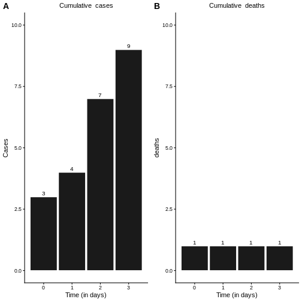
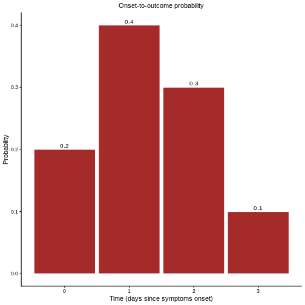
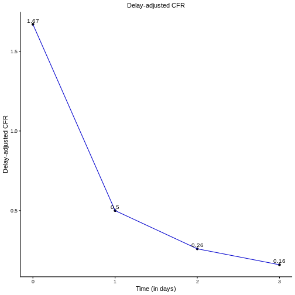

::: questions

-   How are delays adjust for when estimating CFR?

:::

::: objectives

-   Understand how delays are incorporated into severity estimation
-   Understand the underestimation factor
-   Understand the mechanisms behind `{cfr}`

:::

## Introduction

The `{cfr}` package accounts for onset-to-outcome delays to produce more
accurate estimates of case fatality risk (CFR). This document outlines
how these delays are incorporated and explains the underlying
mathematical framework that enables this adjustment.

## Naive estimation of CFR

Consider a dataset containing daily incidence cases and deaths. 

<!--html_preserve-->

<table class="gt_table" data-quarto-disable-processing="false" data-quarto-bootstrap="false">
  <thead>
    <tr class="gt_col_headings">
      <th class="gt_col_heading gt_columns_bottom_border gt_right" rowspan="1" colspan="1" scope="col" id="time">Time</th>
      <th class="gt_col_heading gt_columns_bottom_border gt_right" rowspan="1" colspan="1" scope="col" id="cases">Cases</th>
      <th class="gt_col_heading gt_columns_bottom_border gt_right" rowspan="1" colspan="1" scope="col" id="deaths">Deaths</th>
    </tr>
  </thead>
  <tbody class="gt_table_body">
    <tr><td headers="time" class="gt_row gt_right">0</td>
<td headers="cases" class="gt_row gt_right">3</td>
<td headers="deaths" class="gt_row gt_right">1</td></tr>
    <tr><td headers="time" class="gt_row gt_right">1</td>
<td headers="cases" class="gt_row gt_right">1</td>
<td headers="deaths" class="gt_row gt_right">0</td></tr>
    <tr><td headers="time" class="gt_row gt_right">2</td>
<td headers="cases" class="gt_row gt_right">3</td>
<td headers="deaths" class="gt_row gt_right">0</td></tr>
    <tr><td headers="time" class="gt_row gt_right">3</td>
<td headers="cases" class="gt_row gt_right">2</td>
<td headers="deaths" class="gt_row gt_right">0</td></tr>
  </tbody>
  
</table>

<!--/html_preserve-->

When examining their cumulative distributions (as illustrated in the figure below), we may wish to estimate the case fatality rate (CFR).

The naive estimate of CFR, denoted as $b_t$, is calculated as the ratio of cumulative deaths $D_t$ to cumulative cases $C_t$ at time $t$:

$$b_t = \frac{D_t}{C_t} $$

Applying this formula directly to our dataset yields the $b_t$ values shown in the figure below.

This approach, while straightforward, does not account for the temporal lag between case reporting and death occurrence, which can lead to biased estimates (underestimates), particularly during the early stages of an outbreak or when case numbers are changing rapidly and many of them with unknown outcome.

## Unbiased CFR

To understand how delays affect the naive CFR estimate, we can express $C_t$ and $D_t$ as function of the incidences $c_t$.

The cumulative number of cases is simply the sum of all confirmed cases up to time $t$:
$$C_t = \sum\limits_{i=0}^{t}c_i.$$

However, the cumulative number of deaths represents a proportion of confirmed cases with known outcomes up to time $t$. This must account for the delay distribution between case confirmation and death

$$ D_t = p_t\times \sum\limits_{i=0}^{t}\sum\limits_{j=0}^{\infty}c_{i}f_{i-j}$$

where:

- $c_i=$ number of cases confirmed on day $i$
- $f_s$ = probability density function for the delay of $s$ days from case confirmation outcome
- $p_t$ = proportion of cases that result in death (true CFR) at time $t$

Then the unbiased CFR would be

$$ b_t = p_t \times u_t, \text{where} \;\; u_t = \frac{\sum\limits_{i=0}^{t}\sum\limits_{j=0}^{\infty}c_{i}f_{i-j}}{\sum\limits_{i=0}^{t}c_i}$$

If fact $u_t$ is called the **underestimation factor**, and the true  proportion of confirmed cases to die from the infection is then given by:

$$ p_t = b_t\frac{\sum\limits_{i=0}^{t}c_i}{\sum\limits_{i=0}^{t}\sum\limits_{j=0}^{\infty}c_{i}f_{i-j}}.$$

In practice, the delay distribution $f_s$ is estimated from samples of onset-to-outcome data. However, when deaths are few or absent during the early stages of an outbreak, assumptions about $f_s$ must be made based on literature from previous outbreaks of the same or similar diseases.

For example, suppose we have obtained the onset-to-outcome distribution for the dataset in our example. This distribution, shown in the figure below, characterizes the probability of death occurring $s$ days after case confirmation.

Given that the equations are applied to discrete count data, such as daily case and death counts, $f_s$ denotes the associated Probability Mass Function (PMF).

Then we can use to produce estimated for $p_t$ as follows:

### Day 0

At $t = 0$ we observe $C_0 = 3, D_0 = 1$, giving a naive estimate $b_0 = \frac{1}{3}$. However, accounting for delays, the expected number of deaths by day 0 is

$$
\begin{equation}
\begin{split}
D_0 & = p_0 \times \sum_{i=0}^{0} \sum_{j=0}^{i} c_i f_{j-j} \\ 
& = p_0 \times \left( c_0 \times f_0 \right) \\ 
& = p_0 \times 3 \times 0.2 \\ 
& = p_0 \times 0.6 
\end{split}
\end{equation}
$$ 

where $p_0$ represents the true CFR. The factor $3 \times 0.2 = 0.6$ represents the expected proportion of cases with known outcomes by day 0, given the delay distribution. Hence

$$
b_0 = \frac{D_0}{C_0} = \frac{p_0 \times 0.6}{3}
$$

The understimation factor $u_0 = \frac{0.6}{3} = 0.2$ indicates that $b_0$ is only 20% of the true value $p_0$.

Solving for $p_0$, using the fact that $b_0 = \frac{1}{3}$, gives

$$
\Rightarrow p_0 = \frac{b_0 \times 3}{0.6} = \frac{1}{0.6} = 1.67
$$

### Day 1

At $t = 1$ we observe $C_1 = 4, D_1 = 1$, giving a naive estimate $b_1 = \frac{1}{4}$. 

Accounting for delays, the expected number of deaths by day 1 is

$$
\begin{equation}
\begin{split}
D_1 & = p_1 \times \sum_{i=1}^{1} \sum_{j=0}^{i} c_i f_{i-j} \\ 
& = p_1 \times \left[ c_1 \times f_0 + c_0 \times (f_0 + f_1) \right] \\ 
& = p_1 \times \left[ 1 \times 0.2 + 3 \times (0.4 + 0.2) \right] \\ 
& = p_1 \times 2
\end{split}
\end{equation}
$$

Then

$$
b_1 = \frac{D_1}{C_1} = \frac{p_1 \times 2}{4}
$$

The understimation factor $u_1 = \frac{2}{4} = 0.5$ indicates that $b_1$ is only 50% of the true value $p_1$.

Solving for $p_1$, gives

$$
\Rightarrow p_1 = \frac{b_1 \times 4}{2} = \frac{1}{2} = 0.5
$$

### Day 2

At $t = 2$ we observe $C_2 = 7, D_2 = 1$, giving a naive estimate $b_2 = \frac{1}{7}$. 

Accounting for delays, the expected number of deaths by day 2 is

$$
\begin{equation}
\begin{split}
D_2 & = p_2 \times \sum_{i=1}^{2} \sum_{j=0}^{i} c_i f_{i-j} \\ 
& = p_2 \times \Big[ c_2 \times f_0 + c_1 \times (f_0 + f_1) + c_0 \times (f_0 + f_1 + f_2) \Big] \\ 
& = p_2 \times \Big[ 3 \times 0.2 + 1 \times (0.4 + 0.2) + 3 \times (0.2 + 0.4 + 0.3) \Big] \\ 
& = p_2 \times 3.9
\end{split}
\end{equation}
$$

Then

$$
b_2 = \frac{D_2}{C_2} = \frac{p_2 \times 3.9}{7}
$$

The understimation factor $u_2 = \frac{3.9}{7} = 0.56$ indicates that $b_2$ is only 56% of the true value $p_2$.

Solving for $p_2$, gives

$$
\Rightarrow p_2 = \frac{b_2 \times 7}{3.9} = \frac{1}{3.9} = 0.26
$$

:::: challenge
## Can you do this?

- Calculate $p_t$ at time $t = 3$.

::: solution

At $t = 3$ we observe $C_3 = 9, D_3 = 1$, giving a naive estimate $b_3 = \frac{1}{9}$. 

Accounting for delays, the expected number of deaths by day 3 is

$$
\begin{equation}
\begin{split}
D_3 & = p_3 \times \sum_{i=1}^{3} \sum_{j=0}^{i} c_i f_{i-j} \\ 
& = p_3 \times \Big[ c_3 \times f_0 + c_2 \times (f_0 + f_1) + c_1 \times (f_0 + f_1 + f_2) + c_0 \times (f_0 + f_1 + f_2 + f_3) \Big] \\ 
& = p_3 \times \Big[ 2 \times 0.2 + 3 \times (0.2 + 0.4) + 1 \times (0.2 + 0.4 + 0.3) + 3 \times (0.2 + 0.4 + 0.3 + 0.1) \Big] \\ 
& = p_3 \times 6.1
\end{split}
\end{equation}
$$

Then

$$
b_3 = \frac{D_3}{C_3} = \frac{p_3 \times 6.1}{9}
$$

The understimation factor $u_3 = \frac{6.1}{9} = 0.68$ indicates that $b_3$ is only 68% of the true value $p_3$.

Solving for $p_3$, gives

$$
\Rightarrow p_2 = \frac{b_3 \times 9}{6.1} = \frac{1}{6.1} = 0.16
$$

:::

:::::

Once we calculate the delay-adjusted CFR for $t = 0,2,..., 3$, we can draw its curve, as shown in the figure below.

::::: challenge

## Naive vs adjusted CFR

- What differences do you notice between the delay-adjusted CFR and the naive CFR?

::: hint

This figure may give you a clue

:::
::: solution

The naive estimate can underestimate the CFR value at the early stages of the epidemic. 

:::
:::::

::::::::::::::::::::::::::::::::::::: keypoints 

- Understand how delays are accounted for {cfr}

::::::::::::::::::::::::::::::::::::::::::::::::
