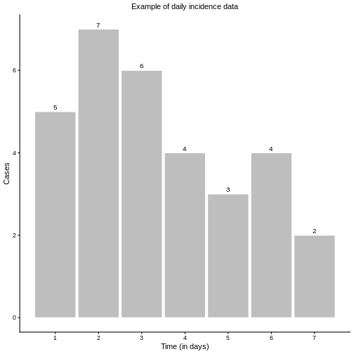
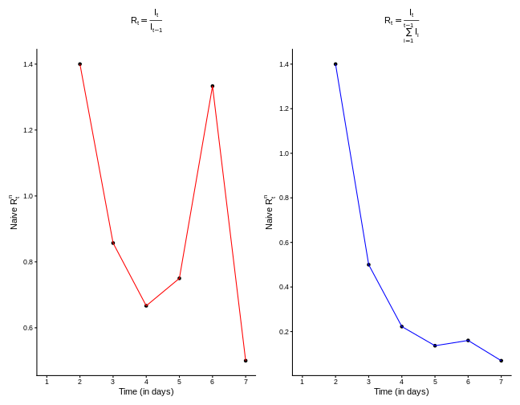
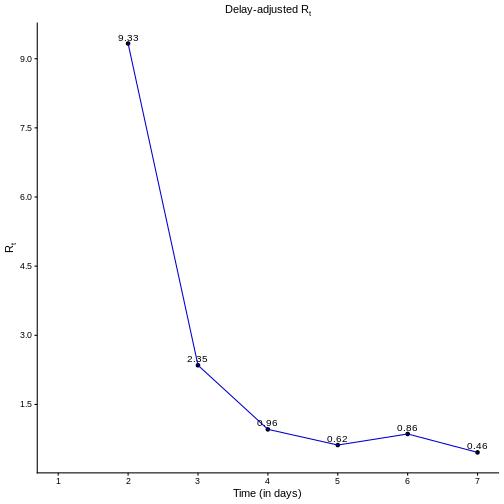

::: questions
- How are delays accounted for when estimating $R_t$?
:::

::: objectives
- Gain familiarity with the renewal equation
- Show how delays are incorporated into the renewal equation 
- Understand the mechanisms behind `{EpiNow2}` 
:::

## Introduction

The `{EpiNow2}` package uses the renewal equation to produce robust estimates of the effective reproduction number $R_t$, which are then used to generate projections. In this episode, we provide an intuitive explanation of the mathematical machinery underlying the method, focusing on how delays are incorporated with incidence data.

## Naive estimation of $R_t$

Imagine we have a series of daily incidence cases, as shown in the figure below, and we want to calculate $R_t$.

As defined in the previous episodes, $R_t$ represents the average number of new infections generated by a single infectious individual at time $t$. Interpreting this definition directly, we could estimate $R_t$ as the ratio of new infections at time $t$ ($I_t$) to the active infectious individuals at time $t-1$, denoted by $I^*_{t-1}$, which is the sum of previous infections from recent history:

$$I_{t-1}^{*} =  I_{t-1} + I_{t-2} + I_{t-3} + \ldots I_{t_s} \text{for} \; s \in \{1, 2,3,\ldots t-1\}$$

For practical purposes, it is usually unnecessary to include the full history; limiting the sum to recent infections is often sufficient. However, mathematically, we could extend the calculation as far back as the first incidence data. Hence, such naive $R_t^n$ is given as:
$$ R_t^{n} = \frac{I_t}{I^*_{t-1}} = \frac{I_t}{\sum\limits_{s=1}^{t-1}I_{t-s}}.  $$
If we restrict the notion of "recent history" to only  the previously day, $t-1$, then simply $I^*_{t-1} = I_{t-1}$ and
$$ R_t^{n} = \frac{I_t}{I_{t-1}}. $$
Applying these approaches to our example incidence data yields the corresponding different values of $R_t$, as shown in the below figures

The observed differences in the $R_t$ curves shown in the figures above raise two important questions:

1. What is the length of “recent history”?
How far back should we go to include all active infectious cases capable of generating new infections? The answer is that we should not go too far: as time passes, earlier infections contribute less to transmission due to the natural course of infection dynamics.

2. Do all previous infections have the same ability to cause new infections?
The answer is no. Most recent infections are still in the early stages of viral replication and are more likely to transmit, whereas older infections have reduced infectiousness. 

Both questions are closely related and concern __delays__: what we observe at time $t$ are the results of past events. Properly accounting for these delays is essential for producing robust and accurate estimates of $R_t$.

## Delay-adjusted estimation of $R_t$

Now, suppose we have access to a probability distribution for the generation time of the disease, which describes the likelihood of an infected individual transmitting the infection over time, as illustrated in the figure below.

This distribution tells us how likely an infected individual is to transmit the infection at different times after becoming infected.

### Renewal equation

The renewal equation provides a natural way to incorporate delays in the computation of $R_t$ and directly addresses the two important questions we raised earlier. It is defined as:

$$ R_t = \frac{I_t}{\sum\limits_{s=1}^{\tau} I(t-s)*\omega(s)}, \; \tau \in \{1,2,3, \ldots, t-1 \}$$
where:

- $\omega(s)$ is the probability that an individual generates a new infection in $s$ days after becoming infected,

- $I_{t-s}$ is the number of infections that occurred $s$ days prior to the current time $t$.

Here, $\tau$ determines how far we should look back into recent history, while the term $I(t-s)*ω(s)$ acts as a convolution operator. it  weights the contribution of infections on day 
$t−s$ to the infections observed on day $t$, according to the likelihood of generating new infections at delay of $s$ days, given by $\omega(s)$. 

Let us compute $R_t$ at $t=2,4$ using the renewal equation.

**Case 1:** $t=2$ 

From the incidence data we have  $I_1 = 5$ and $I_2 = 7$. From the generation time distribution we have $\omega(1) = 0.15$. Substituting into the renewal equation gives: 
$$R_2 = \frac{I_2}{I_1*\omega(1)} = \frac{7}{5*0.15} = 9.33$$

**Case 2:** $t=4$ 

From the incidence data we have $I_3 = 6$ and $I_4 = 4$. From the generation time distribution we have $\omega(1) = 0.15, \omega(2) = 0.30$, and $\omega(3) = 0.24$. 
$$R_4 = \frac{I_4}{I_3*\omega(1)+I_2*\omega(2)+I_1*\omega(3)} = \frac{4}{6*0.15 + 7*0.3+5*.24} = 0.95$$

::::: challenge
## Can you do this?

- Calculate $R_t$ at time $t = 3, 5, 6,$ and $7$.

::: solution

Apply the formula to get: 

**Case:** $t = 3$
  $$ R_3 = \frac{I_3}{I_2*\omega(1) + I_1*\omega(2)} = \frac{6}{7*0.15 + 5*0.3} = 2.35$$

**Case:** $t = 5$

$$ R_5 = \frac{I_5}{I_4*\omega(1)+ I_3*\omega(2)+ I_2*\omega(3)+I_1*\omega(4)}$$
$$ = \frac{3}{4*0.15+6*0.3+7*0.24+5*.15}= 0.62$$

***Case:** $t=6$ 

$$ R_6 = \frac{I_6}{I_5*\omega(1)+I_4*\omega(2)+I_3*\omega(3)+ I_2*\omega(4)+I_1*\omega(5)} $$ 
$$ = \frac{4}{3*0.15 + 4*0.3 + 6*0.24+7*0.15+ 5*0.1} = 0.86$$

**Case:** $t = 7$

$$ R_7 = \frac{I_7}{I_6*\omega(1)+I_5*\omega(2)+I_4*\omega(3)+I_3*\omega(4)+I_2*\omega(5)+I_1*\omega(6)}$$
$$ =  \frac{2}{4*0.15+3*0.3 + 4*0.24+6*0.15+7*0.1+5*0.05} = 0.46$$

:::

:::::

Once we calculate the delay-adjusted   $R_t$ for $t = 2,3,..., 7$, we can draw its curve, as shown in the figure below.

::::: challenge
## Naive vs adjusted $R_t$

- What differences do you notice between the delay-adjusted $R_t$ and the naive $R_t^n$?

::: hint

This figure may give you a clue

:::
::: solution

Both naive estimates can underestimate the $Rt$ value at the early stages of the epidemic. Also, the Naive-1 is more sensitive to sudden increases in the report of new incident cases, as reported for day 6.

:::
:::::

## Projection  for future cases

After estimating $R_t$ values up to the current time $t$, we can rearrange the renewal equation to predict the incidence at time $t+1$ as follows:

$$ \bar{I}_{t+1} = R_t*\sum\limits_{s=1}^\tau I_{t-s}*\omega(S)$$
Applying this into our example, we get 
$$\bar{I}_8 = 0.46* (2*0.15+4*0.3+3*0.24+4*0.15+6*0.1+7*0.05+5*0.01) = 1.76 \approx 2.$$

:::::::::::::::::::::::::::::::::::::::::: spoiler

## Is that what {EpiNow2} does?
- To some extent, yes. What we described is the simplest form of the renewal equation, which only accounts for the generation time distribution.  
- The **{EpiNow2}** package goes further by adding extra utilities, such as:  
  - Accounting for uncertainty in the delay distribution (e.g., providing $95\%$ confidence intervals for $\omega(s)$, which are then used to generate lower and upper estimates of $R_t$ and projected incidence.  
  - Incorporating additional delay distributions (such as incubation periods) through the same convolution process, leading to more robust estimates.  
  - Using advanced statistical methods and computational tools to make the estimation process both more rigorous and faster.

::::::::::::::::::::::::::::::::::::::::::::::::::

::: keypoints
- Understand the basic form of renewal equations
- Understand how delays are accounted for in {EpiNow2}
- Understand how {EpiNow2} makes projections
:::
