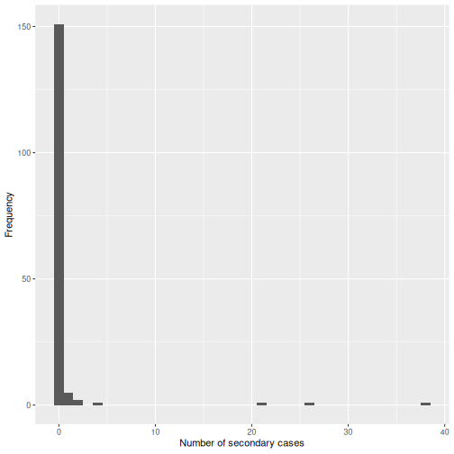
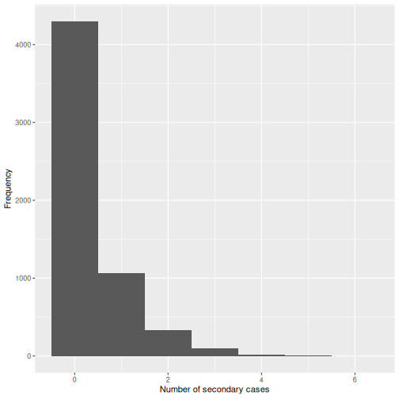
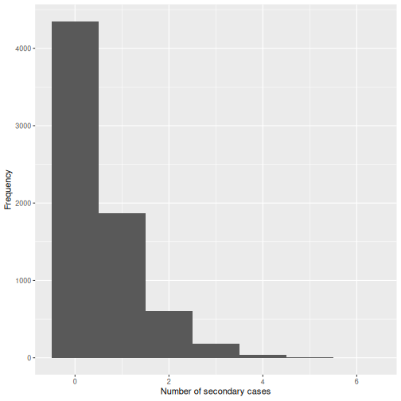
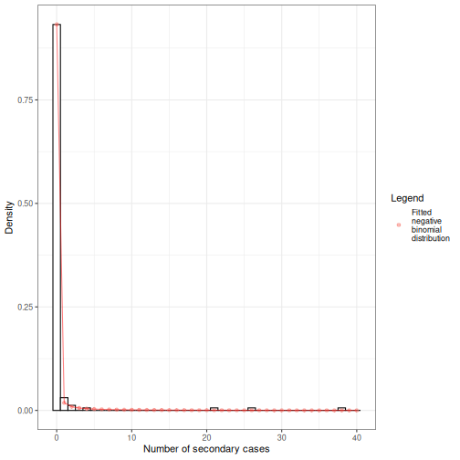

:::::::::::::::::::::::::::::::::::::: questions 

- How can we estimate individual-level variation in transmission (i.e. superspreading potential) from contact tracing data?
- What are the implications for variation in transmission for decision-making?

::::::::::::::::::::::::::::::::::::::::::::::::

::::::::::::::::::::::::::::::::::::: objectives

- Estimate the distribution of onward transmission from infected individuals (i.e. offspring distribution) from outbreak data using `{epicontacts}`.
- Estimate the extent of individual-level variation (i.e. the dispersion parameter) of the offspring distribution using `{fitdistrplus}`.
- Estimate the proportion of transmission that is linked to 'superspreading events' using `{superspreading}`.

::::::::::::::::::::::::::::::::::::::::::::::::

::::::::::::::::::::::::::::::::::::: prereq

## Prerequisites

Learners should familiarise themselves with following concept dependencies before working through this tutorial: 

**Statistics**: common probability distributions, particularly Poisson and negative binomial.

**Epidemic theory**: The reproduction number, R.

:::::::::::::::::::::::::::::::::

## Introduction

<!-- we know -->

From smallpox to severe acute respiratory syndrome coronavirus 2 (SARS-CoV-2), some infected individuals spread infection to more people than others. Disease transmission is the result of a combination of biological and social factors, and these factors average out to some extent at the population level during a large epidemic. Hence researchers often use population averages to assess the potential for disease to spread. However, in the earlier or later phases of an outbreak, individual differences in infectiousness can be more important. In particular, they increase the chance of superspreading events (SSEs), which can ignite explosive epidemics and also influence the chances of controlling transmission ([Lloyd-Smith et al., 2005](https://wellcomeopenresearch.org/articles/5-83)).

![**Chains of SARS-CoV-2 transmission in Hong Kong initiated by local or imported cases.** (**a**), Transmission network of a cluster of cases traced back to a collection of four bars across Hong Kong (n = 106). (**b**), Transmission network associated with a wedding without clear infector–infectee pairs but linked back to a preceding social gathering and local source (n = 22). (**c**), Transmission network associated with a temple cluster of undetermined source (n = 19). (**d**), All other clusters of SARS-CoV-2 infections where the source and transmission chain could be determined ([Adam et al., 2020](https://www.nature.com/articles/s41591-020-1092-0)).](fig/see-intro-superspreading.png)

<!-- we dont know -->

The [basic reproduction number](../learners/reference.md#basic), $R_{0}$, measures the average number of cases caused by one infectious individual in a entirely susceptible population. Estimates of $R_{0}$ are useful for understanding the average dynamics of an epidemic at the population-level, but can obscure considerable individual variation in infectiousness. This was highlighted during the global emergence of SARS-CoV-2 by numerous ‘superspreading events’ in which certain infectious individuals generated unusually large numbers of secondary cases ([LeClerc et al, 2020](https://wellcomeopenresearch.org/articles/5-83)).

).](fig/see-intro-secondary-cases-fig-b.png){alt='R = 0.58 and k = 0.43.'}

<!-- we want -->

In this tutorial, we are going to quantify individual variation in transmission, and hence estimate the potential for superspreading events. Then we are going to use these estimates to explore the implications of superspreading for contact tracing interventions.

We are going to use data from the `{outbreaks}` package, manage the linelist and contacts data using `{epicontacts}`, and estimate distribution parameters with `{fitdistrplus}`. Lastly, we are going to use `{superspreading}` to explore the implications of variation in transmission for decision-making.

We’ll use the pipe `%>%` to connect some of the functions from these packages, so let’s also call the `{tidyverse}` package.

```r
library(outbreaks)
library(epicontacts)
library(fitdistrplus)
library(superspreading)
library(tidyverse)
```


::::::::::::::::::: checklist

### The double-colon

The double-colon `::` in R let you call a specific function from a package without loading the entire package into the current environment. 

For example, `dplyr::filter(data, condition)` uses `filter()` from the `{dplyr}` package.

This help us remember package functions and avoid namespace conflicts.

:::::::::::::::::::

## The individual reprodution number

The individual reproduction number is defined as the number of secondary cases caused by a particular infected individual. 

Early in an outbreak we can use contact data to reconstruct transmission chains (i.e. who infected whom) and calculate the number of secondary cases generated by each individual. This reconstruction of linked transmission events from contact data can provide an understanding about how different individuals have contributed to transmission during an epidemic ([Cori et al., 2017](https://royalsocietypublishing.org/doi/10.1098/rstb.2016.0371)).

Let's practice this using the `mers_korea_2015` linelist and contact data from the `{outbreaks}` package and integrate them with the `{epicontacts}` package to calculate the distribution of secondary cases during the 2015 MERS-CoV outbreak in South Korea ([Campbell, 2022](https://community.appliedepi.org/t/estimating-the-degree-of-super-spreading-from-transmission-chain-data/103/2)):


``` r
## first, make an epicontacts object
epi_contacts <-
  epicontacts::make_epicontacts(
    linelist = outbreaks::mers_korea_2015$linelist,
    contacts = outbreaks::mers_korea_2015$contacts
  )
```


``` r
# visualise contact network
epicontacts::vis_epicontacts(epi_contacts)
```


::::::::::::::::::::::::::: spoiler

### Is contact data tidy?

Contact data from a transmission chain can provide information on which infected individuals came into contact with others. We expect to have the infector (`from`) and the infectee (`to`) plus additional columns of variables related to their contact, such as location (`exposure`) and date of contact.

Following [tidy data](https://tidyr.tidyverse.org/articles/tidy-data.html#tidy-data) principles, the observation unit in our contact dataset is the **infector-infectee** pair. Although one infector can infect multiple infectees, from contact tracing investigations we may record contacts linked to more than one infector (e.g. within a household). But we should expect to have unique infector-infectee pairs, because typically each infected person will have acquired the infection from one other.

To ensure these unique pairs, we can check on replicates for infectees:


``` r
# no infector-infectee pairs are replicated
epi_contacts %>%
  purrr::pluck("contacts") %>%
  dplyr::group_by(to) %>%
  dplyr::filter(dplyr::n() > 1)
```

``` output
# A tibble: 5 × 4
# Groups:   to [2]
  from  to     exposure       diff_dt_onset
  <chr> <chr>  <fct>                  <int>
1 SK_16 SK_107 Emergency room            17
2 SK_87 SK_107 Emergency room             2
3 SK_14 SK_39  Hospital room             16
4 SK_11 SK_39  Hospital room             13
5 SK_12 SK_39  Hospital room             12
```

:::::::::::::::::::::::::::

When each infector-infectee row is unique, the number of entries per infector corresponds to the number of secondary cases generated by that individual.


``` r
# count secondary cases per infector
infector_secondary <- epi_contacts %>%
  purrr::pluck("contacts") %>%
  dplyr::count(from, name = "secondary_cases")
```

But this output only contains number of secondary cases for reported infectors, not for each of the individuals in the whole `epicontacts` object.

To get this, first, we can use `epicontacts::get_id()` to get the full list of unique identifiers ("id") from the `epicontacts` class object. Second, join it with the count secondary cases per infector stored in the `infector_secondary` object. Third, replace the missing values with `0` to express no report of secondary cases from them.


``` r
all_secondary <- epi_contacts %>%
  # extract ids in contact *and* linelist using "which" argument
  epicontacts::get_id(which = "all") %>%
  # transform vector to dataframe to use left_join()
  tibble::enframe(name = NULL, value = "from") %>%
  # join count secondary cases per infectee
  dplyr::left_join(infector_secondary) %>%
  # infectee with missing secondary cases are replaced with zero
  tidyr::replace_na(
    replace = list(secondary_cases = 0)
  )
```

From a histogram of the `all_secondary` object, we can identify the **individual-level variation** in the number of secondary cases. Three cases were related to more than 20 secondary cases, while the complementary cases with less than five or zero secondary cases.


<!-- Visualizing the number of secondary cases on a histogram will help us to relate this with the statistical distribution to fit: -->


``` r
## plot the distribution
all_secondary %>%
  ggplot(aes(secondary_cases)) +
  geom_histogram(binwidth = 1) +
  labs(
    x = "Number of secondary cases",
    y = "Frequency"
  )
```



The number of secondary cases can be used to _empirically_ estimate the **offspring distribution**, which is the number of secondary _infections_ caused by each case. One candidate statistical distribution used to model the offspring distribution is the **negative binomial** distribution with two parameters:

- **Mean**, which represents the $R_{0}$, the average number of (secondary) cases produced by a single individual in an entirely susceptible population, and

- **Dispersion**, expressed as $k$, which represents the individual-level variation in transmission by single individuals.



From the histogram and density plot, we can identify that the offspring distribution is highly skewed or **overdispersed**. In this framework, the superspreading events (SSEs) are not arbitrary or exceptional, but simply realizations from the right-hand tail of the offspring distribution, which we can quantify and analyse ([Lloyd-Smith et al., 2005](https://www.nature.com/articles/nature04153)).

::::::::::::::::::::::::::: callout

### Terminology recap

- From linelist and contact data, we calculate the **number of secondary cases** caused by the observed infected individuals.
- Whereas $R_{0}$ captures the average transmission in the population, we can define the **individual reproduction number** as a random variable representing the _expected_ number of secondary cases caused by a infected individual.
- From the stochastic effects in transmission, the number of secondary _infections_ caused by each case is described by an **offspring distribution**.
- An _empirical_ offspring distribution can be modeled by the **negative-binomial** distribution with mean $R_{0}$ and dispersion parameter $k$.

:::::::::::::::::::::::::::

::::::::::::::::::::::::::::: spoiler

### Poisson, overdispersion, and Negative Binomial

<!-- distribution stories -->

For occurrences of associated discrete events we can use **Poisson** or negative binomial discrete distributions.

In a Poisson distribution, mean is equal to variance. But when variance is higher than the mean, this is called **overdispersion**. In biological applications, overdispersion occurs and so a negative binomial may be worth considering as an alternative to Poisson distribution.

**Negative binomial** distribution is specially useful for discrete data over an unbounded positive range whose sample variance exceeds the sample mean. In such terms, the observations are overdispersed with respect to a Poisson distribution, for which the mean is equal to the variance.

In epidemiology, [negative binomial](https://en.wikipedia.org/wiki/Negative_binomial_distribution) have being used to model disease transmission for infectious diseases where the likely number of onward infections may vary considerably from individual to individual and from setting to setting, capturing all variation in infectious histories of individuals, including properties of the biological (i.e. degree of viral shedding) and environmental circumstances (e.g. type and location of contact).

:::::::::::::::::::::::::::::

:::::::::::::::::::::::::::::::::: challenge

Calculate the distribution of secondary cases for Ebola using the `ebola_sim_clean` object from `{outbreaks}` package.

Is the offspring distribution of Ebola skewed or overdispersed?

:::::::::::::::::: hint

**Note:** This dataset has 5829 cases. Running `epicontacts::vis_epicontacts()` may overload your session!

::::::::::::::::::

:::::::::::::::::: solution


``` r
## first, make an epicontacts object
ebola_contacts <-
  epicontacts::make_epicontacts(
    linelist = ebola_sim_clean$linelist,
    contacts = ebola_sim_clean$contacts
  )

# count secondary cases

ebola_infector_secondary <- ebola_contacts %>%
  purrr::pluck("contacts") %>%
  dplyr::count(from, name = "secondary_cases")

ebola_secondary <- ebola_contacts %>%
  # extract ids in contact *and* linelist using "which" argument
  epicontacts::get_id(which = "all") %>%
  # transform vector to dataframe to use left_join()
  tibble::enframe(name = NULL, value = "from") %>%
  # join count secondary cases per infectee
  dplyr::left_join(ebola_infector_secondary) %>%
  # infectee with missing secondary cases are replaced with zero
  tidyr::replace_na(
    replace = list(secondary_cases = 0)
  )

## plot the distribution
ebola_secondary %>%
  ggplot(aes(secondary_cases)) +
  geom_histogram(binwidth = 1) +
  labs(
    x = "Number of secondary cases",
    y = "Frequency"
  )
```



From a visual inspection, the distribution of secondary cases for the Ebola data set in `ebola_sim_clean` shows an skewed distribution with secondary cases equal or lower than 6. We need to complement this observation with a statistical analysis to evaluate for overdispersion.

::::::::::::::::::

::::::::::::::::::::::::::::::::::

## Estimate the dispersion parameter

To empirically estimate the dispersion parameter $k$, we could fit a negative binomial distribution to the number of secondary cases.

We can fit distributions to data using the `{fitdistrplus}` package, which provides maximum likelihood estimates.

```r
library(fitdistrplus)
```


``` r
## fit distribution
offspring_fit <- all_secondary %>%
  dplyr::pull(secondary_cases) %>%
  fitdistrplus::fitdist(distr = "nbinom")

offspring_fit
```

``` output
Fitting of the distribution ' nbinom ' by maximum likelihood 
Parameters:
       estimate  Std. Error
size 0.02039807 0.007278299
mu   0.60452947 0.337893199
```

:::::::::::::::::::::::::::::::: callout

### Name of parameters

From the `{fitdistrplus}` output:

- The `size` object refers to the estimated dispersion parameter $k$, and
- The `mu` object refers to the estimated mean, which represents the $R_{0}$, 

::::::::::::::::::::::::::::::::


From the number secondary cases distribution we estimated a dispersion parameter $k$ of
0.02, with a 95% Confidence Interval from 0.006 to 0.035. As the value of $k$ is significantly lower than one, we can conclude that there is considerable potential for superspreading events.

We can overlap the estimated density values of the fitted negative binomial distribution and the histogram of the number of secondary cases:



:::::::::::::::::::: callout

### Individual-level variation in transmission

The individual-level variation in transmission is defined by the relationship between the mean ($R_{0}$), dispersion ($k$), and the variance of a negative binomial distribution.

The negative binomial model has $variance = R_{0}(1+\frac{R_{0}}{k})$, so smaller values of $k$ indicate greater variance and, consequently, greater **individual-level variation** in transmission.

$$\uparrow variance = R_{0}(1+\frac{R_{0}}{\downarrow k})$$

When $k$ approaches infinity ($k \rightarrow \infty$) the variance equals the mean (because $\frac{R_{0}}{\infty}=0$). This makes the conventional Poisson model an special case of the negative binomial model.

::::::::::::::::::::

::::::::::::::::::::::: challenge

Use the distribution of secondary cases from the `ebola_sim_clean` object from `{outbreaks}` package.

Fit a negative binomial distribution to estimate the mean and dispersion parameter of the offspring distribution.

Does the estimated dispersion parameter of Ebola provide evidence of an individual-level variation in transmission?

:::::::::::::: hint

Review how we fitted a negative binomial distribution using the `fitdistrplus::fitdist()` function.

::::::::::::::

:::::::::::::: solution


``` r
ebola_offspring <- ebola_secondary %>%
  dplyr::pull(secondary_cases) %>%
  fitdistrplus::fitdist(distr = "nbinom")

ebola_offspring
```

``` output
Fitting of the distribution ' nbinom ' by maximum likelihood 
Parameters:
     estimate  Std. Error
size 2.353899 0.250124611
mu   0.539300 0.009699219
```


``` r
## extract the "size" parameter
ebola_mid <- ebola_offspring$estimate[["size"]]

## calculate the 95% confidence intervals using the standard error estimate and
## the 0.025 and 0.975 quantiles of the normal distribution.

ebola_lower <- ebola_mid + ebola_offspring$sd[["size"]] * qnorm(0.025)

ebola_upper <- ebola_mid + ebola_offspring$sd[["size"]] * qnorm(0.975)

# ebola_mid
# ebola_lower
# ebola_upper
```

From the number secondary cases distribution we estimated a dispersion parameter $k$ of
2.354, with a 95% Confidence Interval from 1.864 to 2.844.

For dispersion parameter estimates higher than one we get low distribution variance, hence, low individual-level variation in transmission.

But does this mean that the secondary case distribution does not have superspreading events (SSEs)? You will later find one additional challenge: How do you define an SSE threshold for Ebola?

::::::::::::::

:::::::::::::: solution

### Select the best model

We can use the maximum likelihood estimates from `{fitdistrplus}` to compare different models and assess fit performance using estimators like the AIC and BIC. Read further in the vignette on [Estimate individual-level transmission](https://epiverse-trace.github.io/superspreading/articles/estimate_individual_level_transmission.html) and use the `{superspreading}` helper function `ic_tbl()` for this!

::::::::::::::

:::::::::::::::::::::::

:::::::::::::::::::::::::::::::::: checklist

### The dispersion parameter across diseases

Research into sexually transmitted and vector-borne diseases has previously suggested a '20/80' rule, with 20% of individuals contributing at least 80% of the transmission potential ([Woolhouse et al](https://www.pnas.org/doi/10.1073/pnas.94.1.338)). 

On its own, the dispersion parameter $k$ is hard to interpret intuitively, and hence converting into proportional summary can enable easier comparison. When we consider a wider range of pathogens, we can see there is no hard and fast rule for the percentage that generates 80% of transmission, but variation does emerge as a common feature of infectious diseases

- When the 20% most infectious cases contribute to the 80% of transmission (or more), there is a high individual-level variation in transmission, with a highly overdispersed offspring distribution ($k<0.1$), e.g., SARS-1.

- When the 20% most infectious cases contribute to the ~50% of transmission, there is a low individual-level variation in transmission, with a moderately dispersed offspring distribution ($k > 0.1$), e.g. Pneumonic Plague.

![**Evidence for variation in individual reproductive number**. (Left, c) Proportion of transmission expected from the most infectious 20% of cases, for 10 outbreak or surveillance data sets (triangles). Dashed lines show proportions expected under the 20/80 rule (top) and homogeneity (bottom). (Right, d), Reported superspreading events (SSEs; diamonds) relative to estimated reproductive number R (squares) for twelve directly transmitted infections. Crosses show the 99th-percentile proposed as threshold for SSEs. (More figure details in [Lloyd-Smith et al., 2005](https://www.nature.com/articles/nature04153))](fig/SEE-individual-reproductive-number-fig-c-d.png)


::::::::::::::::::::::::::::::::::

## Controlling superspreading with contact tracing

During an outbreak, it is common to try and reduce transmission by identifying people who have come into contact with an infected person, then quarantine them in case they subsequently turn out to be infected. Such contact tracing can be deployed in multiple ways. 'Forward' contact tracing targets downstream contacts who may have been infected by a newly identifed infection (i.e. the 'index case'). 'Backward' tracing instead tracks the upstream primary case who infected the index case (or a setting or event at which the index case was infected), for example by retracing history of contact to the likely point of exposure. This makes it possible to identify others who were also potentially infected by this earlier primary case.

In the presence of individual-level variation in transmission, i.e., with an overdispersed offspring distribution, if this primary case is identified, a larger fraction of the transmission chain can be detected by forward tracing each of the contacts of this primary case  ([Endo et al., 2020](https://wellcomeopenresearch.org/articles/5-239/v3)).

![Schematic representation of contact tracing strategies. Black arrows indicate the directions of transmission, blue and Orange arrows, a successful or failed contact tracing, respectivelly. When there is evidence of individual-level variation in transmission, often resulting in superspreading, backward contact tracing from the index case (blue circle) increase the probability to find the primary case (green circle) or clusters with a larger fraction of cases, potentially increasing the number of quarentined cases (yellow circles). [Claire Blackmore, 2021](https://www.paho.org/sites/default/files/backward_contact_tracing_v3_0.pdf)](fig/contact-tracing-strategies.png)

When there is evidence of individual-level variation (i.e. overdispersion), often resulting in so-called superspreading events, a large proportion of infections may be linked to a small proportion of original clusters. As a result, finding and targeting originating clusters in combination with reducing onwards infection may substantially enhance the effectiveness of tracing methods ([Endo et al., 2020](https://wellcomeopenresearch.org/articles/5-239/v3)). 

Empirical evidence focused on evaluating the efficiency of backward tracing lead to 42% more cases identified than forward tracing supporting its implementation when rigorous suppression of transmission is justified ([Raymenants et al., 2022](https://www.nature.com/articles/s41467-022-32531-6))


## Probability of cases in a given cluster

Using `{superspreading}`, we can estimate the probability of having a cluster of secondary infections caused by a primary case identified by backward tracing of size $X$ or larger ([Endo et al., 2020](https://wellcomeopenresearch.org/articles/5-239/v3)).


``` r
# Set seed for random number generator
set.seed(33)

# estimate the probability of
# having a cluster size of 5, 10, or 25
# secondary cases from a primary case,
# given known reproduction number and
# dispersion parameter.
superspreading::proportion_cluster_size(
  R = offspring_fit$estimate["mu"],
  k = offspring_fit$estimate["size"],
  cluster_size = c(5, 10, 25)
)
```

``` output
          R          k prop_5 prop_10 prop_25
1 0.6045295 0.02039807  87.9%   74.6%   46.1%
```


Even though we have an $R<1$, a highly overdispersed offspring distribution ($k=0.02$) means that if we detect a new case, there is a 46.1% probability they originated from a cluster of 25 infections or more. Hence, by following a backwards strategy, contact tracing efforts will increase the probability of successfully contain and quarantining this large number of earlier infected individuals, rather than simply focusing on the new case, who is likely to have infected nobody (because $k$ is very small).

We can also use this number to prevent gathering of certain sized to reduce the epidemic by preventing potential superspreading events. Interventions can target to reduce the reproduction number in order to reduce the probability of having clusters of secondary cases.


::::::::::::::::::::::::::::::::: challenge

### Backward contact tracing for Ebola

Use the Ebola estimated parameters for `ebola_sim_clean` object from `{outbreaks}` package.

Calculate the probability of having a cluster of secondary infections caused by a primary case identified by backward tracing of size 5, 10, 15 or larger.

Would implementing a backward strategy at this stage of the Ebola outbreak increase the probability of containing and quarantining more onward cases?

:::::::::::::::: hint

Review how we estimated the probability of having clusters of a fixed size, given an offspring distribution mean and dispersion parameters, using the `superspreading::proportion_cluster_size()` function.

::::::::::::::::

:::::::::::::::: solution


``` r
# estimate the probability of
# having a cluster size of 5, 10, or 25
# secondary cases from a primary case,
# given known reproduction number and
# dispersion parameter.
superspreading::proportion_cluster_size(
  R = ebola_offspring$estimate["mu"],
  k = ebola_offspring$estimate["size"],
  cluster_size = c(5, 10, 25)
)
```

``` output
       R        k prop_5 prop_10 prop_25
1 0.5393 2.353899   1.8%      0%      0%
```

The probability of having clusters of five people is 1.8%. At this stage, given this offspring distribution parameters, a backward strategy may not increase the probability of contain and quarantine more onward cases.

::::::::::::::::

:::::::::::::::::::::::::::::::::

## Challenges

::::::::::::::::::::::::: challenge

### Does Ebola have any superspreading event?

'Superspreading events' can mean different things to different people, so [Lloyd-Smith et al., 2005](https://www.nature.com/articles/nature04153) proposed a general protocol for defining a superspreading event (SSE). If the number of secondary infections caused by each case, $Z$, follows a negative binomial distribution ($R, k$):

- We define an SSE as any infected individual who infects more than $Z(n)$ others, where $Z(n)$ is the nth percentile of the $Poisson(R)$ distribution. 
- A 99th-percentile SSE is then any case causing more infections than would occur in 99% of infectious histories in a homogeneous population

Using the corresponding distribution function, estimate the SSE threshold to define a SSE for the Ebola offspring distribution estimates for the `ebola_sim_clean` object from `{outbreaks}` package.

::::::::::::::::: hint

In a Poisson distribution, the **lambda** or **rate** parameter are equal to the estimated **mean** from a negative binomial distribution. You can explore this in [The distribution zoo](https://ben18785.shinyapps.io/distribution-zoo/) shiny app.

:::::::::::::::::

::::::::::::::::: solution

To get the quantile value for the 99th-percentile we need to use the [density function](https://sakai.unc.edu/access/content/group/3d1eb92e-7848-4f55-90c3-7c72a54e7e43/public/docs/lectures/lecture13.htm#probfunc) for the Poisson distribution `dpois()`.


``` r
# get mean
ebola_mu_mid <- ebola_offspring$estimate["mu"]

# get 99th-percentile from poisson distribution
# with mean equal to mu
stats::qpois(
  p = 0.99,
  lambda = ebola_mu_mid
)
```

``` output
[1] 3
```

Compare this values with the ones reported by [Lloyd-Smith et al., 2005](https://www.nature.com/articles/nature04153). See figure below:

![Reported superspreading events (SSEs; diamonds) relative to estimated reproduction number R (squares) for twelve directly transmitted infections. Lines show 5–95 percentile range of the number of secondary cases following a Poisson distribution with lambda equal to the reproduction number ($Z∼Poisson(R)$), and crosses show the 99th-percentile proposed as threshold for SSEs. Stars represent SSEs caused by more than one source case. ‘Other’ diseases are: 1, Streptococcus group A; 2, Lassa fever; 3, Mycoplasma pneumonia; 4, pneumonic plague; 5, tuberculosis. R is not shown for ‘other’ diseases, and is off-scale for monkeypox.](fig/SEE-individual-reproductive-number-fig-d.png)

:::::::::::::::::

::::::::::::::::::::::::

::::::::::::::::::::::::::::: challenge

### Expected proportion of transmission

What is the proportion of cases responsible for 80% of transmission?

Use `{superspreading}` and compare the estimates for **MERS** using the offspring distributions parameters from this tutorial episode, with **SARS-1** and **Ebola** offspring distributions parameter accessible via the `{epiparameter}` R package.

::::::::::::::::::::: hint

To use `superspreading::proportion_transmission()` we recommend to read the [Estimate what proportion of cases cause a certain proportion of transmission](https://epiverse-trace.github.io/superspreading/reference/proportion_transmission.html) reference manual.


Currently, `{epiparameter}` has offspring distributions for SARS, Smallpox, Mpox, Pneumonic Plague, Hantavirus Pulmonary Syndrome, Ebola Virus Disease. Let's access the offspring distribution `mean` and `dispersion` parameters for SARS-1:


``` r
# Load parameters
sars <- epiparameter::epidist_db(
  disease = "SARS",
  epi_dist = "offspring distribution",
  single_epidist = TRUE
)
sars_params <- epiparameter::get_parameters(sars)
sars_params
```

``` output
      mean dispersion 
      1.63       0.16 
```

:::::::::::::::::::::

::::::::::::::::::::: solution


``` r
#' estimate for ebola --------------

ebola_epiparameter <- epiparameter::epidist_db(
  disease = "Ebola",
  epi_dist = "offspring distribution",
  single_epidist = TRUE
)
ebola_params <- epiparameter::get_parameters(ebola_epiparameter)
ebola_params
```

``` output
      mean dispersion 
       1.5        5.1 
```

``` r
# estimate
# proportion of cases that
# generate 80% of transmission
superspreading::proportion_transmission(
  R = ebola_params[["mean"]],
  k = ebola_params[["dispersion"]],
  percent_transmission = 0.8
)
```

``` output
    R   k prop_80
1 1.5 5.1   43.2%
```

``` r
#' estimate for sars --------------

# estimate
# proportion of cases that
# generate 80% of transmission
superspreading::proportion_transmission(
  R = sars_params[["mean"]],
  k = sars_params[["dispersion"]],
  percent_transmission = 0.8
)
```

``` output
     R    k prop_80
1 1.63 0.16     13%
```

``` r
#' estimate for mers --------------

# estimate
# proportion of cases that
# generate 80% of transmission
superspreading::proportion_transmission(
  R = offspring_fit$estimate["mu"],
  k = offspring_fit$estimate["size"],
  percent_transmission = 0.8
)
```

``` output
          R          k prop_80
1 0.6045295 0.02039807    2.1%
```

MERS has the lowest percent of cases (2.1%) responsible of the 80% of the transmission, representative of highly overdispersed offspring distributions.

Ebola has the highest percent of cases (43%) responsible of the 80% of the transmission. This is representative of offspring distributions with high dispersion parameters.

:::::::::::::::::::::

:::::::::::::::::::::::::::::

::::::::::::::::: callout

### inverse-dispersion?

The dispersion parameter $k$ can be expressed differently across the literature. 

- In the Wikipedia page for the negative binomial, this parameter is defined in its reciprocal form (refer to the [variance equation](https://en.wikipedia.org/wiki/Negative_binomial_distribution)). 
- In [the distribution zoo](https://ben18785.shinyapps.io/distribution-zoo/) shiny app, the dispersion parameter $k$ is named "Inverse-dispersion" but it is equal to parameter estimated in this episode. We invite you to explore this!

:::::::::::::::::

:::::::::::::::::::::::::::: callout

### heterogeneity?

The individual-level variation in transmission is also referred as the heterogeneity in the transmission or degree of heterogeneity in [Lloyd-Smith et al., 2005](https://wellcomeopenresearch.org/articles/5-83), heterogeneous infectiousness in [Campbell et al., 2018](https://bmcbioinformatics.biomedcentral.com/articles/10.1186/s12859-018-2330-z) when introducing the `{outbreaker2}` package. Similarly, a contact network can store heterogeneous epidemiological contacts as in the documentation of the `{epicontacts}` package ([Nagraj et al., 2018](https://www.repidemicsconsortium.org/epicontacts/articles/epicontacts.html)).

::::::::::::::::::::::::::::

::::::::::::::::::::::::::::: testimonial

### Read these blog posts

The [Tracing monkeypox](https://plus.maths.org/content/monkeypox) article from the [JUNIPER](https://maths.org/juniper/) consortium showcases the usefulness of network models on contact tracing.

The [Going viral](https://kucharski.substack.com/p/going-viral) post from Adam Kucharski shares insides from YouTube virality, disease outbreaks, and marketing campaigns on the conditions that spark contagion online.

:::::::::::::::::::::::::::::


::::::::::::::::::::::::::::::::::::: keypoints 

- Use `{epicontacts}` to calculate the number of secondary cases cause by a particular individual from linelist and contact data.
- Use `{fitdistrplus}` to empirically estimate the offspring distribution from the number of secondary cases distribution.
- Use `{superspreading}` to estimate the probability of having clusters of a given size from primary cases and inform contact tracing efforts.

::::::::::::::::::::::::::::::::::::::::::::::::

