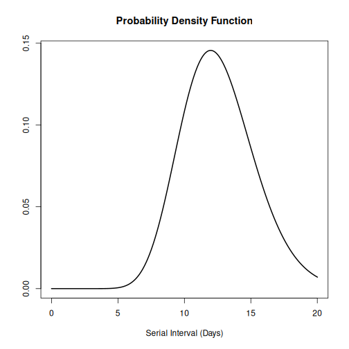
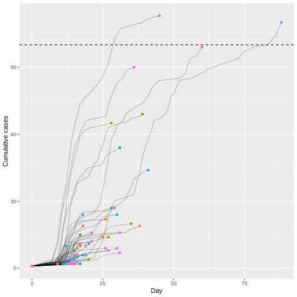
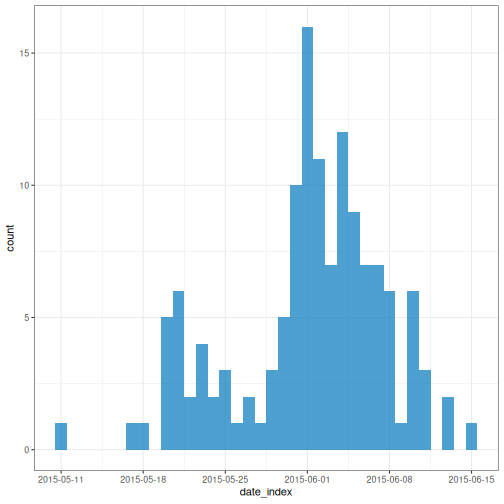
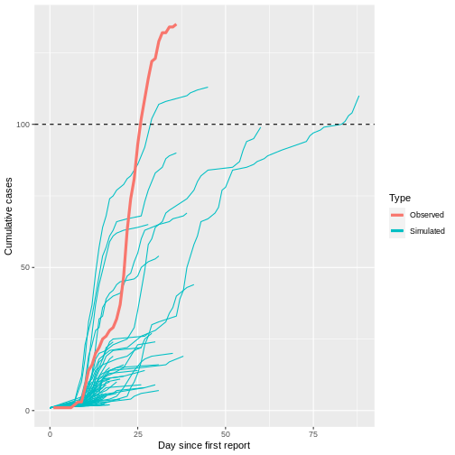
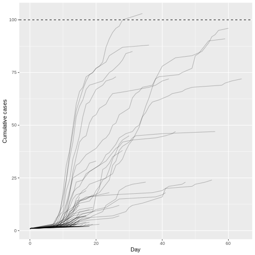
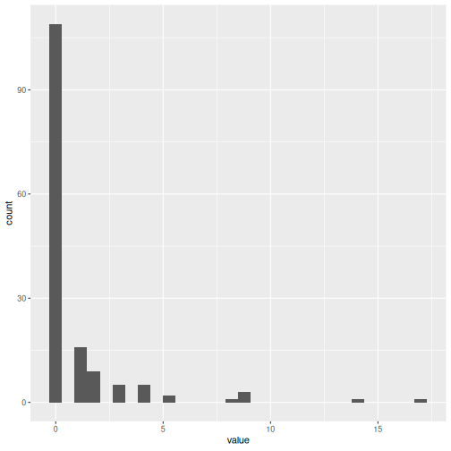
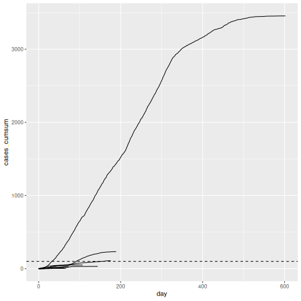

:::::::::::::::::::::::::::::::::::::: questions 

- How can we simulate transmission chains based on infection characteristics?

::::::::::::::::::::::::::::::::::::::::::::::::

::::::::::::::::::::::::::::::::::::: objectives

- Create a short term projection using a branching process with `{epichains}`.

::::::::::::::::::::::::::::::::::::::::::::::::

::::::::::::::::::::::::::::::::::::: prereq

## Prerequisites

Learners should familiarise themselves with the following concept dependencies before working through this tutorial: 

**Statistics**: Common probability distributions, including Poisson and negative binomial.

**Epidemic theory**: The reproduction number, $R$.

:::::::::::::::::::::::::::::::::

## Introduction

<!-- what we know -->

Individual variation in transmission can affect both the potential for an epidemic to establish in a population and the ease of control ([Cori et al., 2017](https://royalsocietypublishing.org/doi/10.1098/rstb.2016.0371)). 

+ Greater variation reduces the overall probably of a single new case causing a large local outbreak, because most cases infect few others and individuals that generate a large number of secondary cases are relatively rare.

+ However, if a 'superspreading event' does occur and the outbreak gets established, this variation can make an outbreak harder to control using *mass interventions* (i.e. blanket interventions that implicitly assume everyone contributes equally to transmission), because some cases contribute disproportionality: a single uncontrolled case may generate a large number of secondary cases.

+ Conversely, variation in transmission may provide opportunities for *targeted interventions* if the individuals who contribute more to transmission (due to biological or behavioural factors), or the settings in which 'superspreading events' occur, share socio-demographic, environmental or geographical characteristics that can be defined.

<!-- what we dont know -->

How can we quantify the potential of a new infection to cause a large outbreak based on its reproduction number $R$ and the dispersion $k$ of its offspring distribution?

<div class="figure" style="text-align: center">

<p class="caption">Observed number of cumulative cases from the Middle East respiratory syndrome (MERS) outbreak in South Korea, 2015, alongside with simulated transmission chains assuming an offspring distribution with $R=0.6$ and $k=0.02$.</p>
</div>


<!-- what we are going to do -->

In this episode, we will use the `{epichains}` package to simulate transmission chains and estimate the potential for large outbreaks following the introduction of a new case. We are going to use it with functions from `{epiparameter}`, `{dplyr}` and `{purrr}`, so also loading the `{tidyverse}` package:

```r
library(epichains)
library(epiparameter)
library(tidyverse)
```


::::::::::::::::::: checklist

### The double-colon

The double-colon `::` in R let you call a specific function from a package without loading the entire package into the current environment. 

For example, `dplyr::filter(data, condition)` uses `filter()` from the `{dplyr}` package.

This help us remember package functions and avoid namespace conflicts.

:::::::::::::::::::

## Simulation of uncontrolled outbreaks

Infectious disease epidemics spread through populations when a chain of infected individuals transmit the infection to others. [Branching processes](https://epiverse-trace.github.io/epichains/articles/theoretical_background.html) can be used to model this transmission. A branching process is a stochastic process (i.e. a random process that can be described by a known probability distribution), where each infectious individual gives rise to a random number of individuals in the next generation of infection, starting with the index case in generation 1. The distribution of the number of secondary cases each individual generates is called the offspring distribution ([Azam & Funk, 2024](https://epiverse-trace.github.io/epichains/articles/epichains.html)).

`{epichains}` provides methods to analyse and simulate the *size* and *length* of branching processes with an given offspring distribution. `{epichains}` implements a rapid and simple model to simulate transmission chains to assess epidemic risk, project cases into the future, and evaluate interventions that change $R$.

::::::::::::::::::: discussion

### chain size and length

- The **size** of the transmission chain is defined as the total number of individuals infected across all generations of infection, and 

- the **length** of the transmission chain is the number of generations from the first case to the last case in the outbreak before the chain ended. 

The *size* calculation includes the first case, and the *length* calculation contains the first generation when the first case starts the chain (See figure below).

![**An example of a transmission chain starting with a single case C1.** Cases are represented by blue circles and arrows indicating who infected whom. The chain grows through generations Gen 1, Gen 2, and Gen 3, producing cases C2, C3, C4, C5, and C6. The chain ends at generation Gen 3 with cases C4, C5, and C6. The size of C1’s chain is 6, including C1 (that is, the sum of all blue circles), and the length is 3, which includes Gen 1 (maximum number of generations reached by C1’s chain) ([Azam & Funk, 2024](https://epiverse-trace.github.io/epichains/articles/epichains.html)).](https://raw.githubusercontent.com/epiverse-trace/epichains/main/vignettes/img/transmission_chain_example.png)

::::::::::::::::::::

To use `{epichains}`, we need to know (or assume) two key epidemiological values: the offspring distribution and the generation time.

## Get the offspring distribution

Here we assume the MERS offspring distribution follows a negative binomial distribution, with mean (reproduction number $R$) and dispersion $k$ values estimated from the linelist and contact data of `mers_korea_2015` in the `{outbreaks}` R package in the previous episode.


``` r
mers_offspring <- c(mean = 0.60, dispersion = 0.02)
```

:::::::::::::::::::::::::::: callout

### offspring distribution for epichains

We input an offspring distribution to `{epichains}` by referring to the R function that generates random values from the distribution we want. For a negative binomial distribution, we use `rnbinom` with its corresponding `mu` and `size` arguments:

```r
  offspring_dist = rnbinom,
  mu = mers_offspring["mean"],
  size = mers_offspring["dispersion"],
```

The reference manual in `?rnbinom` tells us our required specific arguments.

::::::::::::::::::::::::::::

:::::::::::::::::::::::::: spoiler

### Poisson and other distributions

`{epichains}` can accept any R function that generates random numbers, so the specified arguments will change depending on the R function used. For more details on the range of possible options, see the function reference manual.

For example, let's say we want to use a Poisson distribution for the offspring distribution. First, read the argument required in the `?rpois` reference manual. Second, specify the `lambda` argument parameter, also known as rate or mean in the literature. In `{epichains}`, this can look like this:

```r
  offspring_dist = rpois,
  lambda = mers_offspring["mean"],
```

In this example, we can specify `lambda = mers_offspring["mean"]` because the mean number of secondary cases generated (i.e. $R$) should be the same regardless of the distribution we assume. What changes is the variance of the distribution, and hence the level of individual-level variation in transmission. When the dispersion parameter $k$ approaches infinity ($k \rightarrow \infty$) in a negative binomial distribution, the variance equals the mean. This makes the conventional Poisson distribution a special case of the negative binomial distribution.

::::::::::::::::::::::::::

## Get generation time

The [serial interval](../learners/reference.md#serialinterval) distribution is often used to approximate the generation time distribution. This approximation is commonly used because it is easier to observe and measure the onset of symptoms in each case than the precise time of infection.

:::::::::::::::::::::::::::::::: spoiler

### generation time vs serial interval

).](fig/serial-interval-observed.jpeg)

However, using the *serial interval* as an approximation of the *generation time* is primarily valid for diseases in which infectiousness starts after symptom onset ([Chung Lau et al., 2021](https://academic.oup.com/jid/article/224/10/1664/6356465)). In cases where infectiousness starts before symptom onset, the serial intervals can have negative values, which is the case for diseases with pre-symptomatic transmission ([Nishiura et al., 2020](https://www.ijidonline.com/article/S1201-9712(20)30119-3/fulltext#gr2)).

::::::::::::::::::::::::::::::::

Let's use the `{epiparameter}` package to access and use the available serial interval for MERS disease:


``` r
serial_interval <- epidist_db(
  disease = "mers",
  epi_dist = "serial",
  single_epidist = TRUE
)

plot(serial_interval, day_range = 0:25)
```




The serial interval for MERS has a mean of 12.6 days and a standard deviation of 2.8 days.

:::::::::::::::::::::::::::: callout

### generation time for epichains

In `{epichains}`, we need to specify the generation time as a function that generates random numbers. Using `{epiparameter}` has the advantage of using the distribution function `epiparameter::generate()` for this input. This will look like this:

```r
function(x) generate(x = serial_interval, times = x)
```

This interface is similar to the one `{cfr}` uses to link with `{epiparameter}`. Read the [work with delay distributions](https://epiverse-trace.github.io/cfr/articles/delay_distributions.html) vignette for further context.

::::::::::::::::::::::::::::

## Simulate a single chain

Now we are prepared to use the `simulate_chains()` function from `{epichains}` to create **one** transmission chain:


``` r
epichains::simulate_chains(
  # simulation controls
  n_chains = 5,
  statistic = "size",
  # offspring
  offspring_dist = rnbinom,
  mu = mers_offspring["mean"],
  size = mers_offspring["dispersion"],
  # generation
  generation_time = function(x) generate(x = serial_interval, times = x)
)
```

`simulate_chains()` requires three sets of arguments as a minimum:

- simulation controls,
- offspring distribution, and
- generation time.

In the lines above, we described how to specify the offspring distribution and generation time. The **simulation controls** include at least two arguments:

- `index_case`, which defines the number of index cases to simulate transmission chains for and
- `statistic`, which defines a chain statistic to track (either `"size"` or `"length"`) as the stopping criteria for each chain being simulated.

::::::::::::::::::::::::::: callout

### Stopping criteria

This is an customisable feature of `{epichains}`. By default, branching process simulations end when they have gone extinct. For long-lasting transmission chains, in `simulate_chains()` you can add the `stat_max` argument. 

For example, if we set an stopping criteria for `statistic = "size"` of `stat_max = 500`, no more offspring will be produced after a chain of size 500.

:::::::::::::::::::::::::::

The `simulate_chains()` output creates a `<epichains>` class object, which we can then analyse further in R.

## Simulate multiple chains

We can use `simulate_chains()` to create multiple chains and increase the probability of simulating uncontrolled outbreak projections given an overdispersed offspring distribution.

We need to specify three additional elements:

- `set.seed(<integer>)`, which is a random number generator function with a specified seed value, the `<integer>` number, to ensure consistent results across different runs of the code.
- `number_simulations`, which defines the number of simulations to run.
- `initial_cases` defines the number of initial cases to input to the `n_chains` argument explained in the lines above.


``` r
# Set seed for random number generator
set.seed(33)
# Number of simulation runs
number_simulations <- 1000
# Number of initial cases
initial_cases <- 1
```

`number_simulations` and `initial_cases` are conveniently stored in objects to facilitate downstream reuse in the workflow.

:::::::::::::::::::::::::::::: checklist

### Iteration using purrr

[Iteration](https://r4ds.hadley.nz/iteration.html) aims to perform the same action on different objects repeatedly.

Learn how to use the core `{purrr}` functions like `map()` from the YouTube tutorial on [How to purrr](https://www.youtube.com/watch?v=nd-Y8b22YaQ) by Equitable Equations.

Or, if you previously used the `*apply` family of functions, visit the package vignette on [purrr base R](https://purrr.tidyverse.org/articles/base.html), which shares key differences, direct translations, and examples.

::::::::::::::::::::::::::::::

To get multiple chains, we must apply the `simulate_chains()` function to each chain defined by a sequence of numbers from 1 to 1000.

::::::::::::::::::::::::::::::: callout

### purrr and epichains

First, let's sketch how we use `purrr::map()` with `epichains::simulate_chains()`. The `map()` function requires two arguments:

- `.x`, with a vector of numbers, and
- `.f`, a function to iterate to each vector value.

```r
map(
  # vector of numbers (simulation IDs)
  .x = seq_len(number_simulations),
  # function to iterate to each simulation ID number
  .f = function(sim) {
    simulate_chains(...) %>%
      # creates a column with the simulation ID number
      mutate(simulation_id = sim)
  }
) %>%
  # combine list outputs (for each simulation ID) into a single data frame
  list_rbind()
```

The `sim` element is placed to register the iteration number (**simulation ID**) as a new column in the `<epichains>` output. The `purrr::list_rbind()` function aims to combine all the list outputs from `map()`.

**Why a dot (`.`) as a prefix?** In the [tidy design principles](https://design.tidyverse.org/dots-prefix.html) book we have a chapter on the dot prefix!

:::::::::::::::::::::::::::::::

Now, we are prepared to use `map()` to repeatedly simulate from `simulate_chains()` and store in a vector from 1 to 1000:


``` r
simulated_chains_map <-
  # iterate one function across multiple numbers (simulation IDs)
  purrr::map(
    # vector of numbers (simulation IDs)
    .x = seq_len(number_simulations),
    # function to iterate to each simulation ID number
    .f = function(sim) {
      epichains::simulate_chains(
        # simulation controls
        n_chains = initial_cases,
        statistic = "size",
        # offspring
        offspring_dist = rnbinom,
        mu = mers_offspring["mean"],
        size = mers_offspring["dispersion"],
        # generation
        generation_time = function(x) generate(x = serial_interval, times = x)
      ) %>%
        # creates a column with the simulation ID number
        dplyr::mutate(simulation_id = sim)
    }
  ) %>%
  # combine list outputs (for each simulation ID) into a single data frame
  purrr::list_rbind()
```


::::::::::::::::::::::::::::::::: discussion

### Read the epichains output


To explore the output format of the `<epichains>` class object of name `simulated_chains_map`, let's look at the simulated `simulation_id` number 806. 

:::::::::::::::::::::::::::::::::

::::::::::::::::::::::::: solution

### The epichains object

Let's use `dplyr::filter()` for this:

```r
chain_to_observe <- 806
```


``` r
#### get epichain summary ----------------------------------------------------

simulated_chains_map %>%
  dplyr::filter(simulation_id == chain_to_observe)
```

``` output
`<epichains>` object

< epichains head (from first known infector) >

  chain infector infectee generation     time simulation_id
2     1        1        2          2 16.38623           806
3     1        1        3          2 11.79430           806
4     1        1        4          2 10.77252           806
5     1        1        5          2 11.39945           806
6     1        1        6          2 10.23130           806
7     1        2        7          3 26.01046           806


Number of infectors (known): 3
Number of generations: 3
Use `as.data.frame(<object_name>)` to view the full output in the console.
```

Key elements from this output are in the footer, the piece of text that appears at the bottom:

```output
Number of infectors (known): 3
Number of generations: 3
```

The simulated `simulation_id` number 806 has three known infectors and three generations. These numbers are more visible when reading the `<epichains>` objects as a data frame.

:::::::::::::::::::::::::

::::::::::::::::::::::::: solution

### The epichains data frame


``` r
#### infector-infectee data frame --------------------------------------------

simulated_chains_map %>%
  dplyr::filter(simulation_id == chain_to_observe) %>%
  dplyr::as_tibble()
```

``` output
# A tibble: 9 × 6
  chain infector infectee generation  time simulation_id
  <int>    <dbl>    <dbl>      <int> <dbl>         <int>
1     1       NA        1          1   0             806
2     1        1        2          2  16.4           806
3     1        1        3          2  11.8           806
4     1        1        4          2  10.8           806
5     1        1        5          2  11.4           806
6     1        1        6          2  10.2           806
7     1        2        7          3  26.0           806
8     1        2        8          3  29.8           806
9     1        2        9          3  26.6           806
```

Chain 806 tells us a **story**: "In the first transmission generation at `time = 0`, one index case infected the first case with `sim_id = 1`. Then, in the second transmission generation (between `time` 10 to 16), `sim_id = 1` infected five cases. Later, in the third transmission generation (between `time` 26 to 30), `sim_id = 2` infected three new cases."

:::::::::::::::::::::::::

::::::::::::::::::::::::: solution

### An infectee data frame

The output data frame collects **infectees** as the observation unit: 

- Each infectee has a `sim_id`. 
- Each _infectee_ that behaved as an _infector_ is registered in the `infector` column using `sim_id` of that infectee. 
- Each infectee got infected in a specific `generation` and (continuous) `time`. 
- The simulation number is registered under the `simulation_id` column.

**Note:** The `Number of infectors (known)` includes the `NA` observation under the `infector` column. This refers to the infector specified as index case (in the `n_chains` argument), which started the transmission chain to the infectee of `sim_id = 1`, at `generation = 1`, and `time = 0`.

:::::::::::::::::::::::::

## Visualize multiple chains

To visualize the simulated chains, we need some pre-processing:

1. Let's use `{dplyr}` to get round time numbers to resemble surveillance days.
2. Count the daily cases in each simulation (by `simulation_id`).
3. Calculate the cumulative number of cases within a simulation.


``` r
# daily aggregate of cases
simulated_chains_day <- simulated_chains_map %>%
  # use data.frame output from <epichains> object
  dplyr::as_tibble() %>%
  # transform simulation ID column to factor (categorical variable)
  dplyr::mutate(simulation_id = as_factor(simulation_id)) %>%
  # get the round number (day) of infection times
  dplyr::mutate(day = ceiling(time)) %>%
  # count the daily number of cases in each simulation (simulation ID)
  dplyr::count(simulation_id, day, name = "cases") %>%
  # calculate the cumulative number of cases for each simulation (simulation ID)
  dplyr::group_by(simulation_id) %>%
  dplyr::mutate(cases_cumsum = cumsum(cases)) %>%
  dplyr::ungroup()
```

Before the plot, let's create a summary table with the total time duration and size of each chain. We can use the `{dplyr}` "combo" of `group_by()`, `summarise()` and `ungroup()`:


``` r
# Summarise the chain duration and size
sim_chains_max <-
  simulated_chains_day %>%
  dplyr::group_by(simulation_id) %>%
  dplyr::summarise(
    # duration
    day_max = max(day),
    # size
    cases_total = max(cases_cumsum)
  ) %>%
  dplyr::ungroup()

sim_chains_max
```

``` output
# A tibble: 1,000 × 3
   simulation_id day_max cases_total
   <fct>           <dbl>       <int>
 1 1                   0           1
 2 2                   0           1
 3 3                   0           1
 4 4                   0           1
 5 5                   0           1
 6 6                   0           1
 7 7                   0           1
 8 8                   0           1
 9 9                   0           1
10 10                  0           1
# ℹ 990 more rows
```

Now, we are prepared for using the `{ggplot2}` package:


``` r
# Visualize transmission chains by cumulative cases
ggplot() +
  # create grouped chain trajectories
  geom_line(
    data = simulated_chains_day,
    mapping = aes(
      x = day,
      y = cases_cumsum,
      group = simulation_id
    ),
    color = "black",
    alpha = 0.25,
    show.legend = FALSE
  ) +
  # create points to visualize the chain endpoint
  geom_point(
    data = sim_chains_max,
    mapping = aes(
      x = day_max,
      y = cases_total,
      group = simulation_id,
      color = simulation_id
    ),
    show.legend = FALSE
  ) +
  # define a 100-case threshold
  geom_hline(aes(yintercept = 100), lty = 2) +
  labs(
    x = "Day",
    y = "Cumulative cases"
  )
```




Although most introductions of 1 index case do not generate secondary cases (N = 940) or most outbreaks rapidly become extinct (median duration of 17.5 and median size of 9), only 2 epidemic trajectories among 1000 simulations (0.2%) can reach to more than 100 infected cases. This finding is particularly remarkable because the reproduction number $R$ is less than 1 (offspring distribution mean of 0.6), but, given an offspring distribution dispersion parameter of 0.02, it shows the potential for explosive outbreaks of MERS disease.

We can count how many chains reached the 100-case threshold using `{dplyr}` functions:


``` r
# number of chains that reached the 100-case threshold
sim_chains_max %>%
  dplyr::arrange(desc(day_max)) %>%
  dplyr::filter(cases_total > 100)
```

``` output
# A tibble: 2 × 3
  simulation_id day_max cases_total
  <fct>           <dbl>       <int>
1 666                88         110
2 23                 45         113
```


::::::::::::::::::::::::::::::::::: spoiler

### Observed cases vs simulated chains

Let's overlap the cumulative number of observed cases using the linelist object from the `mers_korea_2015` dataset of the `{outbreaks}` R package. To prepare the dataset so we can plot daily total cases over time, we use `{incidence2}` to convert the linelist to an `<incidence2>` object, complete the missing dates of the time series with `complete_dates()`


``` r
library(outbreaks)

mers_cumcases <- mers_korea_2015$linelist %>%
  # incidence2 workflow
  incidence2::incidence(date_index = "dt_onset") %>%
  incidence2::complete_dates() %>%
  # wrangling using {dplyr}
  dplyr::mutate(count_cumsum = cumsum(count)) %>%
  tibble::rownames_to_column(var = "day") %>%
  dplyr::mutate(day = as.numeric(day))
```

Use `plot()` to make an incidence plot:


``` r
# plot the incidence2 object
plot(mers_cumcases)
```



:::::::::::::::::::::::::::::::::::

When plotting the observed number of cumulative cases from the Middle East respiratory syndrome (MERS) outbreak in South Korea in 2015 alongside the previously simulated chains, we see that the observed cases followed a trajectory that is consistent with the simulated explosive outbreak dynamics (which makes sense, given the simulation uses parameters based on this specific outbreak).



When we increase the dispersion parameter from $k = 0.01$ to $k = \infty$ - and hence reduce individual-level variation in transmission - and assume a fixed reproduction number $R = 1.5$, the proportion of simulated outbreaks that reached the 100-case threshold increases. This is because the simulated outbreaks now have more of a consistent, clockwise dynamic, rather than the high level of variability seen previously.

).](fig/see-nature04153_Fig2-c.jpg)

:::::::::::::::::::::: testimonial

### Early spread projections

In the epidemic's initial phase, you can use `{epichains}` to apply a branching process model to project the number of future cases. Even though the model accounts for randomness in transmission and variation in the number of secondary cases, there may be additional local features we have not considered. Analysis of early forecasts made for COVID in different countries using this model structure found that predictions were often overconfident ([Pearson et al., 2020](https://www.eurosurveillance.org/content/10.2807/1560-7917.ES.2020.25.18.2000543#validationofthemodel-1)). This is likely because the real-time model did not include all the changes in the offspring distribution that were happening at the local level as a result of behaviour change and control measures. You can read more about the importance of local context in COVID-19 models in [Eggo et al. (2020)](https://www.nature.com/articles/s43588-020-00014-7).

We invite you to read the vignette on [Projecting infectious disease incidence: a COVID-19 example](https://epiverse-trace.github.io/epichains/articles/projecting_incidence.html)! for more on making predictions using `{epichains}`.

::::::::::::::::::::::

## Challenges

:::::::::::::::::::::::::: challenge

### Monkeypox large outbreak potential

Evaluate the potential for a new Monkey pox (Mpox) case to generate an explosive large outbreak. 

- Simulate 1000 transmission chains with 1 initial case each.
- Use the appropriate package to access delay data from previous outbreaks.
- How many simulated trajectories reach more than 100 infected cases?

:::::::::::::: hint

With `{epiparameter}`, you can access and use offspring and delay distributions from previous Ebola outbreaks.


``` r
library(epiparameter)
library(tidyverse)

epiparameter::epidist_db(epi_dist = "offspring") %>%
  epiparameter::parameter_tbl() %>%
  dplyr::count(disease, epi_distribution)
```

``` output
# Parameter table:
# A data frame:    6 × 3
  disease                       epi_distribution           n
  <chr>                         <chr>                  <int>
1 Ebola Virus Disease           offspring distribution     1
2 Hantavirus Pulmonary Syndrome offspring distribution     1
3 Mpox                          offspring distribution     1
4 Pneumonic Plague              offspring distribution     1
5 SARS                          offspring distribution     2
6 Smallpox                      offspring distribution     4
```

``` r
epiparameter::epidist_db(epi_dist = "serial interval") %>%
  epiparameter::parameter_tbl() %>%
  dplyr::count(disease, epi_distribution)
```

``` output
# Parameter table:
# A data frame:    6 × 3
  disease               epi_distribution     n
  <chr>                 <chr>            <int>
1 COVID-19              serial interval      4
2 Ebola Virus Disease   serial interval      4
3 Influenza             serial interval      1
4 MERS                  serial interval      2
5 Marburg Virus Disease serial interval      2
6 Mpox                  serial interval      5
```

::::::::::::::

:::::::::::::: solution


``` r
# load packages -----------------------------------------------------------

library(epiparameter)
library(tidyverse)

# delays ------------------------------------------------------------------

mpox_offspring_epidist <- epiparameter::epidist_db(
  disease = "mpox",
  epi_dist = "offspring",
  single_epidist = TRUE
)

mpox_offspring <- epiparameter::get_parameters(mpox_offspring_epidist)

mpox_serialint <- epiparameter::epidist_db(
  disease = "mpox",
  epi_dist = "serial interval",
  single_epidist = TRUE
)

# iterate -----------------------------------------------------------------

# Set seed for random number generator
set.seed(33)
# Number of simulation runs
number_simulations <- 1000
# Number of initial cases
initial_cases <- 1

simulated_chains_mpox <-
  # iterate one function across multiple numbers (simulation IDs)
  purrr::map(
    # vector of numbers (simulation IDs)
    .x = seq_len(number_simulations),
    # function to iterate to each simulation ID number
    .f = function(sim) {
      epichains::simulate_chains(
        # simulation controls
        n_chains = initial_cases,
        statistic = "size",
        # offspring
        offspring_dist = rnbinom,
        mu = mpox_offspring["mean"],
        size = mpox_offspring["dispersion"],
        # generation
        generation_time = function(x) generate(x = mpox_serialint, times = x)
      ) %>%
        # creates a column with the simulation ID number
        dplyr::mutate(simulation_id = sim)
    }
  ) %>%
  # combine list outputs (for each simulation ID) into a single data frame
  purrr::list_rbind()

# visualize ---------------------------------------------------------------

# daily aggregate of cases
simulated_chains_mpox_day <- simulated_chains_mpox %>%
  # use data.frame output from <epichains> object
  dplyr::as_tibble() %>%
  # transform simulation ID column to factor (categorical variable)
  dplyr::mutate(simulation_id = as_factor(simulation_id)) %>%
  # get the round number (day) of infection times
  dplyr::mutate(day = ceiling(time)) %>%
  # count the daily number of cases in each simulation (simulation ID)
  dplyr::count(simulation_id, day, name = "cases") %>%
  # calculate the cumulative number of cases for each simulation (simulation ID)
  dplyr::group_by(simulation_id) %>%
  dplyr::mutate(cases_cumsum = cumsum(cases)) %>%
  dplyr::ungroup()

# Visualize transmission chains by cumulative cases
ggplot() +
  # create grouped chain trajectories
  geom_line(
    data = simulated_chains_mpox_day,
    mapping = aes(
      x = day,
      y = cases_cumsum,
      group = simulation_id
    ),
    color = "black",
    alpha = 0.25,
    show.legend = FALSE
  ) +
  # define a 100-case threshold
  geom_hline(aes(yintercept = 100), lty = 2) +
  labs(
    x = "Day",
    y = "Cumulative cases"
  )
```



Assuming a Monkey pox outbreak with $R$ = 0.32 and $k$ = 0.58, there is no trajectory among 1000 simulations that reach more than 100 infected cases. Compared to MERS ($R$ = 0.6 and $k$ = 0.02).

::::::::::::::

::::::::::::::::::: hint

### Epidemic Risk assessment accounting for superspreading

With `{superspreading}`, you can get numerical solutions to processes that `{epichains}` solve using branching processes. We invite you to read the `{superspreading}` vignette on [Epidemic risk](https://epiverse-trace.github.io/superspreading/articles/epidemic_risk.html) and respond to:

- What is the probability that a newly introduced pathogen will cause a large outbreak?
- What is the probability that an infection will, by chance, fail to establish following initial introduction(s)?
- What is the probability the outbreak will be contained?

Check how these estimates vary non-linearly with respect to the mean reproduction number $R$ and dispersion $k$ of a given disease.

<!-- draft challenge -->

<!-- Calculate the probability a new Mpox case will lead to a large outbreak in the absence of control measures. Use the appropriate package to access delay data from previous outbreaks. -->

```r
library(superspreading)
```


```r
library(superspreading)
```


::::::::::::::::::

:::::::::::::::::::::::::

:::::::::::::::::::::::::: challenge

### From a distribution of secondary cases

[Christian Althaus, 2015](https://www.thelancet.com/journals/laninf/article/PIIS1473-3099(15)70135-0/fulltext) reused data published by [Faye et al., 2015 (Figure 2)](https://www.thelancet.com/journals/laninf/article/PIIS1473-3099(14)71075-8/fulltext#gr2) on the transmission tree on Ebola virus disease in Conakry, Guinea, 2014.

Using the data under the **hint** tab, estimate the offspring distribution from the distribution of secondary cases. Then estimate the large outbreak potential from this data.

::::::::::: hint

Code with the transmission tree data written by [Christian Althaus, 2015](https://www.thelancet.com/journals/laninf/article/PIIS1473-3099(15)70135-0/fulltext):


``` r
# Number of individuals in the trees
n <- 152
# Number of secondary cases for all individuals
c1 <- c(1, 2, 2, 5, 14, 1, 4, 4, 1, 3, 3, 8, 2, 1, 1,
        4, 9, 9, 1, 1, 17, 2, 1, 1, 1, 4, 3, 3, 4, 2,
        5, 1, 2, 2, 1, 9, 1, 3, 1, 2, 1, 1, 2)
c0 <- c(c1, rep(0, n - length(c1)))

c0 %>%
  enframe() %>%
  ggplot(aes(value)) +
  geom_histogram()
```



:::::::::::

::::::::::: solution

```r
# load packages ---------------------------
library(epichains)
library(epiparameter)
library(fitdistrplus)
library(tidyverse)
```


``` r
# fit a negative binomial distribution ------------------------------------

# Fitting a negative binomial distribution to the number of secondary cases
fit.cases <- fitdistrplus::fitdist(c0, "nbinom")
fit.cases
```

``` output
Fitting of the distribution ' nbinom ' by maximum likelihood 
Parameters:
      estimate Std. Error
size 0.1814260 0.03990278
mu   0.9537995 0.19812301
```

``` r
# serial interval parameters ----------------------------------------------

ebola_serialinter <- epiparameter::epidist_db(
  disease = "ebola",
  epi_dist = "serial interval",
  single_epidist = TRUE
)

# simulate outbreak trajectories ------------------------------------------

# Set seed for random number generator
set.seed(645)
# Number of simulation runs
number_simulations <- 1e2
# Number of initial cases
initial_cases <- 1

sim_multiple_chains <-
  purrr::map(
    .x = seq_len(number_simulations),
    .f = function(sim) {
      epichains::simulate_chains(
        n_chains = initial_cases,
        # stopping
        statistic = "size",
        # offspring
        offspring_dist = rnbinom,
        mu = fit.cases$estimate["mu"],
        size = fit.cases$estimate["size"],
        # generation
        generation_time = function(x) generate(x = ebola_serialinter, times = x)
      ) %>%
        dplyr::mutate(simulation_n = sim)
    }
  ) %>%
  # combine list outputs (for each simulation ID) into a single data frame
  purrr::list_rbind()

# visualize ----------------------------------------

sim_chains_aggregate <-
  sim_multiple_chains %>%
  dplyr::as_tibble() %>%
  dplyr::mutate(simulation_n = as_factor(simulation_n)) %>%
  dplyr::mutate(day = ceiling(time)) %>%
  dplyr::count(simulation_n, day, name = "cases") %>%
  dplyr::group_by(simulation_n) %>%
  dplyr::mutate(cases_cumsum = cumsum(cases)) %>%
  dplyr::ungroup()

ggplot() +
  geom_line(
    data = sim_chains_aggregate,
    mapping = aes(
      x = day,
      y = cases_cumsum,
      group = simulation_n
    ),
    show.legend = FALSE
  ) +
  # define a 100-case threshold
  geom_hline(aes(yintercept = 100), lty = 2)
```




Remarkably, even with R0 less than 1 (R = 0.95) we can have potentially explosive outbreaks. The observed variation in individual infectiousness in Ebola means that although the probability of extinction is high, new index cases also have the potential for explosive regrowth of the epidemic.

:::::::::::

:::::::::::::::::::::::::::::

::::::::::::::::::::::::::::::::::::: keypoints 

- Use `{epichains}` to simulate the large outbreak potential of diseases with overdispersed offspring distributions.

::::::::::::::::::::::::::::::::::::::::::::::::

